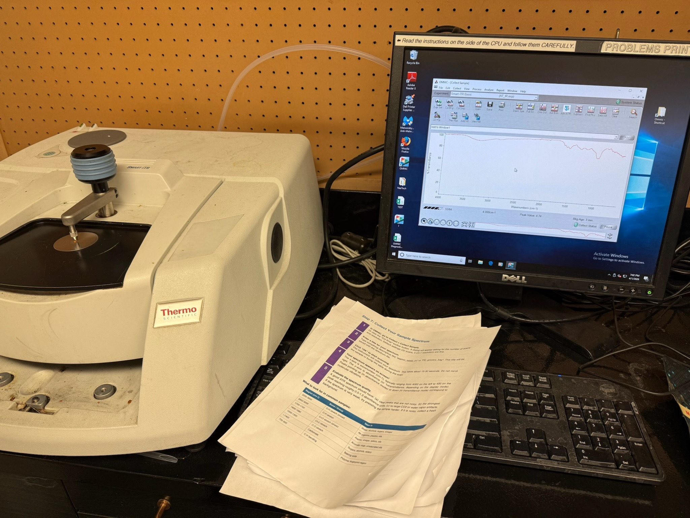

# IR Spectroscopy of Everyday Materials

**Date:** April 1st 2026
**Instrument:** FT-IR Spectrometer (ATR mode)

## Overview

Infrared spectroscopy survey of common household and laboratory materials. Each sample was measured using the FT-IR spectrometer to capture its absorption/transmittance spectrum across the mid-infrared range (~550-4000 cm-1). The goal is to build a reference library of spectra and identify characteristic functional group signatures in everyday substances.

## Samples

| # | Category | Samples |
|---|----------|---------|
| 1 | Solvents | acetone, isopropanol, water |
| 2 | Food/minerals | coffee, salt, sugar |
| 3 | Personal care | soap, shampoo, conditioner, lotion, sunscreen |
| 4 | Household | cleaner |
| 5 | Polymers/materials | plastic bag, plastic cap, plastic glove, paper, paperplasticcup |
| 6 | Biological | finger |
| 7 | Control | background |

## Data

Raw spectra are in `DATA/` as CSV files. Each CSV has two columns (no header): wavenumber (cm-1) and transmittance (%), with ~7,150 data points per spectrum spanning approximately 550-4000 cm-1.

## Methods

1. Background spectrum collected first to establish baseline
2. Each sample placed on ATR crystal
3. Spectrum acquired across mid-IR range
4. Raw CSV exported from instrument software

## Results

*Analysis in progress — see `OUTPUT/` for scripts and figures.*
