# IR Spectroscopy of Everyday Materials

  
  
  
  

<button class="shuffle-btn" onclick="shufflePhotos()">Shuffle Photos</button>

April 1st 2026 Thermo Scientific Nicolet iS5 FT-IR Spectrometer (ATR mode)

## Overview

Fourier-transform infrared (FT-IR) spectroscopy identifies the polar covalent bonds in a material by measuring which infrared frequencies it absorbs. Different functional groups — O-H, C=O, C-H, N-H, and others — vibrate at characteristic frequencies, producing a unique absorption fingerprint for each compound. This survey of common household and laboratory materials uses the FT-IR spectrometer in ATR mode to capture each sample's spectrum across the mid-infrared range (~550–4000 cm⁻¹), building a reference library of spectra and identifying characteristic functional group signatures in everyday substances.

## Setup

| Category | Details |
|----------|---------|
| Instrument | Thermo Scientific Nicolet iS5 FT-IR Spectrometer |
| Mode | Attenuated Total Reflectance (ATR) |
| Range | ~550–4000 cm⁻¹ |
| Resolution | ~7,150 data points per spectrum |
| Runs | Two sessions (19 + 6 samples) |

A background spectrum was collected first to establish a baseline. Each sample was placed directly on the ATR crystal, a spectrum acquired across the mid-IR range, and the raw CSV exported from the instrument software.

### Samples

| # | Category | Samples |
|---|----------|---------|
| 1 | Solvents | acetone, isopropanol, water |
| 2 | Food/minerals | coffee, salt, sugar |
| 3 | Personal care | soap, shampoo, conditioner, lotion, sunscreen, cleaner |
| 4 | Polymers | plastic bag, plastic cap, plastic glove, plastic wrapper |
| 5 | Paper | paper, paper-plastic cup |
| 6 | Biological | finger, leaf, orange peel |
| 7 | Control | background |

## Data

Raw spectra are available as CSV files each containing two columns (wavenumber in cm⁻¹ and transmittance in %) with ~7,150 data points per spectrum. Data is organized into two experimental runs: <a href="https://github.com/vivianweidai/research/tree/main/20260401%20IR%20Spectroscopy/DATA/ONE">ONE</a> (19 samples) and <a href="https://github.com/vivianweidai/research/tree/main/20260401%20IR%20Spectroscopy/DATA/TWO">TWO</a> (6 samples) over two different days.

## Methods

The instrument (Nicolet iS5) applies background correction automatically — each sample's transmittance is already measured relative to the background spectrum, so non-absorbing regions read ~100% transmittance. The data cleaning pipeline:

1. **Parse** — raw CSVs use scientific notation with no headers; each file was parsed into numeric wavenumber and transmittance columns.
2. **Convert to absorbance** — transmittance was converted using A = −log₁₀(T/100), where T is transmittance in percent. Absorbance is dimensionless and directly proportional to concentration via the Beer-Lambert law.
3. **Export** — all 23 samples were saved as individual cleaned CSVs with headers (wavenumber, transmittance, absorbance) into a single <a href="https://github.com/vivianweidai/research/tree/main/20260401%20IR%20Spectroscopy/OUTPUT/SCRUBBED">SCRUBBED</a> folder.

## Results

### Representatives

  <input type="radio" name="spec-tab" id="tab-acetone">
  <input type="radio" name="spec-tab" id="tab-water">
  <input type="radio" name="spec-tab" id="tab-salt">
  <input type="radio" name="spec-tab" id="tab-plastic">
  <input type="radio" name="spec-tab" id="tab-sugar">

  

    <label for="tab-acetone">Acetone</label>
    <label for="tab-water">Water</label>
    <label for="tab-salt">Salt</label>
    <label for="tab-plastic">Plastic Bag</label>
    <label for="tab-sugar">Sugar</label>
  

  

    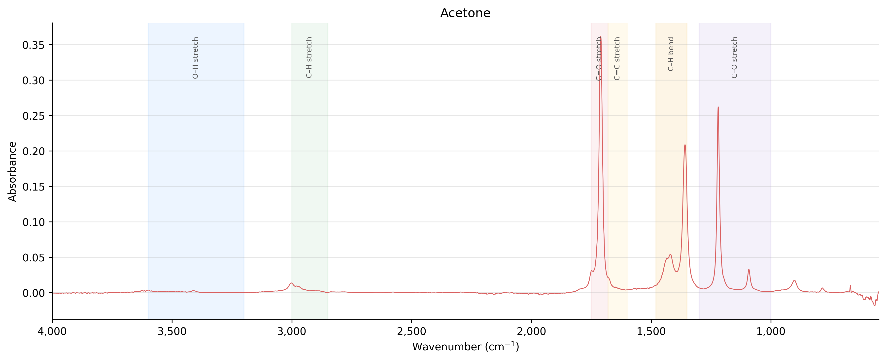
    
Acetone shows a textbook IR spectrum. The dominant peak at ~1,715 cm⁻¹ is the C=O carbonyl stretch — the strongest and most characteristic absorption in ketones. The C–H methyl stretches appear around 2,950–3,000 cm⁻¹, the peaks at ~1,350–1,450 cm⁻¹ are C–H bending (symmetric and asymmetric scissoring of the CH₃ groups), and the sharp peaks in the 1,000–1,300 cm⁻¹ region correspond to C–O and C–C skeletal stretches. The absence of a broad O–H band confirms the sample is anhydrous.

  

  

    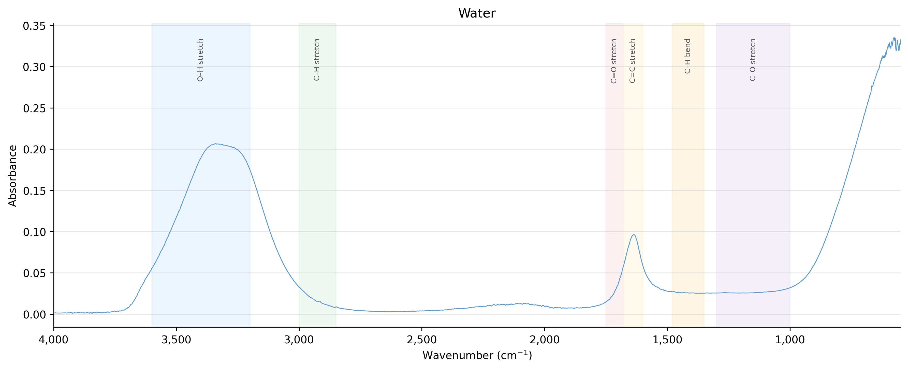
    
Water produces the classic broad O–H stretching band centered around 3,300 cm⁻¹, spanning nearly the entire 3,000–3,600 cm⁻¹ region due to hydrogen bonding. The sharp peak at ~1,640 cm⁻¹ is the O–H bending (scissoring) mode. The strong absorption rising below 1,000 cm⁻¹ is the librational (rocking) mode of liquid water.

  

  

    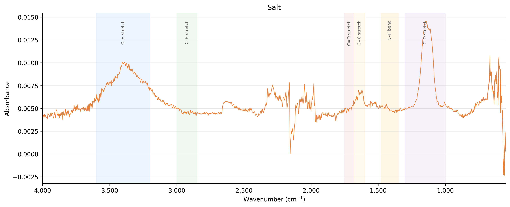
    
Salt (NaCl) is an ionic compound with no covalent bonds, so it produces a nearly flat baseline with no characteristic IR absorptions. The small features visible are likely surface moisture (trace O–H) and atmospheric CO₂ interference. This makes salt an effective negative control and explains why NaCl is traditionally used for IR sample windows.

  

  

    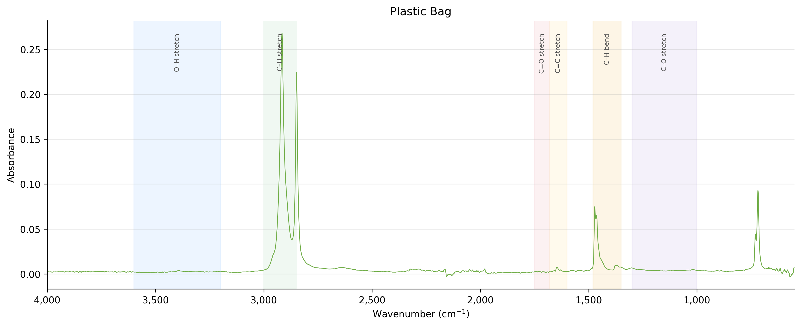
    
Polyethylene (plastic bag) shows an almost pure C–H spectrum. The sharp doublet at ~2,920 and ~2,850 cm⁻¹ corresponds to asymmetric and symmetric C–H stretching of the CH₂ backbone. The C–H bending peaks at ~1,460 cm⁻¹ (scissoring) and ~720 cm⁻¹ (rocking) complete the picture. No O–H, C=O, or other heteroatom peaks — just carbon and hydrogen.

  

  

    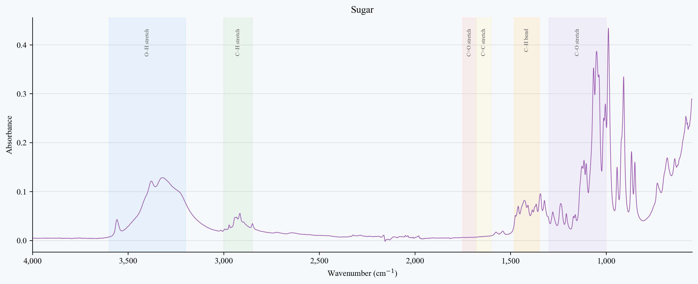
    
Sugar (sucrose) shows a broad O–H stretching band at 3,000–3,500 cm⁻¹ from its many hydroxyl groups, plus a rich fingerprint region below 1,500 cm⁻¹ dominated by C–O stretching vibrations of the glycosidic bond and sugar ring. The complexity of the fingerprint region reflects the molecule's size — each sugar has a unique IR fingerprint that can be used for identification.

  

### Categories

  <input type="radio" name="cat-tab" id="cat-solvents">
  <input type="radio" name="cat-tab" id="cat-food">
  <input type="radio" name="cat-tab" id="cat-personal">
  <input type="radio" name="cat-tab" id="cat-polymers">
  <input type="radio" name="cat-tab" id="cat-paper">
  <input type="radio" name="cat-tab" id="cat-biological">

  

    <label for="cat-solvents">Solvents</label>
    <label for="cat-food">Food / Minerals</label>
    <label for="cat-personal">Personal Care</label>
    <label for="cat-polymers">Polymers</label>
    <label for="cat-paper">Paper</label>
    <label for="cat-biological">Biological</label>
  

  

    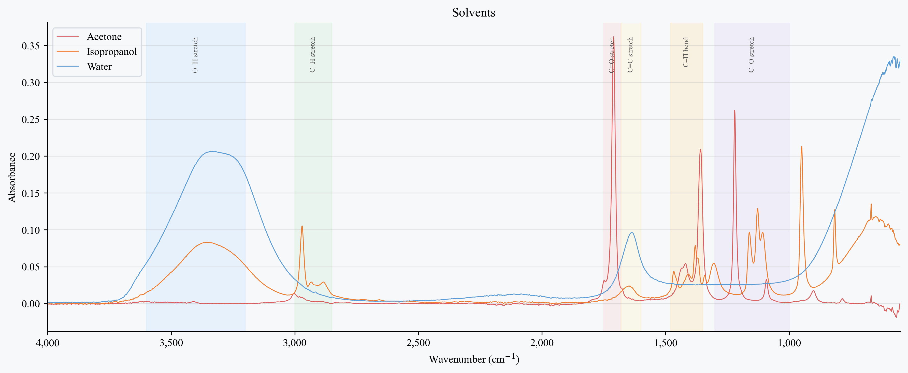
    
Three solvents with very different bonding. <strong>Water</strong> dominates with its broad O–H stretch centered at ~3,300 cm⁻¹ and sharp O–H bend at ~1,640 cm⁻¹. <strong>Isopropanol</strong> combines a broad O–H band (hydrogen-bonded alcohol) with strong C–H stretches at ~2,950 cm⁻¹ and a rich C–O stretching region around 1,000–1,150 cm⁻¹. <strong>Acetone</strong> stands out with its sharp C=O carbonyl peak at ~1,715 cm⁻¹ — the hallmark of a ketone — and no O–H band, confirming it is anhydrous.

  

  

    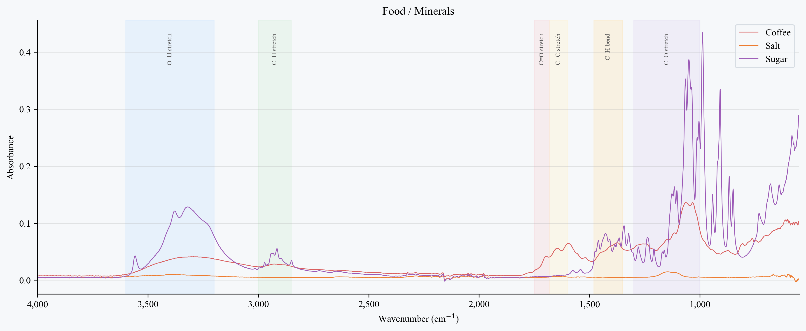
    
<strong>Coffee</strong> produces a broad O–H band around 3,300 cm⁻¹ (water and hydroxyl groups in organic acids) plus C=O and C–O absorptions in the fingerprint region from caffeine, chlorogenic acids, and lipids. <strong>Sugar</strong> (sucrose) shows a similarly broad O–H region from its many hydroxyl groups, but its fingerprint region below 1,500 cm⁻¹ is dominated by intense C–O stretching vibrations of the glycosidic bond and sugar ring — each sugar has a unique fingerprint here. <strong>Salt</strong> (NaCl) is the outlier: as a purely ionic compound with no covalent bonds, it produces an almost perfectly flat baseline — no IR-active vibrations to absorb.

  

  

    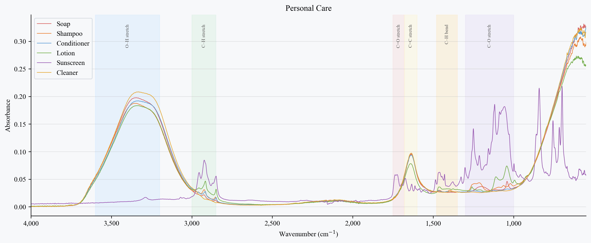
    
Personal care products are complex mixtures but share common signatures. All six samples show a broad O–H/N–H band at 3,000–3,500 cm⁻¹ from water, glycerin, and fatty alcohols. The C–H stretches at ~2,920/2,850 cm⁻¹ reflect long-chain fatty acids and surfactants. <strong>Soap</strong> and <strong>cleaner</strong> stand out with sharper C–H peaks and stronger fingerprint absorptions, while <strong>shampoo</strong>, <strong>conditioner</strong>, and <strong>lotion</strong> cluster together — unsurprising given their similar water-and-surfactant formulations. <strong>Sunscreen</strong> diverges with additional C=O absorption from UV-filtering compounds.

  

  

    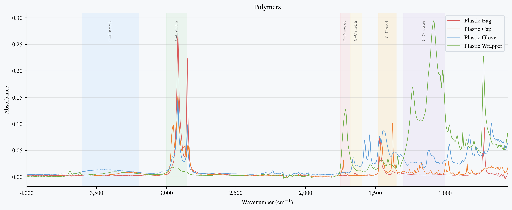
    
Four plastic samples show that not all polymers are alike. <strong>Plastic bag</strong> (polyethylene) and <strong>plastic wrapper</strong> both display the classic PE signature: sharp C–H doublet at ~2,920/2,850 cm⁻¹ with minimal other absorptions. <strong>Plastic cap</strong> (polypropylene) adds a methyl C–H shoulder and extra bending peaks. <strong>Plastic glove</strong> (nitrile or vinyl) is the outlier — its spectrum includes C=O, C–O, and possible C≡N stretches, revealing a more complex polymer with heteroatom functional groups.

  

  

    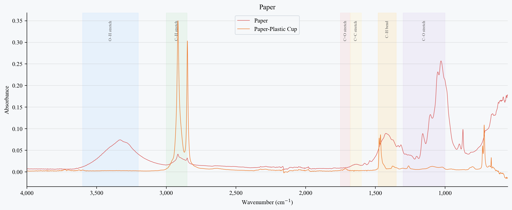
    
<strong>Paper</strong> is primarily cellulose — the broad O–H stretch at 3,000–3,500 cm⁻¹ comes from hydroxyl groups along the polysaccharide chain, and the strong C–O absorptions at 1,000–1,150 cm⁻¹ are characteristic of the glycosidic linkages. The <strong>paper-plastic cup</strong> overlays a polyethylene coating on the cellulose base: the added C–H stretches at ~2,920/2,850 cm⁻¹ reveal the PE lining, while the underlying O–H and C–O bands from the paper substrate remain visible.

  

  

    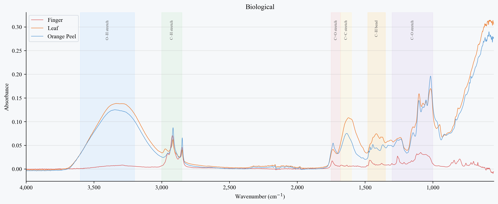
    
Biological samples are chemically rich. <strong>Finger</strong> (skin) shows amide I (~1,640 cm⁻¹) and amide II (~1,540 cm⁻¹) bands from keratin protein, plus lipid C–H stretches and a broad O–H/N–H region. <strong>Leaf</strong> combines cellulose signatures (O–H, C–O) with cuticle wax C–H peaks and possible chlorophyll absorptions. <strong>Orange peel</strong> is dominated by terpene and essential oil signatures — strong C–H stretches, a C=O band from citric acid or esters, and complex C–O absorptions from pectin and sugars in the rind.

  

See the <a href="https://github.com/vivianweidai/research/blob/main/20260401%20IR%20Spectroscopy/OUTPUT/ir_analysis.ipynb">static notebook</a> or .

---

<a href="https://vivianweidai.com/curriculum/">Curriculum</a><a href="https://vivianweidai.com/olympiads/">Olympiads</a><a href="https://vivianweidai.com/research/">Research</a>
<a class="footer-github" href="https://github.com/vivianweidai/research/tree/main/20260401%20IR%20Spectroscopy">View on GitHub</a>

