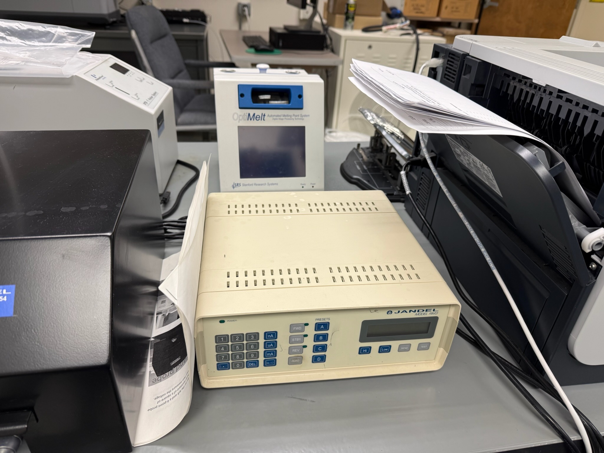

# Four-Point Probe Resistivity Measurements

**Date:** April 4th 2026
**Instrument:** Jandel RM3 Four-Point Probe

## Overview

Sheet resistance and resistivity measurements of conductive materials using the four-point probe technique. The Jandel RM3 applies a known current through the outer two probes and measures the voltage drop across the inner two, eliminating contact resistance from the measurement.

## Data

Raw measurement data in `DATA/`. See `OUTPUT/` for analysis scripts and figures.

## Methods

1. Sample placed on measurement stage
2. Four-point probe head lowered onto sample surface
3. Current applied and voltage measured across multiple points
4. Sheet resistance calculated from V/I ratio with geometric correction factors

## Results

*Analysis in progress — see `OUTPUT/` for scripts and figures.*
