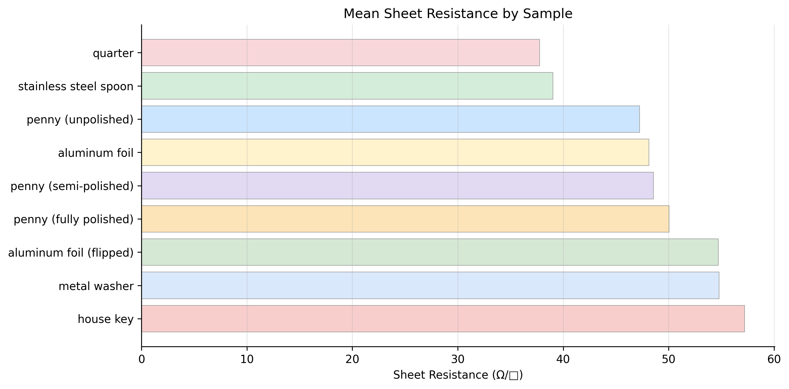

# Four-Point Probe Sheet Resistance Measurements

  
  
  
  

<button class="shuffle-btn" onclick="shufflePhotos()">Shuffle Photos</button>

April 4th 2026 Jandel RM3-AR Four-Point Probe Test Unit

## Overview

Sheet resistance is a measure of how easily electric current flows across a material's surface, reported in ohms per square (Ω/□). It characterizes conductive materials without needing to know the exact thickness.

The four-point probe technique separates the current-carrying and voltage-sensing functions into different probe pairs. The Jandel RM3 applies a known current through the outer two probes and measures the voltage drop across the inner two. Because virtually no current flows through the voltage-sensing probes, the contact resistance between each probe tip and the sample surface drops out of the measurement entirely — only the resistance of the sample itself is captured.

## Setup

| Category | Details |
|----------|---------|
| Instrument | Jandel RM3-AR Four-Point Probe Test Unit |
| Technique | Four-point probe — separate current and voltage pairs eliminate contact resistance |
| Measurement | Sheet resistance (Ω/□) |

Each sample was placed on the measurement stage, the four-point probe head lowered onto the surface, and current applied through the outer probes while voltage was measured across the inner two. Multiple points were measured per sample.

## Samples

| Category | Samples |
|----------|---------|
| Coins | quarter, penny (unpolished / semi-polished / fully polished) |
| Household metals | stainless steel spoon, aluminum foil, metal washer, house key |
| Biological | leaf |
| Other | DVD, paper cardboard |

Conductive samples (coins, household metals) produced measurable sheet resistance readings. Non-conductive samples (leaf, DVD, paper cardboard) returned Contact Limit or Out of Range at all current settings. The penny was sanded into three bands — untouched copper, lightly polished, and fully sanded to exposed zinc — to compare surface condition effects. Each sample was measured multiple times in both forward and reverse current directions.

## Data

Raw data were photographs of the instrument display taken after each measurement. These were manually transcribed into a CSV file. The raw photos are in the <a href="https://github.com/vivianweidai/research/tree/main/20260404%20Four%20Point%20Probe/PHOTOS">PHOTOS</a> directory and the CSV is in the <a href="https://github.com/vivianweidai/research/tree/main/20260404%20Four%20Point%20Probe/OUTPUT">OUTPUT</a> directory.

## Results

56 valid sheet resistance readings were collected at 9 µA. Three non-conductive samples (leaf, DVD, paper cardboard) returned Contact Limit at all current settings, and one metal washer reading was excluded due to an <a href="https://github.com/vivianweidai/research/blob/main/20260404%20Four%20Point%20Probe/PHOTOS/20260404%20Setup%2089.jpeg">incorrect current range (20 nA)</a> — the current had been changed while testing insulator samples to see if a different current could produce a detection, and was not reset before measuring the washer.

| Sample | Material | n | Mean (Ω/□) | Range |
|--------|----------|--:|------------|-------|
| Quarter | Nickel-clad copper | 2 | 37.8 | 37.6–37.9 |
| Spoon | Stainless steel | 7 | 39.0 | 36.6–41.5 |
| Penny (unpolished) | Copper-plated zinc | 3 | 47.3 | 44.5–48.9 |
| Aluminum foil | Aluminum | 5 | 48.1 | 47.6–48.7 |
| Penny (semi-polished) | Copper-plated zinc | 10 | 48.6 | 46.1–51.8 |
| Penny (fully polished) | Copper-plated zinc | 16 | 50.1 | 47.5–55.7 |
| Aluminum foil (flipped) | Aluminum | 3 | 54.7 | 52.8–56.2 |
| Metal washer | Steel | 5 | 54.8 | 53.2–56.2 |
| House key | Brass | 5 | 57.2 | 56.1–58.3 |

### Key Findings

**Conductivity ranking.** The quarter (nickel-clad copper) and stainless steel spoon were the most conductive samples, with the lowest sheet resistance. The brass house key was the least conductive metal tested. All non-metals were too resistive to measure.

**Penny surface condition.** Sanding the penny from unpolished copper through to fully exposed zinc *increased* sheet resistance — the unpolished copper surface (47.3 Ω/□) was more conductive than the fully polished zinc (50.1 Ω/□). This is consistent with copper being a better conductor than zinc, though the ranges overlap so the difference is not definitive.

**Aluminum foil orientation.** Flipping the foil upside down increased sheet resistance from 48.1 to 54.7 Ω/□ — the matte and shiny sides of aluminum foil have measurably different surface conductivity, possibly due to differences in oxide layer thickness or surface roughness from the rolling process.

### Limitations

Readings fluctuated significantly during measurement — the display value drifted continuously and never fully stabilized, even on the same sample without moving the probes. Repeated measurements of the same item produced a wide spread of values, making it difficult to draw firm quantitative conclusions. The broad ranges in the table above reflect this instability rather than true differences between measurement points.

Four-point probes are typically used on flat, uniform thin films (e.g., semiconductor wafers or sputtered coatings) where the sample makes consistent contact across all four probe tips. The irregular, curved, and oxidized surfaces of household objects likely caused inconsistent probe contact and variable current paths through the material. In standard practice, samples are also held in place with a vacuum chuck or clamp, and the probe head is lowered with controlled force to ensure repeatable contact pressure — none of which was available here. A future attempt would benefit from flat, polished samples and a stabilization period before recording each reading.

See the <a href="https://github.com/vivianweidai/research/blob/main/20260404%20Four%20Point%20Probe/OUTPUT/four_point_probe_analysis.ipynb">static notebook</a> or .

---

<a href="https://vivianweidai.com/curriculum/">Curriculum</a><a href="https://vivianweidai.com/olympiads/">Olympiads</a><a href="https://vivianweidai.com/research/">Research</a>
<a class="footer-github" href="https://github.com/vivianweidai/research/tree/main/20260404%20Four%20Point%20Probe">View on GitHub</a>

