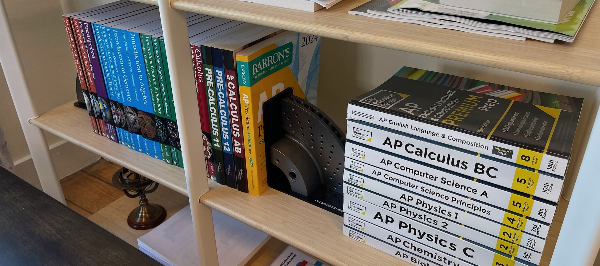

## Curriculum

  <a href="NOTES/mathematics.pdf">Mathematics</a>
  <a href="NOTES/computing.pdf">Computing</a>
  <a href="NOTES/physics.pdf">Physics</a>
  <a href="NOTES/chemistry.pdf">Chemistry</a>
  <a href="NOTES/biology.pdf">Biology</a>
  <a href="NOTES/astronomy.pdf">Astronomy</a>

## Textbooks

  <input type="radio" name="tab" id="tab-math">
  <input type="radio" name="tab" id="tab-comp">
  <input type="radio" name="tab" id="tab-phys">
  <input type="radio" name="tab" id="tab-chem">
  <input type="radio" name="tab" id="tab-bio">
  <input type="radio" name="tab" id="tab-astro">

  

    <label for="tab-math">Mathematics</label>
    <label for="tab-comp">Computing</label>
    <label for="tab-phys">Physics</label>
    <label for="tab-chem">Chemistry</label>
    <label for="tab-bio">Biology</label>
    <label for="tab-astro">Astronomy</label>
  

  

    <table>
      <tr><th>Date</th><th>Textbook</th></tr>
      <tr class="highlight"><td>December 2025</td><td>Calculus: Early Transcendentals by James Stewart</td></tr>
      <tr><td><s>May 2025</s></td><td><s>Advanced Placement Calculus BC Exam</s></td></tr>
      <tr><td><s>May 2024</s></td><td><s>Advanced Placement Precalculus Exam</s></td></tr>
      <tr class="highlight"><td>September 2023</td><td>Precalculus Mathematics in a Nutshell by George F. Simmons</td></tr>
    </table>
  

  

    <table>
      <tr><th>Date</th><th>Textbook</th></tr>
      <tr><td>May 2026</td><td>Advanced Placement Statistics Exam</td></tr>
      <tr><td><s>May 2025</s></td><td><s>Advanced Placement Statistics Exam</s></td></tr>
      <tr><td><s>May 2025</s></td><td><s>Advanced Placement Computer Science A Exam</s></td></tr>
      <tr><td><s>May 2024</s></td><td><s>Advanced Placement Computer Science A Exam</s></td></tr>
      <tr><td><s>May 2024</s></td><td><s>Advanced Placement Computer Science Principles Exam</s></td></tr>
    </table>
  

  

    <table>
      <tr><th>Date</th><th>Textbook</th></tr>
      <tr><td>May 2026</td><td>Advanced Placement Physics 2 Exam</td></tr>
      <tr><td>May 2026</td><td>Advanced Placement Physics C: Electricity and Magnetism Exam</td></tr>
      <tr><td><s>December 2025</s></td><td><s>Physics: Principles with Applications by Douglas C. Giancoli</s></td></tr>
      <tr><td><s>December 2025</s></td><td><s>Physics by Halliday, Resnick and Krane</s></td></tr>
      <tr><td><s>May 2025</s></td><td><s>Advanced Placement Physics 1 Exam</s></td></tr>
      <tr><td><s>May 2025</s></td><td><s>Advanced Placement Physics 2 Exam</s></td></tr>
      <tr><td><s>May 2025</s></td><td><s>Advanced Placement Physics C: Mechanics Exam</s></td></tr>
      <tr><td><s>May 2025</s></td><td><s>Advanced Placement Physics C: Electricity and Magnetism Exam</s></td></tr>
      <tr class="highlight"><td>May 2024</td><td>University Physics by Richard Wolfson</td></tr>
      <tr><td><s>May 2024</s></td><td><s>Advanced Placement Physics 1 Exam</s></td></tr>
      <tr><td><s>March 2024</s></td><td><s>Johns Hopkins University Center for Talented Youth AP Physics 1</s></td></tr>
    </table>
  

  

    <table>
      <tr><th>Date</th><th>Textbook</th></tr>
      <tr><td>May 2026</td><td>Advanced Placement Chemistry Exam</td></tr>
      <tr><td><s>December 2025</s></td><td><s>Chemical Principles: The Quest for Insight by Peter Atkins</s></td></tr>
      <tr><td><s>May 2025</s></td><td><s>Advanced Placement Chemistry Exam</s></td></tr>
      <tr class="highlight"><td>April 2025</td><td>Chemistry by Zumdahl and Zumdahl</td></tr>
      <tr><td><s>May 2024</s></td><td><s>Advanced Placement Chemistry Exam</s></td></tr>
      <tr><td><s>March 2024</s></td><td><s>Johns Hopkins University Center for Talented Youth AP Chemistry</s></td></tr>
    </table>
  

  

    <table>
      <tr><th>Date</th><th>Textbook</th></tr>
      <tr><td>May 2026</td><td>Advanced Placement Biology Exam</td></tr>
      <tr class="highlight"><td>May 2025</td><td>Biology: A Global Approach by Neil A. Campbell</td></tr>
      <tr><td><s>May 2025</s></td><td><s>Advanced Placement Psychology Exam</s></td></tr>
      <tr><td><s>May 2025</s></td><td><s>Advanced Placement Biology Exam</s></td></tr>
      <tr><td><s>May 2024</s></td><td><s>Advanced Placement Biology Exam</s></td></tr>
      <tr><td><s>March 2024</s></td><td><s>Johns Hopkins University Center for Talented Youth AP Biology</s></td></tr>
    </table>
  

  

    <table>
      <tr><th>Date</th><th>Textbook</th></tr>
      <tr><td><s>August 2024</s></td><td><s>Fundamental Astronomy by Hannu Karttunen et al</s></td></tr>
      <tr><td><s>July 2024</s></td><td><s>Everaise Academy: Astronomy by Je Qin Chooi and Gregory Pylypovych</s></td></tr>
      <tr><td><s>June 2024</s></td><td><s>Fundamentals of Astronomy: A Guide for Olympiads by Flavio Salvati</s></td></tr>
    </table>
  

---

<a href="/curriculum/">Curriculum</a><a href="/olympiads/">Olympiads</a><a href="/research/">Research</a>
<a class="footer-github" href="https://github.com/vivianweidai/science/tree/main/curriculum">View on GitHub</a>

