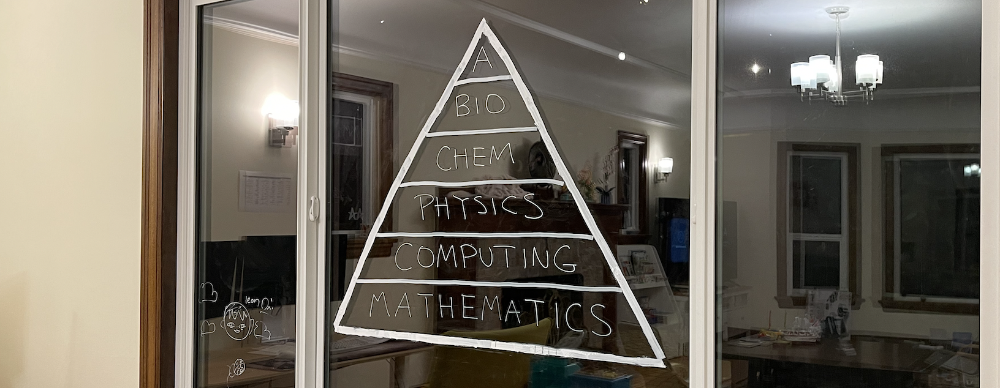

<h2>Science</h2>
<a href="/curriculum/">Curriculum</a><a href="/olympiads/">Olympiads</a><a href="/research/">Research</a>

  <a href="curriculum/archives/mathematics.pdf">Mathematics</a>
  <a href="curriculum/archives/computing.pdf">Computing</a>
  <a href="curriculum/archives/physics.pdf">Physics</a>
  <a href="curriculum/archives/chemistry.pdf">Chemistry</a>
  <a href="curriculum/archives/biology.pdf">Biology</a>
  <a href="curriculum/archives/astronomy.pdf">Astronomy</a>

---

<a href="https://apps.apple.com/app/id6762091743">AppStore</a><a href="https://orcid.org/0009-0003-0301-4061" target="_blank" rel="noopener noreferrer">ORCID</a><a href="https://github.com/vivianweidai/science">GitHub</a>

<a href="/curriculum/">Curriculum</a><a href="/olympiads/">Olympiads</a><a href="/research/">Research</a>

