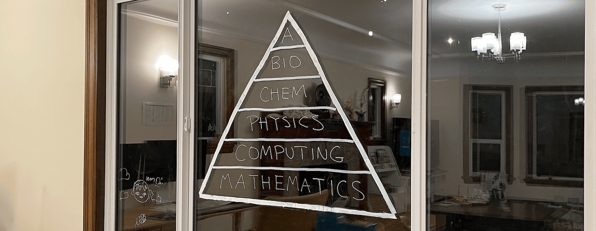
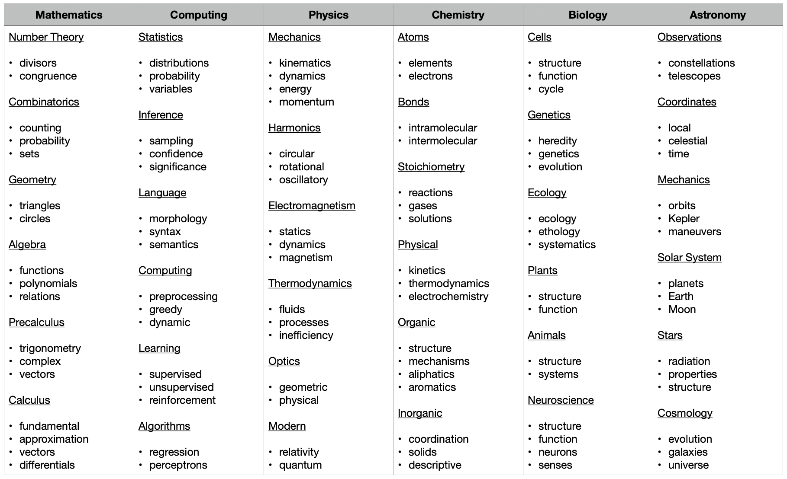

<h2>Science</h2>
<a href="/curriculum/">Curriculum</a><a href="/olympiads/">Olympiads</a><a href="/research/">Research</a>

  <a href="curriculum/archives/mathematics.pdf">Mathematics</a>
  <a href="curriculum/archives/computing.pdf">Computing</a>
  <a href="curriculum/archives/physics.pdf">Physics</a>
  <a href="curriculum/archives/chemistry.pdf">Chemistry</a>
  <a href="curriculum/archives/biology.pdf">Biology</a>
  <a href="curriculum/archives/astronomy.pdf">Astronomy</a>

---

<ul class="updates-list">
  <li>April 20th 2026 <a href="/research/projects/20260420%20UV-Vis%20Spectroscopy/">UV-Vis Spectroscopy of Everyday Fluorophores</a> Chemistry</li>
  <li>April 19th 2026 <a href="/research/projects/20260419%20IR%20Spectroscopy/">IR Spectroscopy of Everyday Materials</a> Chemistry</li>
  <li>April 11th 2026 <a href="/research/projects/20260411%20Centrifuge/">Centrifugation and pH of Everyday Liquids</a> Chemistry Biology</li>
  <li>April 5th 2026 <a href="/research/projects/20260405%20Melting%20Point/">Melting Point of Everyday Compounds</a> Chemistry</li>
  <li>April 4th 2026 <a href="/research/projects/20260404%20Four%20Point%20Probe/">Four-Point Probe Sheet Resistance Measurements</a> Physics</li>
  <li>March 31st 2026 <a href="/research/projects/20260401%20Genes%20in%20Space/">Meow to Mars — Will Space Help or Hurt Mi's Heart? </a> Biology</li>
  <li>February 25th 2025 <a href="/research/projects/20250225%20Catfood/">Red or Green, What Colored Cat Food does Mi Prefer? </a> Mathematics Computing</li>
</ul>

---

<a href="https://github.com/vivianweidai/science">GitHub</a><a href="https://orcid.org/0009-0003-0301-4061" target="_blank" rel="noopener noreferrer">ORCID</a><a href="https://apps.apple.com/app/id6762091743">AppStore</a><a class="inactive">PlayStore</a>

<a href="/curriculum/">Curriculum</a><a href="/olympiads/">Olympiads</a><a href="/research/">Research</a>

