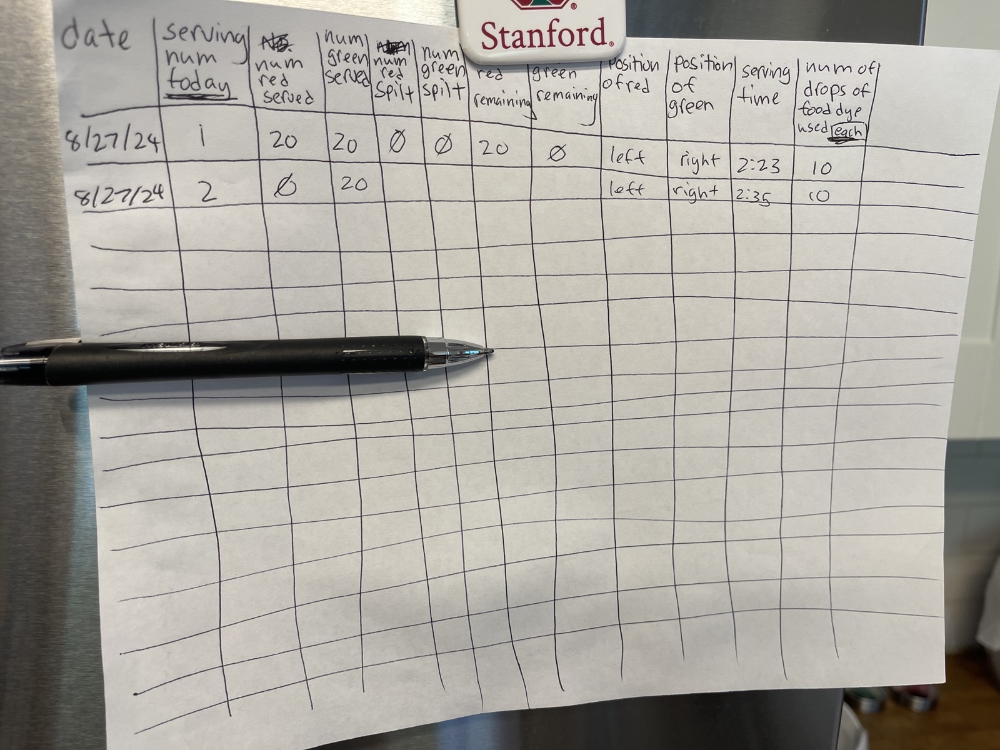
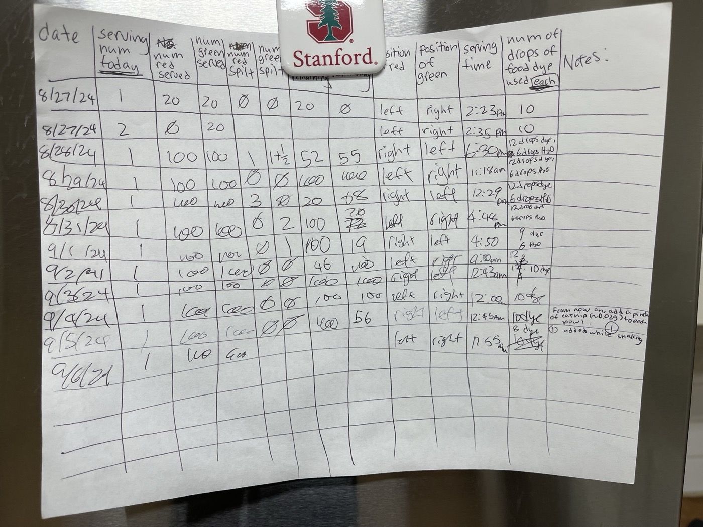
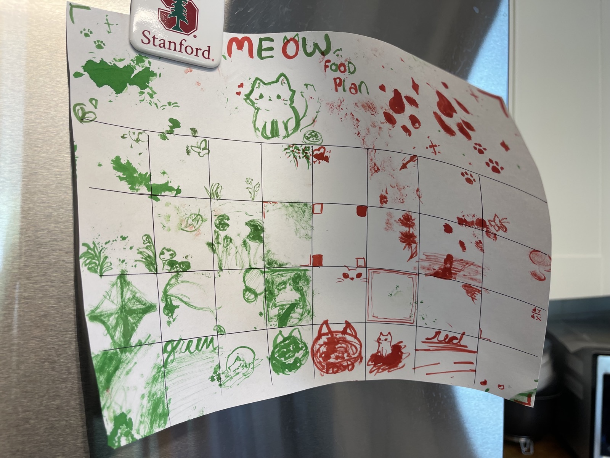

  
  
  
  

<button class="shuffle-btn" onclick="shufflePhotos()">Shuffle Photos</button>

<h2>Overview</h2>February 25th 2025

Does a cat prefer red or green colored food? This experiment tested whether a British Shorthair cat (Mi) shows a statistically significant preference for red- or green-dyed cat food. Regular dry cat food was dyed with food coloring and presented in two side-by-side bowls over 30 days. The bowl Mi approached first was recorded as his preference for that day. A chi-squared test was used to determine whether the observed preference differed significantly from chance.

## Setup

| Toolkit | Details |
|----------|---------|
| Subject | British Shorthair cat (Mi)  |
| Food | Regular dry cat food |
| Dye | Red and green food coloring |
| Serving | 10 pieces per bowl per trial |
| Duration | 30 days (August-September 2024) |

Colored cat food was prepared by mixing regular dry food with red and green food coloring in separate jars. Each day, two bowls were placed side by side — one with 10 red pieces and one with 10 green pieces. Bowl positions were alternated daily to control for side bias. The color Mi approached and began eating first was recorded as his preference. Remaining pieces, serving time, and food dye concentration were also tracked. Days where Mi did not eat from either bowl were excluded. After 30 days, a chi-squared goodness-of-fit test was applied to the observed preferences.

## Data

  
  
  

Raw data was recorded on handwritten data sheets and photographed. Variables tracked per trial include: date, serving number, pieces served and remaining, bowl position (left/right), serving time, and food dye drops used. The original handwritten data sheets are photographed and available in <a href="https://github.com/vivianweidai/science/tree/main/public/research/projects/20250225%20Catfood/photos/data" rel="noopener">photos</a>. The preference tallies were transcribed from these handwritten records into <a href="https://github.com/vivianweidai/science/blob/main/public/research/projects/20250225%20Catfood/output/catfood_summary.csv" rel="noopener">catfood_summary.csv</a>.

## Results

Over 30 days, Mi chose red on 13 days and green on 17 days. A chi-squared goodness-of-fit test with one degree of freedom yielded a test statistic of 0.533, well below the critical value of 3.841 at 95% confidence. The null hypothesis (no color preference) was not rejected. Mi shows no statistically significant preference for red or green cat food.

The chi-squared test and supporting plots are in the analysis <a href="https://github.com/vivianweidai/science/blob/main/public/research/projects/20250225%20Catfood/output/catfood_analysis.ipynb" rel="noopener">notebook</a> and are reproducible on . See also the full <a href="https://github.com/vivianweidai/science/blob/main/public/research/projects/20250225%20Catfood/output/20250225%20Catfood.pdf" rel="noopener">written report</a>.

Technology

<ul class="updates-list">
  <li class="fade-in" data-subj="math">Numerical <a href="/research/toys/mathematics/NumPy/">NumPy</a> Array foundation — linear algebra and vectorized math <a class="chip math" href="/research/#math">Mathematics</a></li>
  <li class="fade-in" data-subj="math">Graphing <a href="/research/toys/mathematics/Matplotlib/">Matplotlib</a> Python 2D and 3D plotting <a class="chip math" href="/research/#math">Mathematics</a></li>
  <li class="fade-in" data-subj="math">Typesetting <a href="/research/toys/mathematics/LaTeX/">LaTeX</a> Equations, references and bibliographies <a class="chip math" href="/research/#math">Mathematics</a></li>
  <li class="fade-in" data-subj="comp">Statistics <a href="/research/toys/computing/SciPy/">SciPy</a> Hypothesis tests, distributions and confidence intervals <a class="chip comp" href="/research/#comp">Computing</a></li>
  <li class="fade-in" data-subj="comp">Repository <a href="/research/toys/computing/GitHub/">GitHub</a> Data and source code repositories <a class="chip comp" href="/research/#comp">Computing</a></li>
  <li class="fade-in" data-subj="comp">Repository <a href="/research/toys/computing/Jupyter/">Jupyter</a> Notebooks combining code, figures and narrative <a class="chip comp" href="/research/#comp">Computing</a></li>
</ul>

