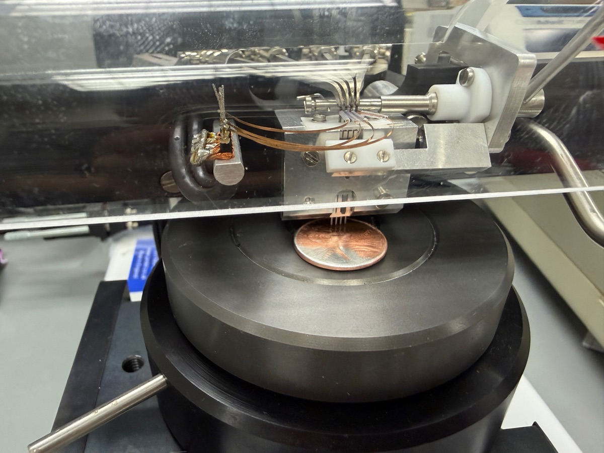

  
  
  
  

<button class="shuffle-btn" onclick="shufflePhotos()">Shuffle Photos</button>

<h2>Overview</h2>April 4th 2026

**Sheet resistance** (Ω/□) — how easily current flows across a surface, independent of thickness. The four-point probe drives current through the outer pair and senses voltage across the inner pair, cancelling contact resistance and leaving only the sample's own resistance.

| Toolkit | Details |
|---------|---------|
| Instrument | Jandel RM3 Four-Point Probe |
| Technique | Four-point probe — separate current and voltage pairs eliminate contact resistance |
| Measurement | Sheet resistance (Ω/□) |

## Setup

| Category | Items |
|----------|-------|
| Coins | quarter, penny (unpolished / semi-polished / fully polished) |
| Household metals | stainless steel spoon, aluminum foil, metal washer, house key |
| Biological | leaf |
| Other | DVD, paper cardboard |

Conductive samples gave readings; non-conductive ones returned Contact Limit or Out of Range. The penny was sanded into three bands — untouched copper, lightly polished, fully sanded to zinc — to test surface effects. Raw data were photographs of the instrument display, manually transcribed into a CSV; the raw photos are in the <a href="https://github.com/vivianweidai/science/tree/main/public/research/projects/20260404%20Four%20Point%20Probe/photos" rel="noopener">photos</a> directory and the scrubbed <a href="https://github.com/vivianweidai/science/blob/main/public/research/projects/20260404%20Four%20Point%20Probe/output/four_point_probe_readings.csv" rel="noopener">CSV</a> is in the <a href="https://github.com/vivianweidai/science/tree/main/public/research/projects/20260404%20Four%20Point%20Probe/output" rel="noopener">output</a> directory.

## Results

Fifty-six valid readings at 9 µA. Three non-conductive samples (leaf, DVD, paper cardboard) returned Contact Limit; one <a class="no-preview" href="https://vivianweidai.com/research/projects/20260404%20Four%20Point%20Probe/photos/setup/setup89.jpeg">washer reading was excluded</a> — current had been left at 20 nA after testing insulators. Quarter and spoon ranked most conductive; brass key least. Two surprises: sanding the penny from copper to zinc *increased* resistance (47.3 → 50.1 Ω/□), and flipping the aluminum foil also raised it (48.1 → 54.7 Ω/□) — matte and shiny sides differ measurably. The wide ranges reflect probe drift on irregular surfaces (four-point probes assume flat, uniform samples), not true variation — readings bounced around continuously and never really settled, even when held still on the same sample. Full per-sample plots in the analysis <a href="https://github.com/vivianweidai/science/blob/main/public/research/projects/20260404%20Four%20Point%20Probe/output/four_point_probe_analysis.ipynb" rel="noopener">notebook</a> or on .

Technology

<ul class="updates-list">
  <li data-subj="phys">Electronics <a href="/research/technology/physics/Circuits/">Circuits</a> Voltage and waveforms <a class="chip phys" href="/research/#phys">Physics</a></li>
  <li data-subj="comp">Produce <a href="/research/technology/computing/Repository/">Repository</a> Data code notebooks <a class="chip comp" href="/research/#comp">Computing</a></li>
</ul>

