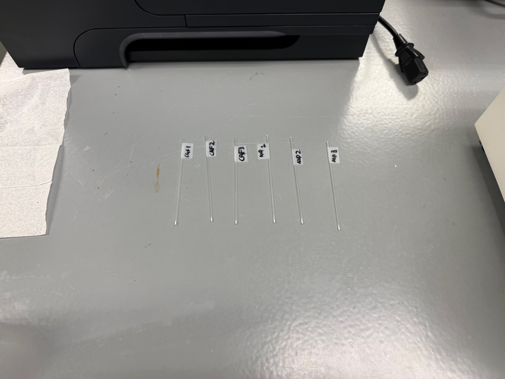

<h1>Melting Point of Everyday Compounds</h1><a class="chip chem" href="/curriculum/#chemistry">Chemistry</a>

  
  
  
  

<button class="shuffle-btn" onclick="shufflePhotos()">Shuffle Photos</button>

<h2>Overview</h2>April 5th 2026

Melting point determination is a fundamental technique for identifying and assessing the purity of solid compounds. A pure substance melts sharply at a characteristic temperature, while impurities broaden the melting range and depress the onset temperature. This experiment aimed to measure the melting points of caffeine and aspirin using the capillary tube method on the OptiMelt. Project on hold pending broken instrument.

## Setup

| Toolkit | Details |
|----------|---------|
| Instrument | OptiMelt Automated Melting Point System |
| Method | Capillary tube |
| Capillary tubes | Eisco Labs Borosilicate Glass Capillary Melting Tubes 4″ long 0.05″ OD |
| Samples | Caffeine (CAF) and aspirin (ASP) |
| Replicates | 3 capillary tubes per compound |

## Samples

Samples were ground to a fine powder and packed into glass capillary tubes (~2–3 mm fill height). Each compound was prepared in triplicate (CAF 1–3, ASP 1–3) to allow averaging and assess reproducibility. Tubes were labeled and inserted into the OptiMelt sample chamber.

## Data

No data was collected — the instrument was non-functional. If the experiment is repeated, the OptiMelt outputs a temperature-vs-time curve with onset and clear points for each capillary.

## Results

Pending instrument repair. Expected deliverables when data is available:

- Melting onset and clear point for each replicate
- Mean melting point ± standard deviation per compound
- Comparison to literature values (caffeine: 235–237 °C, aspirin: 135–136 °C)
- Temperature-time curves from the OptiMelt software

This project connects to the broader thermal analysis series — the next steps are thermogravimetric analysis (TGA) on the TA Instruments TGA Q50 and differential scanning calorimetry (DSC) on the TA Instruments DSC Q20.

<h2 id="extensions">Extensions</h2>

  
  
  
  
  
  

| Instrument | Extension | Description |
|------------|-----------|-------------|
| [TA Instruments DSC Q20](/research/archives/photos/chemistry-dsc-q20.jpg) 📷 | Energy | Heat of fusion, not just Tmelt |
| [TA Instruments DSC Q100](/research/archives/photos/chemistry-dsc-q100.jpg) 📷 | Modulation | Reversing vs non-reversing heat flow (MDSC) |
| [TA Instruments TGA Q50](/research/archives/photos/chemistry-tga-q50.jpg) 📷 | Mass | Continuous weight vs temperature |
| [TA Instruments Tzero Sample Encapsulation Press](/research/archives/photos/chemistry-tzero-press.jpg) 📷 | Prep | Seals DSC pans |
| [CEM Discover Microwave Reactor](/research/archives/photos/chemistry-cem-discover.jpg) 📷 | Synthesis | Microwave-driven elevated-T/P reactions |
| [Hughes Aircraft HRW 250B](/research/archives/photos/chemistry-hughes-welder.jpg) 📷 | Repair | Welds new thermocouple tips |

