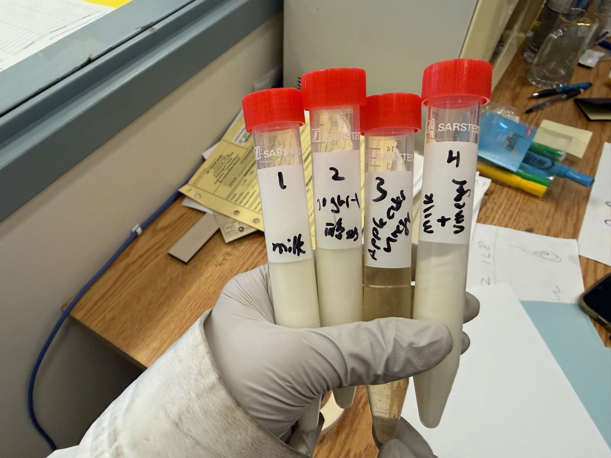

<h2>Research</h2>
<a href="/curriculum/">Curriculum</a><a href="/olympiads/">Olympiads</a><a href="/research/">Research</a>

<h1>Centrifugation and pH of Everyday Liquids</h1>Chemistry Biology

  
  
  
  

<button class="shuffle-btn" onclick="shufflePhotos()">Shuffle Photos</button>

<h2>Overview</h2>April 11th 2026

This experiment centrifuged five common household liquids to observe what separates out. We also practiced basic lab techniques of solution sample preparation with pipettes, analytical balances and pH meters.

## Setup

| Instrument | Details |
|------------|---------|
| Centrifuge | Thermo Scientific Sorvall RT3 Centrifuge |
| pH meter | VWR pHenomenal pH 1100 L, calibrated at 25 °C |
| Vortex mixer | Scientific Industries Vortex-Genie 2 |
| Mini centrifuge | DiaMed ID-Centrifuge |

| Toolkit | Details |
|---------|---------|
| Magnetic stirrer | Canlab Magnetic Stirrer |
| Balance | Sartorius CP225D Analytical Balance |
| Pipettes | Gilson Pipetman Pipettes |
| Tubes | Sarstedt 50 mL conical centrifuge tubes, Falcon 50 mL tubes |

## Samples

Five everyday liquids were loaded into labeled 50 mL centrifuge tubes. Each sample was vortexed to ensure homogeneity, then centrifuged. The pH was measured once before centrifugation by inserting the VWR electrode directly into the sample.

| Sample | Description |
|--------|-------------|
| Coke | Carbonated cola soft drink |
| Milk | Whole milk |
| Yogurt | Plain yogurt (liquid consistency) |
| Apple cider vinegar | Unfiltered apple cider vinegar |
| Vinegar | White distilled vinegar |

## Data

The pH readings were recorded from photographs of the VWR pHenomenal pH 1100 L display. A number of mystery solutions available in the lab were also measured for additional pH practice. Raw data photos are in the <a href="https://github.com/vivianweidai/science/tree/main/research/projects/20260411%20Centrifuge/photos">photos</a> directory.

| Sample | pH | Photo | Notes |
|--------|:--:|:-----:|-------|
| Yogurt | 4.335 | <a href="https://vivianweidai.com/research/projects/20260411%20Centrifuge/photos/data/data1.jpeg">Data 1</a> | Acidic — lactic acid |
| Vinegar | 2.515 | <a href="https://vivianweidai.com/research/projects/20260411%20Centrifuge/photos/data/data3.jpeg">Data 3</a> | Strongly acidic — acetic acid |
| Apple cider vinegar | 2.436 | <a href="https://vivianweidai.com/research/projects/20260411%20Centrifuge/photos/data/data4.jpeg">Data 4</a> | Acidic — acetic acid |
| Coke | 2.342 | <a href="https://vivianweidai.com/research/projects/20260411%20Centrifuge/photos/data/data5.jpeg">Data 5</a> | Strongly acidic, phosphoric/carbonic acid |
| Milk | 6.566 | <a href="https://vivianweidai.com/research/projects/20260411%20Centrifuge/photos/data/data6.jpeg">Data 6</a> | Near neutral, slightly acidic |
| Mystery solutions | 3.7–12.0 | <a href="https://vivianweidai.com/research/projects/20260411%20Centrifuge/photos/data/data7.jpeg">Data 7</a>–<a href="https://vivianweidai.com/research/projects/20260411%20Centrifuge/photos/data/data15.jpeg">Data 15</a> | Nine unknown lab solutions ranging from acidic to strongly basic |

## Results

Four samples were loaded into the Thermo Scientific Sorvall RT3 Centrifuge to balance the rotor (<a href="https://vivianweidai.com/research/projects/20260411%20Centrifuge/photos/data/data16.jpeg">Data 16</a> and <a href="https://vivianweidai.com/research/projects/20260411%20Centrifuge/photos/data/data17.jpeg">Data 17</a>). After centrifugation, visible separation was observed:

- **Tube 1 — Milk** — separated into a translucent whey layer and a white fat/casein pellet (<a href="https://vivianweidai.com/research/projects/20260411%20Centrifuge/photos/data/data24.jpeg">Data 24</a>)
- **Tube 2 — Yogurt** — similar separation to milk with a denser pellet (<a href="https://vivianweidai.com/research/projects/20260411%20Centrifuge/photos/data/data19.jpeg">Data 19</a> and <a href="https://vivianweidai.com/research/projects/20260411%20Centrifuge/photos/data/data20.jpeg">Data 20</a>)
- **Tube 3 — Apple cider vinegar** — sediment ("mother") pelleted at the bottom, leaving clearer vinegar above (<a href="https://vivianweidai.com/research/projects/20260411%20Centrifuge/photos/data/data18.jpeg">Data 18</a>)
- **Tube 4 — Milk + vinegar mixture** — white casein pellet with clear whey above, the acid curdled the milk proteins and centrifugation concentrated them at the bottom (<a href="https://vivianweidai.com/research/projects/20260411%20Centrifuge/photos/data/data21.jpeg">Data 21</a>, <a href="https://vivianweidai.com/research/projects/20260411%20Centrifuge/photos/data/data22.jpeg">Data 22</a> and <a href="https://vivianweidai.com/research/projects/20260411%20Centrifuge/photos/data/data23.jpeg">Data 23</a>)

The experiment demonstrated that centrifugation is most effective on emulsions and suspensions (milk, yogurt, unfiltered vinegar) where particles of different densities are physically mixed but not dissolved.
