
<h2>Research</h2>
<a href="/curriculum/">Curriculum</a><a href="/olympiads/">Olympiads</a><a href="/research/">Research</a>

<h1>IR Spectroscopy of Everyday Materials</h1>Chemistry

  
  
  
  

<button class="shuffle-btn" onclick="shufflePhotos()">Shuffle Photos</button>

<h2>Overview</h2>April 19th 2026

Twenty-one everyday materials, one instrument, one question: which bonds are in there?

IR Spectroscopy identifies the polar covalent bonds in a material by measuring which infrared frequencies it absorbs. Different functional groups — O-H, C=O, C-H, N-H — vibrate at characteristic frequencies, producing a unique absorption fingerprint for each compound.

## Setup

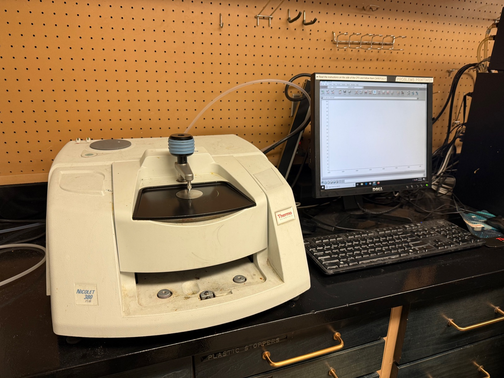

| Instrument | Role | Range |
|------------|------|-------|
| Thermo Scientific Nicolet 380 FT-IR Spectrometer | Bulk samples | ~550–4000 cm⁻¹ |

| Toolkit | Details |
|---------|---------|
| Mode | Attenuated Total Reflectance (ATR) — sample pressed onto the diamond crystal |
| Samples | 21 — solvents, food/minerals, personal care, polymers, paper, biological, control |
| Software | Thermo Scientific OMNIC 8 |

A background spectrum was collected first. The IR beam reflects inside the diamond crystal, an evanescent wave penetrating microns into the pressed sample — no prep, measure as-is.

## Samples

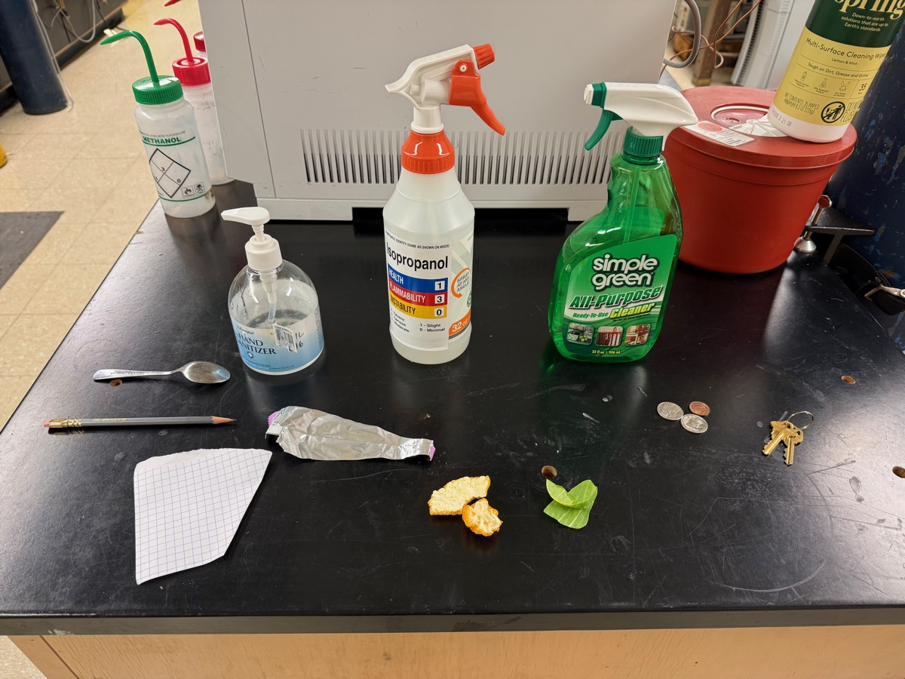

| Category | Samples |
|----------|---------|
| Solvents | acetone, isopropanol, water |
| Food/minerals | coffee, salt, sugar |
| Personal care | soap, shampoo, conditioner, lotion, sunscreen, cleaner |
| Polymers | plastic bag, plastic cap, plastic glove, plastic wrapper |
| Paper | paper, paper-plastic cup |
| Biological | finger, leaf, orange peel |
| Control | background |

## Method

The Nicolet 380 applies background correction automatically — non-absorbing regions read ~100% transmittance. Raw spectra export to <a href="https://github.com/vivianweidai/science/tree/main/public/research/projects/20260419%20IR%20Spectroscopy/data" rel="noopener">CSV</a>, two columns per row (wavenumber in cm⁻¹, transmittance in %). The data-cleaning <a href="https://github.com/vivianweidai/science/blob/main/public/research/projects/20260419%20IR%20Spectroscopy/output/clean_data.py" rel="noopener">pipeline</a>:

1. **Parse** — raw CSVs use scientific notation with no headers; each file was parsed into numeric wavenumber and transmittance columns.
2. **Convert to absorbance** — transmittance was converted using A = −log₁₀(T/100), where T is transmittance in percent. Absorbance is dimensionless and directly proportional to concentration via the Beer-Lambert law.
3. **Export** — all 21 samples were saved as individual cleaned CSVs with headers (wavenumber, transmittance, absorbance) into a single <a href="https://github.com/vivianweidai/science/tree/main/public/research/projects/20260419%20IR%20Spectroscopy/output/scrubbed" rel="noopener">scrubbed</a> folder.

All spectra plots, peak identification, and category overlays were generated from the cleaned data using Python libraries in the analysis <a href="https://github.com/vivianweidai/science/blob/main/public/research/projects/20260419%20IR%20Spectroscopy/output/ir_analysis.ipynb" rel="noopener">notebook</a> and are reproducible on .

## Results

### Representative Samples

  <input type="radio" name="spec-tab" id="tab-acetone">
  <input type="radio" name="spec-tab" id="tab-water">
  <input type="radio" name="spec-tab" id="tab-salt">
  <input type="radio" name="spec-tab" id="tab-plastic">
  <input type="radio" name="spec-tab" id="tab-sugar">

  

    <label for="tab-acetone">Acetone</label>
    <label for="tab-water">Water</label>
    <label for="tab-salt">Salt</label>
    <label for="tab-plastic">Plastic Bag</label>
    <label for="tab-sugar">Sugar</label>
  

  

    
    
The textbook ketone: sharp C=O at ~1,715 cm⁻¹ dominates. Methyl C–H stretches at 2,950–3,000 cm⁻¹, CH₃ bending at 1,350–1,450 cm⁻¹, C–O/C–C skeletal peaks at 1,000–1,300 cm⁻¹. No broad O–H — confirms anhydrous.

  

  

    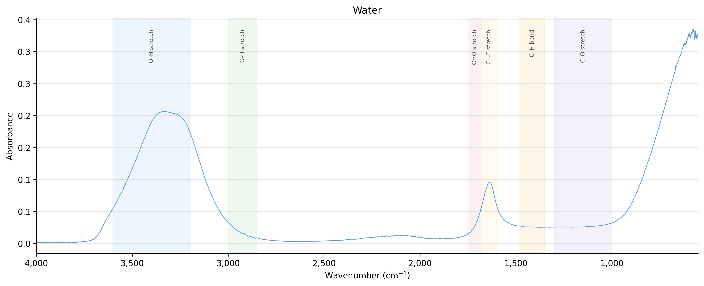
    
One giant O–H feature: the broad 3,000–3,600 cm⁻¹ hydrogen-bonded stretch centered at ~3,300 cm⁻¹. Sharp O–H bend at ~1,640 cm⁻¹; strong librational (rocking) absorption rising below 1,000 cm⁻¹.

  

  

    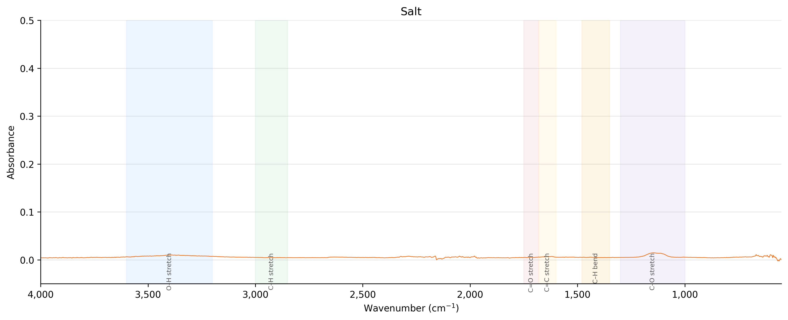
    
The null case. NaCl is purely ionic — no covalent bonds, no IR-active vibrations, no peaks. The tiny features are surface moisture and atmospheric CO₂. Exactly why NaCl is the classical IR-window material.

  

  

    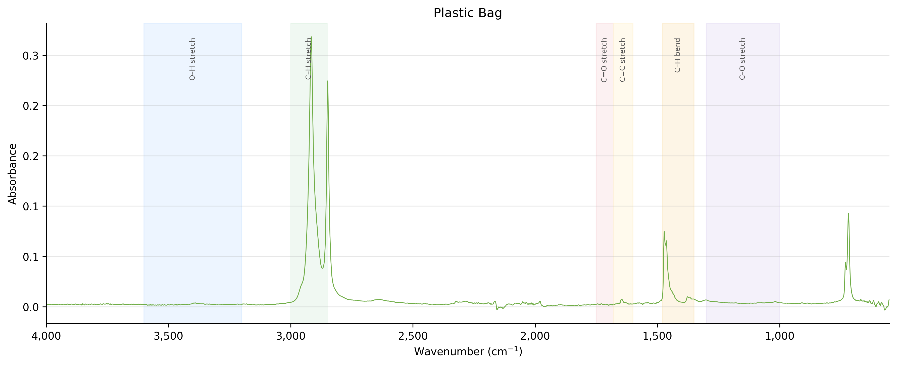
    
Pure hydrocarbon. Polyethylene's CH₂ backbone gives a sharp doublet at ~2,920/2,850 cm⁻¹ (asym/sym stretches), bending at ~1,460 cm⁻¹ (scissor) and ~720 cm⁻¹ (rock). No heteroatom peaks — only C and H.

  

  

    
    
Hydroxyl-dense. Sucrose's many –OH groups give a broad 3,000–3,500 cm⁻¹ O–H band, and the fingerprint region below 1,500 cm⁻¹ is packed with glycosidic-bond and ring C–O stretches unique to each sugar.

  

### Household Categories

  <input type="radio" name="cat-tab" id="cat-solvents">
  <input type="radio" name="cat-tab" id="cat-food">
  <input type="radio" name="cat-tab" id="cat-personal">
  <input type="radio" name="cat-tab" id="cat-polymers">
  <input type="radio" name="cat-tab" id="cat-paper">
  <input type="radio" name="cat-tab" id="cat-biological">

  

    <label for="cat-solvents">Solvents</label>
    <label for="cat-food">Food / Minerals</label>
    <label for="cat-personal">Personal Care</label>
    <label for="cat-polymers">Polymers</label>
    <label for="cat-paper">Paper</label>
    <label for="cat-biological">Biological</label>
  

  

    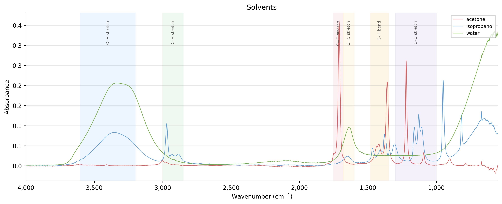
    
Three solvents, three bonding regimes. <strong>Water</strong> — broad O–H at ~3,300 cm⁻¹, sharp bend at 1,640 cm⁻¹. <strong>Isopropanol</strong> — O–H + C–H at ~2,950 + C–O at 1,000–1,150 cm⁻¹. <strong>Acetone</strong> — sharp ketone C=O at 1,715 cm⁻¹, no O–H.

  

  

    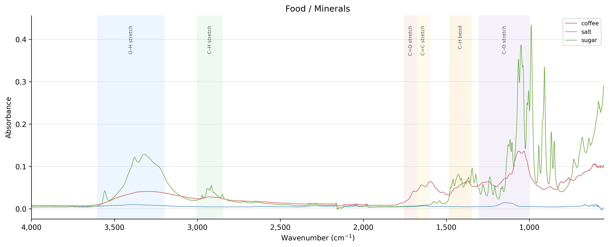
    
<strong>Coffee</strong> — broad O–H + C=O/C–O from caffeine, chlorogenic acids, lipids. <strong>Sugar</strong> — broad O–H from many –OH groups; dense glycosidic C–O fingerprint below 1,500 cm⁻¹. <strong>Salt</strong> — the outlier, purely ionic, flat baseline.

  

  

    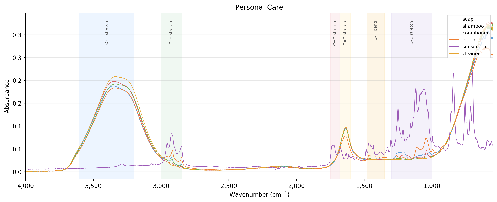
    
Shared base: broad O–H/N–H at 3,000–3,500 cm⁻¹ (water, glycerin, fatty alcohols) + C–H at 2,920/2,850 cm⁻¹ (fatty acids, surfactants). <strong>Shampoo/conditioner/lotion</strong> cluster — same water-surfactant backbone. <strong>Soap/cleaner</strong> — sharper C–H, stronger fingerprint. <strong>Sunscreen</strong> — adds C=O from UV filters.

  

  

    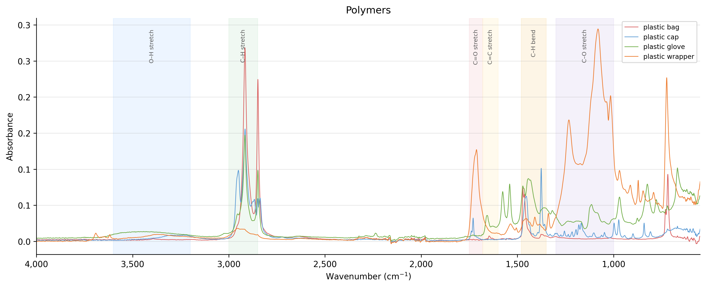
    
Not all polymers are alike. <strong>Plastic bag + wrapper</strong> — polyethylene, pure CH₂ doublet at 2,920/2,850 cm⁻¹. <strong>Plastic cap</strong> — polypropylene, adds a methyl shoulder and extra bending peaks. <strong>Plastic glove</strong> — nitrile/vinyl outlier with C=O, C–O, possibly C≡N; heteroatom functional groups.

  

  

    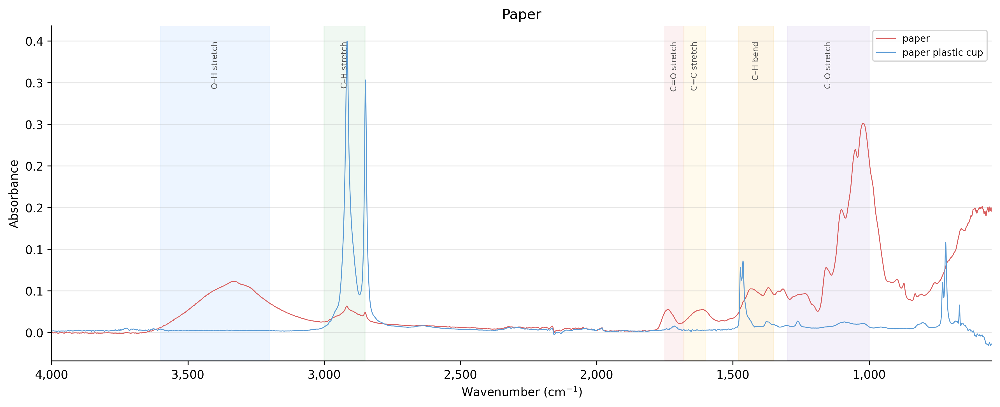
    
<strong>Paper</strong> — pure cellulose: broad O–H at 3,000–3,500 cm⁻¹ + strong C–O at 1,000–1,150 cm⁻¹ (glycosidic linkages). <strong>Paper-plastic cup</strong> — same cellulose base with PE C–H stretches layered on top, exposing the lining.

  

  

    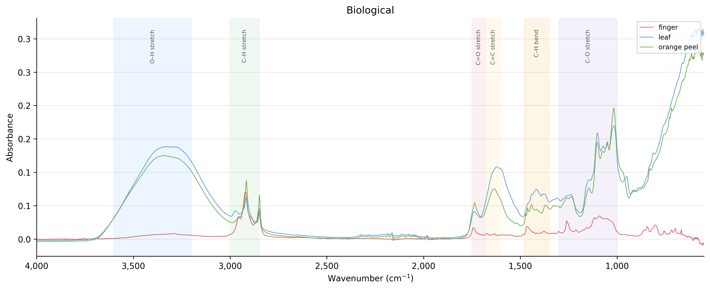
    
Chemically rich. <strong>Finger</strong> — keratin amide I (1,640) + amide II (1,540 cm⁻¹), plus lipid C–H and broad O–H/N–H. <strong>Leaf</strong> — cellulose backbone + cuticle-wax C–H + possible chlorophyll. <strong>Orange peel</strong> — terpene-heavy: C–H, C=O from citric acid/esters, C–O from pectin and rind sugars.

  

### Chemical Categories

  <input type="radio" name="chem-tab" id="chem-oh">
  <input type="radio" name="chem-tab" id="chem-ch">
  <input type="radio" name="chem-tab" id="chem-co">
  <input type="radio" name="chem-tab" id="chem-mixed">
  <input type="radio" name="chem-tab" id="chem-cellulose">
  <input type="radio" name="chem-tab" id="chem-protein">
  <input type="radio" name="chem-tab" id="chem-ionic">

  

    <label for="chem-oh">O–H Dominant</label>
    <label for="chem-ch">C–H Dominant</label>
    <label for="chem-co">Carbonyl</label>
    <label for="chem-mixed">Organic</label>
    <label for="chem-cellulose">Cellulose</label>
    <label for="chem-protein">Protein</label>
    <label for="chem-ionic">Ionic</label>
  

  

    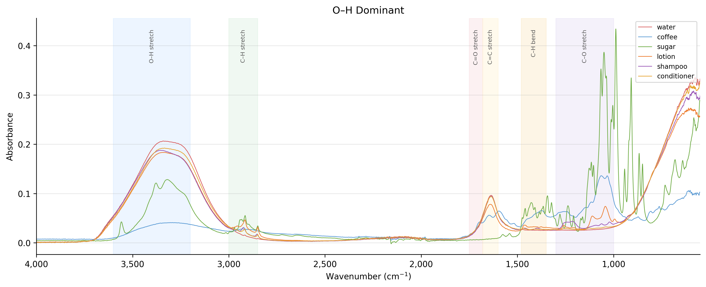
    
<strong>Water, coffee, sugar, lotion, shampoo, conditioner</strong> — broad 3,200–3,600 cm⁻¹ O–H is the loudest signal, whether from liquid water, dissolved sugars, or cosmetic glycerin. Fingerprint regions diverge (sugar/coffee rich in C–O; personal care smoother), but the O–H signature ties them.

  

  

    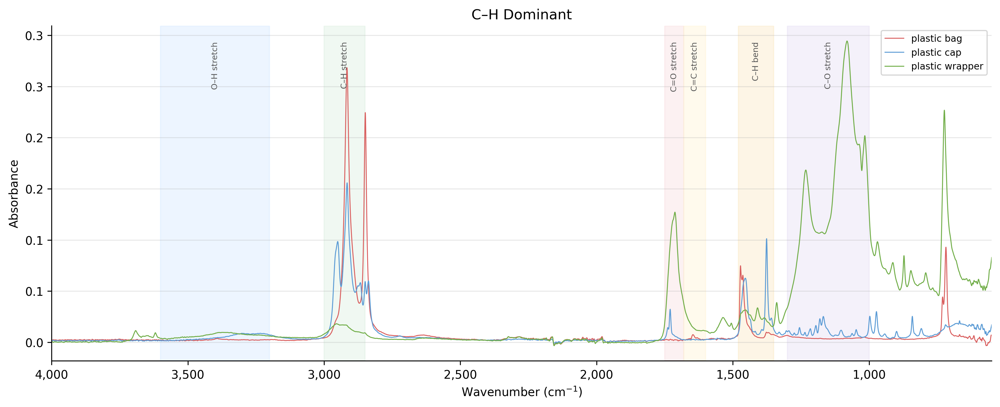
    
<strong>Plastic bag, cap, wrapper</strong> — polyolefins, nearly pure hydrocarbon. Sharp 2,920/2,850 cm⁻¹ doublet + 1,460 cm⁻¹ bending are almost the whole spectrum; the PE/PP backbone carries no heteroatoms, so spectra overlap tightly.

  

  

    
    
<strong>Acetone, sunscreen</strong> — C=O at ~1,715 cm⁻¹ defines both. Acetone's is the ketone carbonyl; sunscreen's comes from ester/ketone groups in UV filters (avobenzone, octinoxate). Different products, same dominant peak.

  

  

    
    
<strong>Isopropanol, soap, cleaner, orange peel</strong> — no single peak wins. Isopropanol balances O–H + C–H + C–O. Soap/cleaner — fatty acid salts, C–H chains + carboxylate. Orange peel — natural terpene/citric-acid/pectin mixture, busy across every region.

  

  

    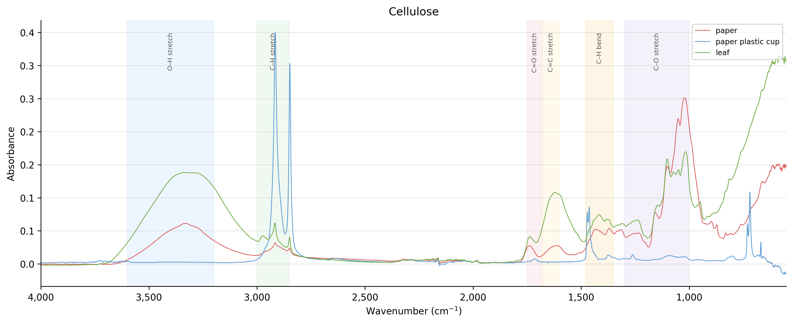
    
<strong>Paper, paper-plastic cup, leaf</strong> — shared cellulose backbone: broad O–H + glycosidic C–O at 1,000–1,150 cm⁻¹. Cup layers PE C–H on top; leaf layers cuticle wax. The cellulose frame stays legible through both.

  

  

    
    
<strong>Finger, plastic glove</strong> — unlikely pair, same bands. Skin keratin gives textbook amide I (1,640) + amide II (1,540 cm⁻¹); the glove's nitrile/vinyl polymer produces amide-like absorptions from its own N–H/C=O. Both break the hydrocarbon/hydroxyl mold.

  

  

    
    
<strong>Salt</strong> — NaCl has no covalent bonds, so no IR-active vibrations, so a flat baseline. The only sample with no molecular signature — and the reason NaCl has historically made IR-transparent windows and pellets.

  

<h2 id="extensions">Extensions</h2>

  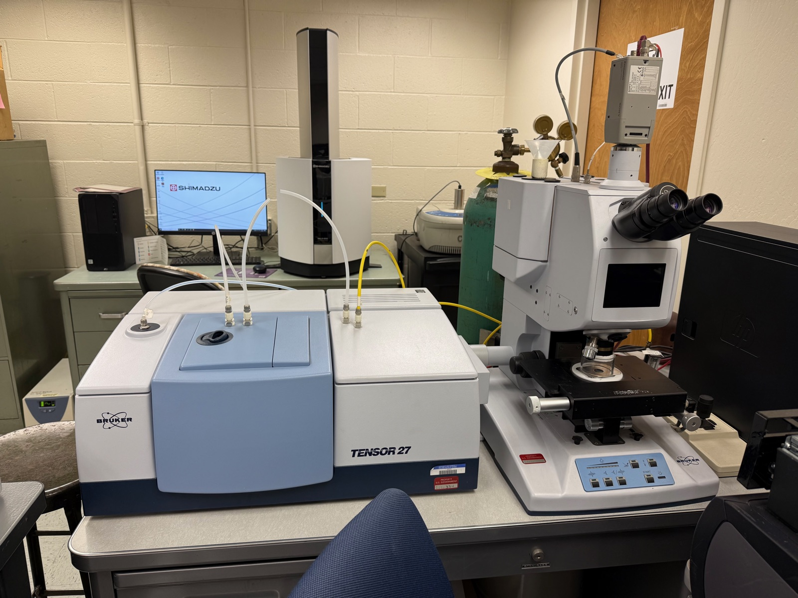
  
  

| Instrument | Extension | Description |
|------------|------|-------------|
| [Bruker Tensor 27 Hyperion FT-IR Microscope](photos/setup/setup14.jpeg) 📷 | Space | Scan IR spectrum at microscopic spot |
| [Mettler Toledo ReactIR iC10](photos/setup/setup9.jpeg) 📷 | Time | Produce IR spectrum as reaction proceeds |
| [Renishaw inVia Raman Microscope](photos/setup/setup13.jpeg) 📷 | Chemistry | Detect non-polar bonds |

