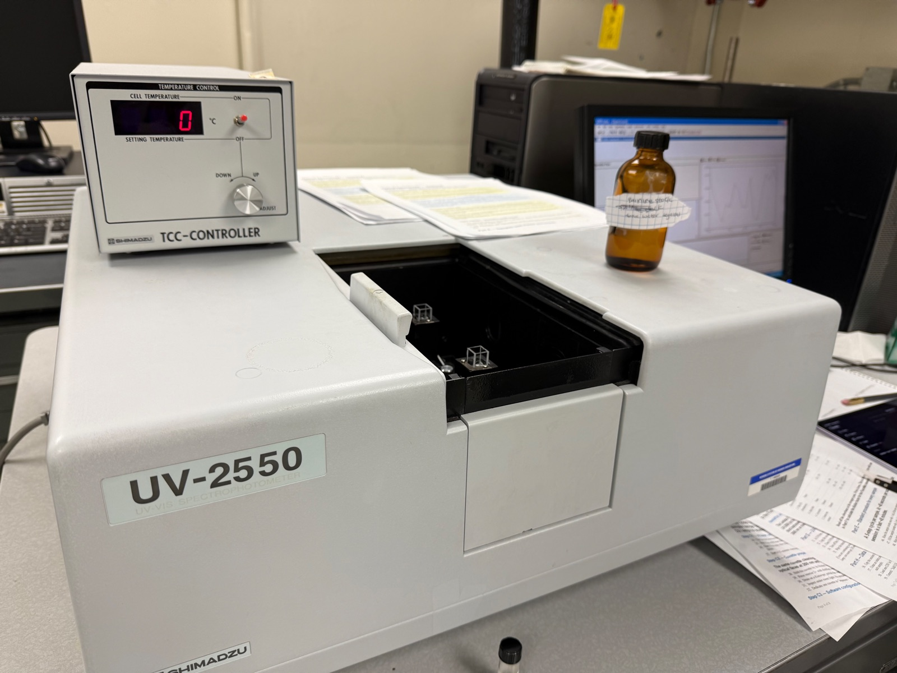
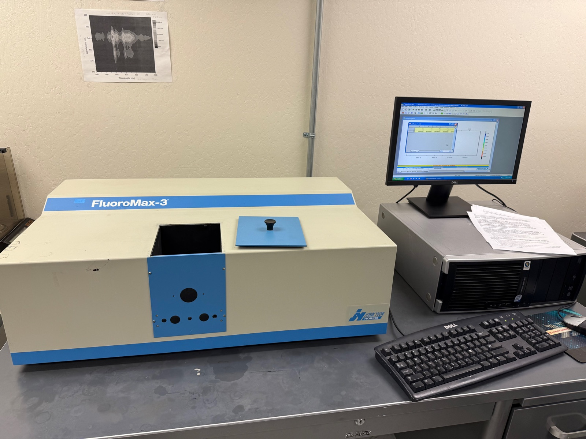
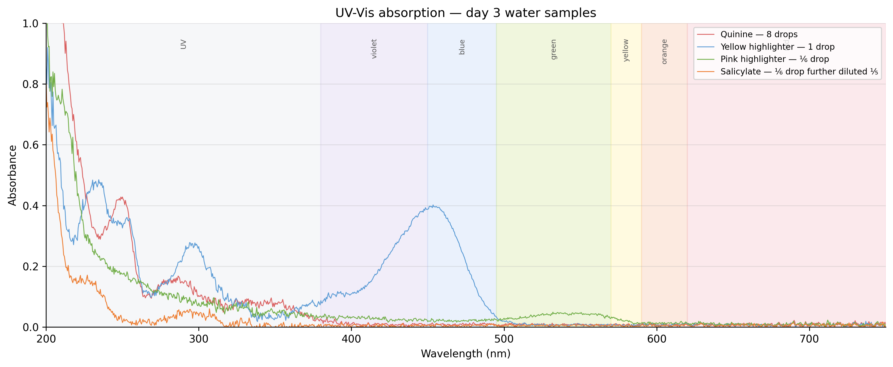
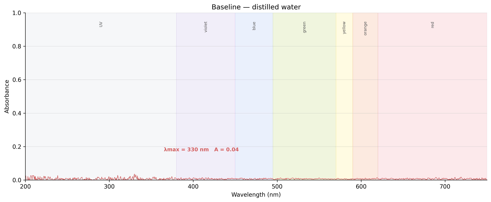
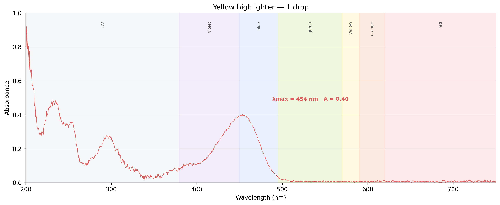
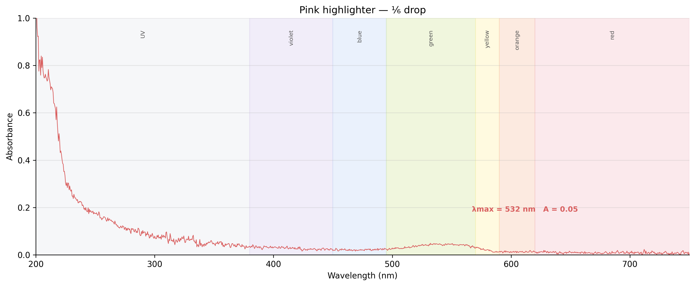
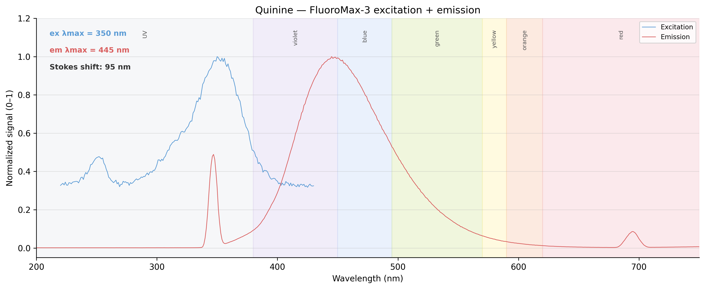
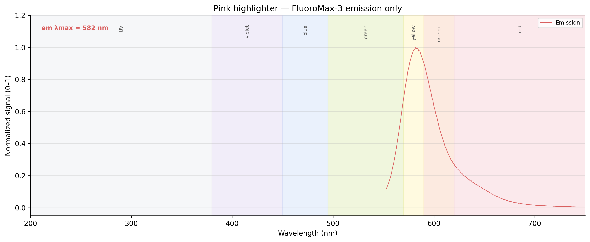
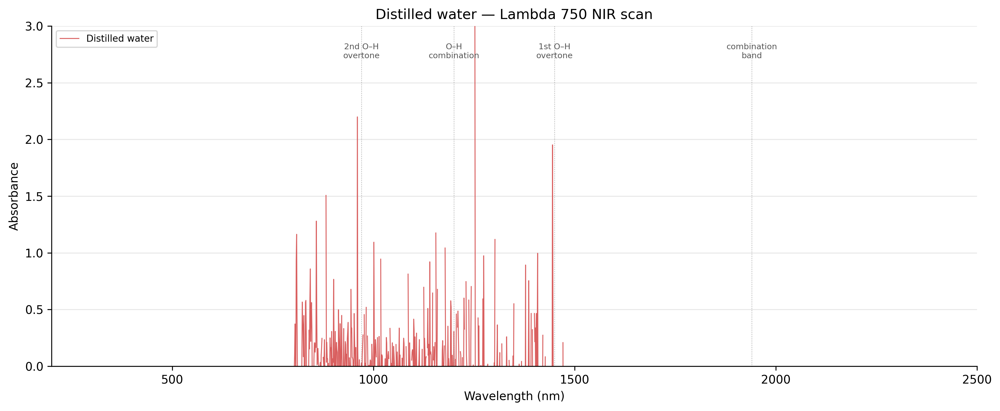
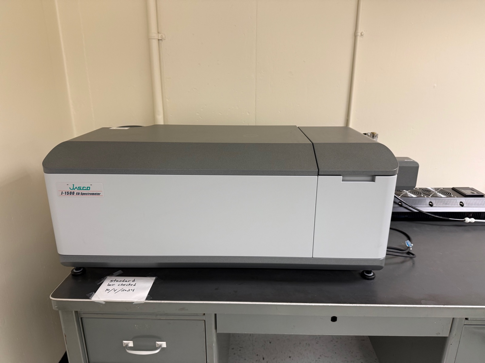

<h1>UV-Vis Spectroscopy of Everyday Fluorophores</h1><a class="chip chem" href="/curriculum/#chemistry">Chemistry</a>

  
  
  
  

<button class="shuffle-btn" onclick="shufflePhotos()">Shuffle Photos</button>

<h2>Overview</h2>April 20th 2026

One set of samples through two instruments:

- **UV-2550** — which colors of light the compound swallows, and how greedily.
- **FluoroMax-3** — which colors come back out again driven by which absorption.

The samples are all **fluorophores**: molecules that catch a photon and release a longer-wavelength one. The gap between the two peaks is the **Stokes shift** — the return photon is never quite the one that went in. Everyday sources stand in for lab references: quinine from tonic water, fluorescein and rhodamine dyes from highlighter ink, curcumin from turmeric, chlorophyll from green tea, salicylate from aspirin.

## Setup

  
  

| Instrument | Role | Range |
|------------|------|-------|
| Shimadzu UV-2550 UV/Vis Spectrophotometer | Absorption (λmax) | 200–800 nm |
| Horiba Jobin Yvon FluoroMax-3 Spectrofluorometer | Fluorescence (emission and excitation) | 200–800 nm |

| Toolkit | Details |
|----------|---------|
| Cuvettes | Fluorescence-grade 10 mm quartz with four clear sides |
| Software | UVProbe (Shimadzu), FluorEssence (Horiba) |
| Blanks | Distilled water (aqueous samples), 95% ethanol (ethanol samples) |

Cuvette protocol (same on every instrument): 3× distilled water, 1× ethanol, 1× water, Kimwipe polish each optical face, gripped only at the top rim with ceramic tweezers. Each sample pre-rinses its cuvette with itself before the keeper fill.

## Samples

Six fluorophores plus two blanks, split by solvent. The grouping is also the scan order: four water samples first against a water baseline, then re-baseline and run the two ethanol extracts. Each sample is prepared from an everyday source: quinine from de-gassed tonic water, fluorescein- and rhodamine-family dyes from highlighter ink reservoirs, curcumin and chlorophyll from turmeric and green tea extracted into ethanol, salicylate from aspirin hydrolyzed with a pinch of baking soda.

  <input type="radio" name="samples-tab" id="s-water" checked>
  <input type="radio" name="samples-tab" id="s-ethanol">

  

    <label for="s-water">Water-based</label>
    <label for="s-ethanol">Ethanol-based</label>
  

  

| Category | Sample |
|----------|--------|
| Antimalarial | quinine (tonic water, degassed) |
| Fluorescent dye | yellow highlighter (fluorescein-family) |
| Fluorescent dye | pink highlighter (rhodamine-family) |
| Pharmaceutical | salicylate (aspirin + NaHCO₃) |
| Blank | distilled water |

  

  

| Category | Sample |
|----------|--------|
| Natural pigment | curcumin (turmeric + ethanol) |
| Natural pigment | green tea extract (tea leaves + ethanol) |
| Blank | 95% ethanol |

  

## Method

The UV-2550 scan yields λmax (peak wavelength) and A (peak absorbance). Both feed the FluoroMax: λmax sets λex, and A sets the dilution factor D = A / 0.05 — the FluoroMax needs samples diluted to A ≈ 0.05 to avoid inner-filter effects.

  <input type="radio" name="methods-tab" id="m-uv" checked>
  <input type="radio" name="methods-tab" id="m-flu">

  

    <label for="m-uv">UV-2550UV-2550</label>
    <label for="m-flu">FluoroMax-3FluoroMax</label>
  

  

| # | Sample | Final Solute |
|---|--------|----------|
| 1 | *baseline — distilled water* | — |
| 2 | blank (distilled water) — confirm ~0 A | — |
| 3 | quinine | 8 drops |
| 4 | yellow HL | 1 drop |
| 5 | pink HL | ⅙ drop |
| 6 | salicylate | ⅕ of ⅙ drop |
| 7 | *re-baseline — 95% ethanol* | — |
| 8 | blank (95% ethanol) — confirm ~0 A | — |
| 9 | curcumin | upcoming |
| 10 | green tea | upcoming |

One absorption scan per sample across 200–800 nm. Every baseline is immediately followed by the solvent blank rescanned as a sample — it should return flat near zero, confirming the baseline held. Most stocks need heavy dilution to land in the 0.3–0.8 A sweet spot: each sample started at 1 drop of stock in 3 mL of solvent, then was diluted or concentrated iteratively until the peak fell in range.

  

  

| # | Sample | Expected λex | Expected λem |
|---|--------|------|------|
| 1 | quinine | 350 | 450 |
| 2 | yellow HL | 488 | 515 |
| 3 | pink HL | 540 | 585 |
| 4 | salicylate | 300 | 410 |
| 5 | curcumin | 425 | 540 |
| 6 | green tea | 430 | 670 |

Each sample goes straight from the UV-2550 into the FluoroMax using the final in-range aliquot diluted to D = A / 0.05 (add D drops of solvent per drop of sample). Two scans per sample: emission fixes λex (from the UV-2550 λmax) and sweeps λem; excitation fixes λem and sweeps λex. An Excitation–Emission Matrix (EEM) scan is planned for **green tea extract** to produce a 2D contour map.

  

## Data

| Instrument | Files | Coverage |
|------------|-------|----------|
| UV-2550 | 19 `.txt` | baseline, quinine (10), yellow HL (3), pink HL (2), salicylate (3) |
| FluoroMax-3 | 7 `.csv` + 7 `.pdf` | quinine, yellow HL, salicylate — emission + excitation; pink HL — emission only |
| Lambda 750 | 2 `.csv` | exploratory — water sample + baseline |

Water-solvent samples only this session — ethanol block (curcumin, green tea) deferred to a later run. Raw files live under <a href="https://github.com/vivianweidai/science/tree/main/public/research/projects/20260420%20UV-Vis%20Spectroscopy/data" rel="noopener">data</a>. Iterative-dilution filenames preserve the full convergence sequence for each sample in the attempt to land in the 0.3–0.8 A sweet spot. The PDF files retain the machine settings used for the scans.

All UV-Vis, fluorescence, and Lambda 750 plots were generated from the raw data using Python libraries in the analysis <a href="https://github.com/vivianweidai/science/blob/main/public/research/projects/20260420%20UV-Vis%20Spectroscopy/output/uv_spectroscopy.ipynb" rel="noopener">notebook</a> and are reproducible on .

## Results

### UV-Vis Absorption - UV-2550

  <input type="radio" name="uv-tab" id="uv-overlay" checked>
  <input type="radio" name="uv-tab" id="uv-baseline">
  <input type="radio" name="uv-tab" id="uv-quinine">
  <input type="radio" name="uv-tab" id="uv-yellow">
  <input type="radio" name="uv-tab" id="uv-pink">
  <input type="radio" name="uv-tab" id="uv-salicylate">

  

    <label for="uv-overlay">Overlay</label>
    <label for="uv-baseline">Baseline</label>
    <label for="uv-quinine">Quinine</label>
    <label for="uv-yellow">Yellow HL</label>
    <label for="uv-pink">Pink HL</label>
    <label for="uv-salicylate">Salicylate</label>
  

  

    
    
Four fluorophores on one axis. <strong>Yellow HL</strong> is the only sample that landed in the 0.3–0.8 A sweet spot (A = 0.40 at 454 nm). Quinine, pink, and salicylate all over-diluted below A = 0.1 — the iterative protocol overshot three times out of four.

  

  

    
    
Distilled water against a water baseline — flat near zero across 200–800 nm. Confirms clean background subtraction before samples loaded. Water's O–H overtones don't appear until the NIR (see Lambda 750 below).

  

  

    
    
<strong>Quinoline π→π* at 347 nm</strong> — the bicyclic nitrogen-heterocycle that makes tonic water glow under UV (see FluoroMax tab). A = 0.10 after 9 dilution iterations: over-diluted, below the 0.3–0.8 target.

  

  

    
    
<strong>Fluorescein-family dye — xanthene ring absorbs in the blue at 454 nm</strong>, ink appears yellow (the complement). A = 0.40 landed cleanly on the first try. Textbook fluorescein λmax is 488 nm; the 34 nm blue-shift here marks this as a fluorescein variant, not pure sodium fluorescein.

  

  

    
    
<strong>Rhodamine-family dye — dialkyl-amino groups on the xanthene ring shift absorption to 532 nm</strong> (green), ink appears pink (the complement). A = 0.05: over-diluted at ⅙ drop, barely above noise. Rhodamines are the brighter, more photostable sibling to fluoresceins — the workhorse dye for single-molecule fluorescence.

  

  

    
    
Salicylate anion, freed from aspirin by NaHCO₃. <strong>Hydroxybenzoate π→π* at 307 nm</strong> — UV only, so aspirin solutions look colorless. A = 0.06 at ⅕ of ⅙ drop; the ⅙ alone saturated at A ≈ 5, the ⅕ dilution over-corrected.

  

### Fluorescence - FluoroMax-3

  <input type="radio" name="flu-tab" id="flu-quinine" checked>
  <input type="radio" name="flu-tab" id="flu-yellow">
  <input type="radio" name="flu-tab" id="flu-pink">
  <input type="radio" name="flu-tab" id="flu-salicylate">

  

    <label for="flu-quinine">Quinine</label>
    <label for="flu-yellow">Yellow HL</label>
    <label for="flu-pink">Pink HL</label>
    <label for="flu-salicylate">Salicylate</label>
  

  

    
    
Textbook quinine fluorescence. λex = <strong>350 nm</strong> (matches UV-2550 and prediction), λem = <strong>445 nm</strong>, Stokes shift <strong>95 nm</strong> — typical for a rigid quinoline framework. The blue glow you see when tonic water sits under a UV lamp.

  

  

    
    
λex = <strong>403 nm</strong>, λem = <strong>512 nm</strong>, Stokes shift <strong>109 nm</strong> — much larger than pure fluorescein's ~30 nm, confirming a perturbed xanthene variant. Spikes around 450–500 nm are Rayleigh scatter from the excitation beam bleeding into the detector.

  

  

    
    
<strong>Emission only</strong> — excitation scan not collected (plan next session). λem = <strong>582 nm</strong> near the 585 prediction; orange-red rhodamine glow. Broad tail toward longer wavelengths may indicate dimer formation — rhodamines self-quench above ~10 μM.

  

  

    
    
<strong>ESIPT in action.</strong> λex = 301, λem = 409 (both match predictions). Stokes shift <strong>108 nm</strong> — unusually large for a small aromatic. The fingerprint of excited-state intramolecular proton transfer: the excited state shuffles a proton from the ortho-OH to the carboxylate before emitting.

  

### Solvent NIR - Lambda 750

Brief exploratory scan of distilled water — one pass on the PerkinElmer Lambda 750 (200–2500 nm), kept for reference. Not revisited. The 10 mm cuvette saturated the detector across most of the NIR, but you can still pick out where water's **O–H overtone bands** sit: the clustered absorption spikes line up with the expected 970 nm (2nd overtone), 1200 nm (combination), and 1450 nm (1st overtone). Beyond ~1500 nm the detector is fully pinned.

<h2 id="extensions">Extensions</h2>

  
  

| Instrument | Extension | Description |
|------------|-----------|-------------|
| [PerkinElmer Lambda 750 UV/Vis/NIR Spectrophotometer](photos/setup/setup12.jpeg) 📷 | Range | More definition and extend into near-infrared (200–2500 nm) for solvent overtones |
| [Jasco J-1500 CD Spectrometer](photos/setup/setup18.jpeg) 📷 | Chirality | Detect chiral molecules and protein secondary structure |

