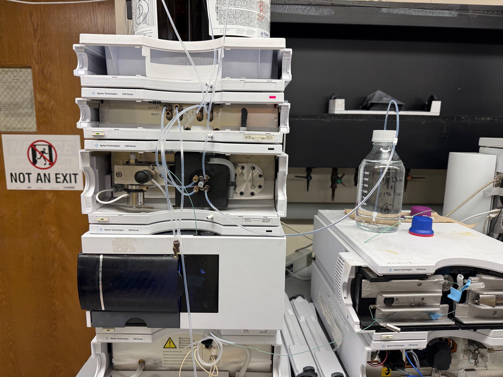
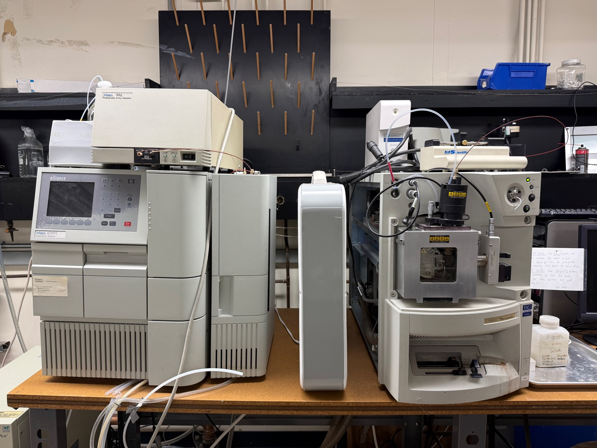
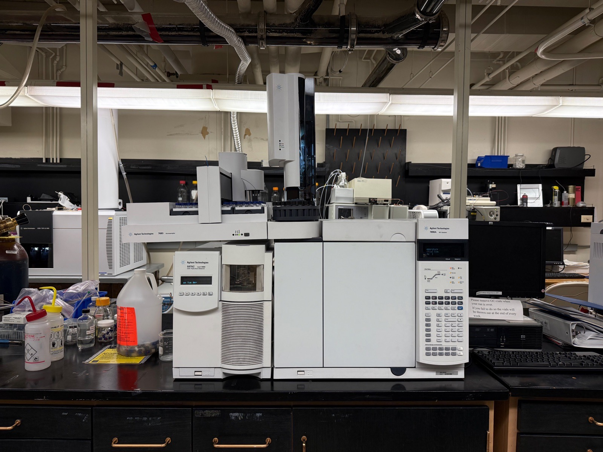
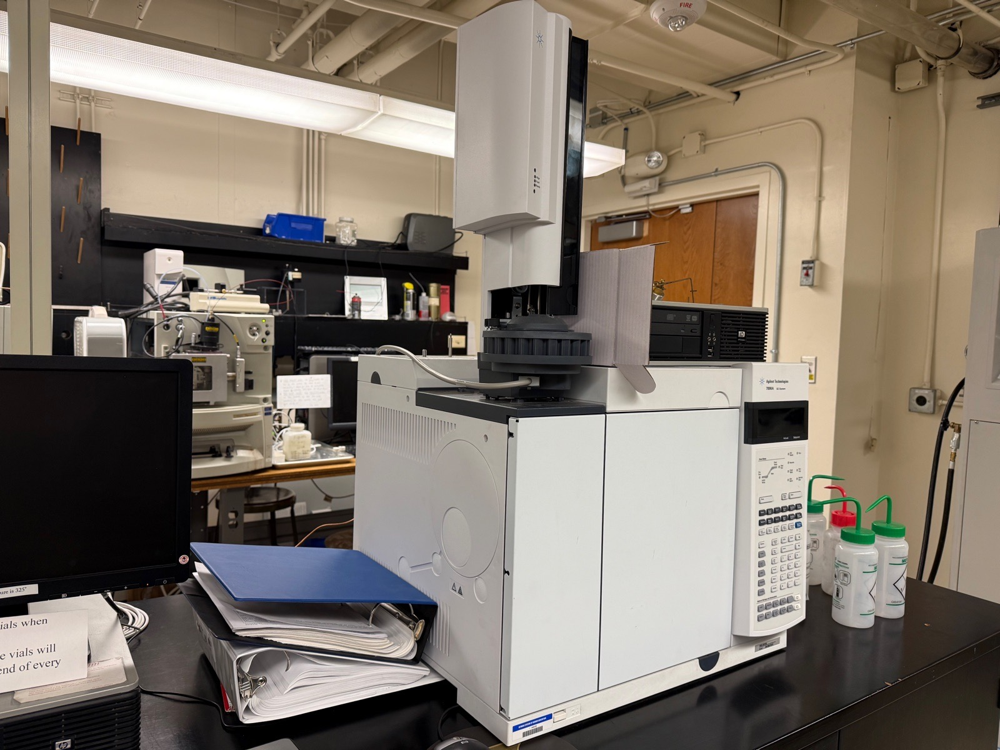

  
  
  
  

<button class="shuffle-btn" onclick="shufflePhotos()">Shuffle Photos</button>

<h2>Overview</h2>April 27th 2026

Chromatography is a **separation** family. A mobile phase carries the mixture through a column of stationary phase; analytes partition between the two and elute at different retention times. Two modes split the chemical universe by what mobile phase you can use:

- **LC** (liquid mobile phase) — for soluble, polar, large, or thermally fragile molecules
- **GC** (gas mobile phase) — for volatile, thermally stable, small molecules

Same idea: pull a mixture apart in time. The detector that reads each peak is a separable add-on (UV, MS or FID) and doesn't change what gets separated. Clickthrough dry run shown below — **the LC version**: water through the LC flow path, no column, no injection. Tests pump pressure, plumbing, autosampler. The GC version follows the same conceptual path with carrier gas through a heated capillary instead of pumped liquid through packed beads.

## Setup

| Instrument | Role | Operating range |
|------------|------|-----------------|
| Agilent 1200 Series HPLC 6230A TOF LC-MS | LC chassis — pump · autosampler · column compartment · detector | 0–400 bar · 0.05–5 mL/min |

| Toolkit | Details |
|---------|---------|
| Mode | Isocratic, 100% A (HPLC-grade water), 0.5 mL/min, 5 min |
| Column | Removed — replaced with zero-volume union (skips ~20–30 min equilibration) |
| Detector | DAD 254 nm when routed to UV — secondary; not the dry-run pass criterion |
| Software | Agilent ChemStation |
| Output | `.M` method + `.D` data to USB |

Stack powers up bottom-to-top — degasser → pump → autosampler → column compartment → detector — each module handshakes with ChemStation before the next. Both local LCs are LC-MS combos (currently as-service); HPLC-only operation needs the post-column flow detached.

## Samples

| Category | Sample |
|----------|--------|
| Blank | None — flow only, no injection |

A real session would inject 1–10 µL from the autosampler tray, run a gradient (e.g. 5% → 95% acetonitrile in water with 0.1% formic acid over 15 min), and read peaks off whichever detector is on the back end.

## Method

1. **Power up** — bottom-to-top stack, ~3–5 min, every module "Online / Ready".
2. **Prime / purge** — bottle A full, inlet submerged; purge channel A at 5 mL/min × 3 min.
3. **Method** — isocratic 100% A · 0.5 mL/min · 5 min · `dryrun_blank` (detector channel left at default).
4. **Run** — click Run Method (no injection); watch pressure settle.
5. **Save** — File → Save Method · Save Data → `.M` + `.D` to USB.
6. **Shutdown** — flow to 0, pump off, lamp off (if DAD), ChemStation closed, stack powered.

## Expected Results

Pressure settles around 5–20 bar at 0.5 mL/min — that's the separation hardware checking out (0 bar = leak; >100 bar = blocked union). Detector trace is whatever the detector does with pure water — a flat DAD baseline, an MS background scan, etc. — and isn't the dry-run pass criterion. Next session installs a C18 reversed-phase column, equilibrates with a water/acetonitrile gradient, and runs a caffeine + paracetamol mix — the textbook two-peak HPLC test sample.

<h2 id="extensions">Extensions</h2>

Same family, two modes, four chromatographs. Separation differs by **mobile phase** (gas vs liquid) and **stationary phase** (what the column prefers). Detectors layer on top to read identity off each peak — different question, separable concern.

  
  
  
  

  <input type="radio" name="chrom-tab" id="chrom-lc" checked>
  <input type="radio" name="chrom-tab" id="chrom-gc">

  

    <label for="chrom-lc">Liquid Chromatography</label>
    <label for="chrom-gc">Gas Chromatography</label>
  

  

    

      <table>
        <thead><tr><th>Instrument</th><th>Stationary phase</th><th>Sorts by</th></tr></thead>
        <tbody>
          <tr><td>Agilent 1200 Series HPLC 6230A TOF LC-MS</td><td>C18 reverse-phase</td><td>Hydrophobicity</td></tr>
          <tr><td>Waters Micromass ZQ Alliance e2695 LC-MS</td><td>C18 reverse-phase</td><td>Hydrophobicity</td></tr>
        </tbody>
      </table>
    

    
Pumped liquid solvent through a packed column. Sorts soluble analytes by hydrophobicity (reverse-phase) or polarity (normal-phase, HILIC).

  

  

    

      <table>
        <thead><tr><th>Instrument</th><th>Stationary phase</th><th>Sorts by</th></tr></thead>
        <tbody>
          <tr><td>Agilent 7890A GC 5975C Inert MSD</td><td>DB-5 (5% phenyl methyl)</td><td>Boiling point + polarity</td></tr>
          <tr><td>Agilent 7890 GC-FID Chiral</td><td>Chiral selector</td><td>R/S enantiomer affinity</td></tr>
        </tbody>
      </table>
    

    
Inert carrier gas through a heated capillary. Sorts volatile analytes by boiling point and column-film affinity. The Agilent 7890 GC-FID Chiral is the differentiated GC — its chiral stationary phase resolves enantiomers (mirror-image molecules) that the standard DB-5 column on the 7890A can't tell apart.

  

Technology

<ul class="updates-list">
  <li data-subj="chem">Separation <a href="/research/tech/chemistry/Liquid Chromatography/">Liquid Chromatography</a> Pumped liquid solvent through packed column — for soluble, polar, thermally fragile analytes <a class="chip chem" href="/research/#chem">Chemistry</a></li>
  <li data-subj="chem">Separation <a href="/research/tech/chemistry/Gas Chromatography/">Gas Chromatography</a> Inert carrier gas through heated capillary — for volatile, thermally stable analytes <a class="chip chem" href="/research/#chem">Chemistry</a></li>
</ul>

