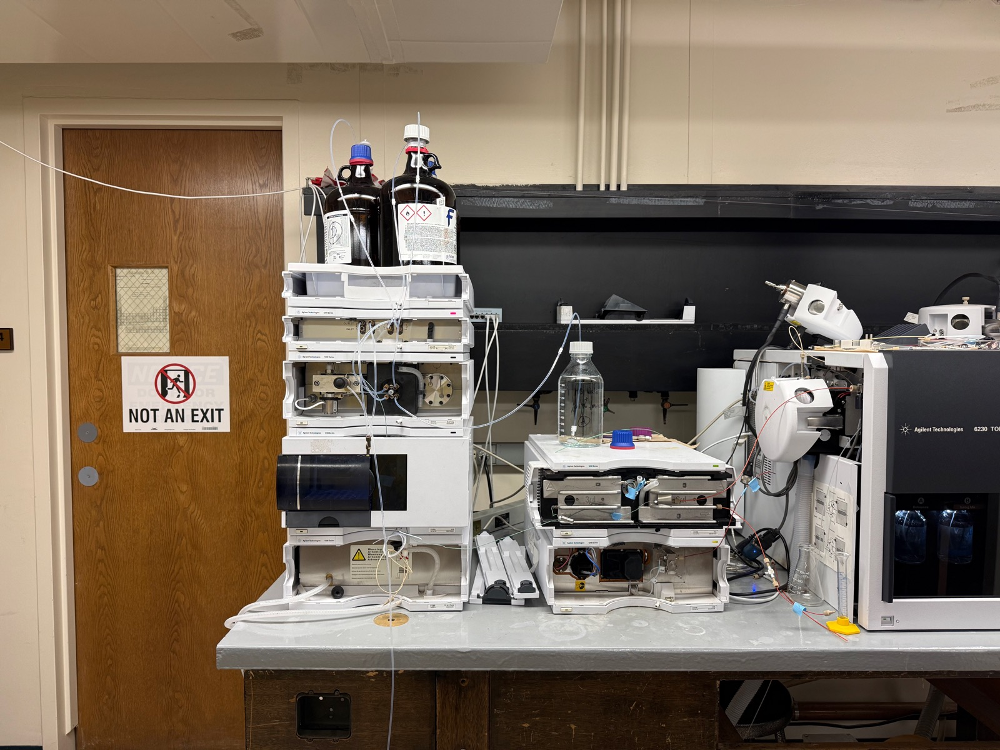

<h2>Overview</h2>April 27th 2026

Liquid chromatography is a **separation** technique. Pressurized mobile phase carries an injected mixture through a column of stationary phase; analytes partition between the two and elute at different retention times. The job is to pull the mixture apart in time.

- **LC = separation** — column, gradient, retention time
- **Detector = identity** — UV/DAD reads absorbance, MS reads mass, ELSD reads scatter, RI reads refractive index

Same column, same gradient, same retention times — different detectors give different answers about *what* eluted. The detector is a swappable add-on bolted to the back end.

**vs. spectroscopy** — IR/UV-Vis interrogate a mixture as one signal. LC pulls the mixture apart in time first; each peak is a different compound, then read by whichever detector follows.

Clickthrough dry run — water through the flow path, **no column, no injection**. Tests the separation hardware: pump pressure, plumbing integrity, autosampler movement. Detector behavior lives downstream and is detector-specific.

## Setup

| Instrument | Role | Range |
|------------|------|-------|
| Agilent 1200 Series HPLC 6230A TOF LC-MS | Quaternary pump · autosampler · column compartment (LC half of the LC-MS) | DAD 190–950 nm if routed to UV |

| Toolkit | Details |
|---------|---------|
| Mode | Isocratic, 100% A (HPLC-grade water), 0.5 mL/min, 5 min run |
| Column | Removed — replaced with a zero-volume union (skips ~20–30 min equilibration) |
| Detector | DAD path — signal A 254 nm, ref 360 nm, scan 200–400 nm (when available; downstream of dry-run scope) |
| Software | Agilent ChemStation |
| Output | `.M` method + `.D` data to USB |

The 1200 stack powers up bottom-to-top — degasser → pump → autosampler → column compartment → detector — each module handshakes with ChemStation before the next comes online. Both local LCs are tied to MS detectors (LC-MS combos, currently as-service); a self-operated HPLC-only run requires detaching the post-column flow.

## Samples

| Category | Sample |
|----------|--------|
| Blank | None — flow only, no injection |

A real session would inject 1–10 µL from the autosampler tray, run a gradient (e.g. 5% → 95% acetonitrile in water with 0.1% formic acid over 15 min), and read peaks off whichever detector is on the back end.

## Method

1. **Power up** — bottom-to-top stack, ~3–5 min, every module "Online / Ready".
2. **Prime / purge** — bottle A full, inlet submerged; purge channel A at 5 mL/min × 3 min.
3. **Method** — isocratic 100% A · 0.5 mL/min · 5 min · `dryrun_blank` (detector channel left at default).
4. **Run** — click Run Method (no injection); watch pressure settle.
5. **Save** — File → Save Method · Save Data → `.M` + `.D` to USB.
6. **Shutdown** — flow to 0, pump off, lamp off (if DAD), ChemStation closed, stack powered.

## Expected Results

Pressure settles around 5–20 bar at 0.5 mL/min — that's the separation hardware checking out (0 bar = leak; >100 bar = blocked union). Detector trace is whatever the detector does with pure water — a flat DAD baseline, an MS background scan, etc. — and isn't the dry-run pass criterion. Next session installs a C18 reversed-phase column, equilibrates with a water/acetonitrile gradient, and runs a caffeine + paracetamol mix — the textbook two-peak HPLC test sample.

<h2 id="extensions">Extensions</h2>

Same separation, swap the detector. Each rung climbs the information ladder — absorbance tells you "something with chromophores at this retention time", unit mass tells you "something around this nominal mass", exact mass tells you the elemental composition.

  
  

| Instrument | Detector | Tells you | Use case |
|------------|----------|-----------|----------|
| Agilent 1200 Series HPLC 6230A TOF LC-MS | UV/DAD (absorbance) | Retention time + UV spectrum | Target **quant** — count what you know is there |
| Waters Micromass ZQ Alliance e2695 LC-MS | Single-quad MS | Retention time + nominal mass (±1 Da) | Target **confirm** — mass evidence for a known target |
| Agilent 1200 Series HPLC 6230A TOF LC-MS | TOF MS | Retention time + exact mass (~ppm) | Target **discover** — find unknowns |

The Agilent box appears twice — same physical LC, two routing paths to two detectors (DAD and TOF). The Waters is a separate physical LC-MS with a single-quad detector.

Technology

<ul class="updates-list">
  <li data-subj="chem">Separation <a href="/research/toys/chemistry/Liquid Chromatography/">Liquid Chromatography</a> Flow through packed column — separate by chemical affinity <a class="chip chem" href="/research/#chem">Chemistry</a></li>
</ul>

