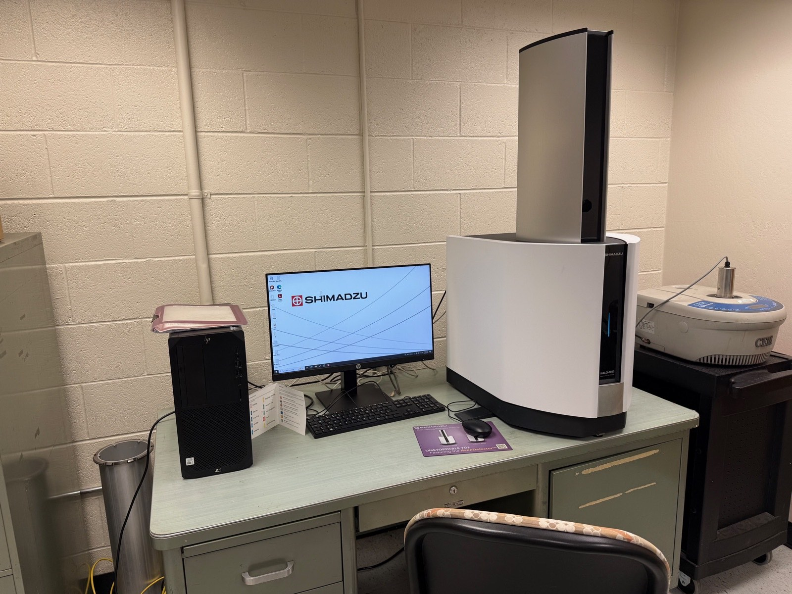
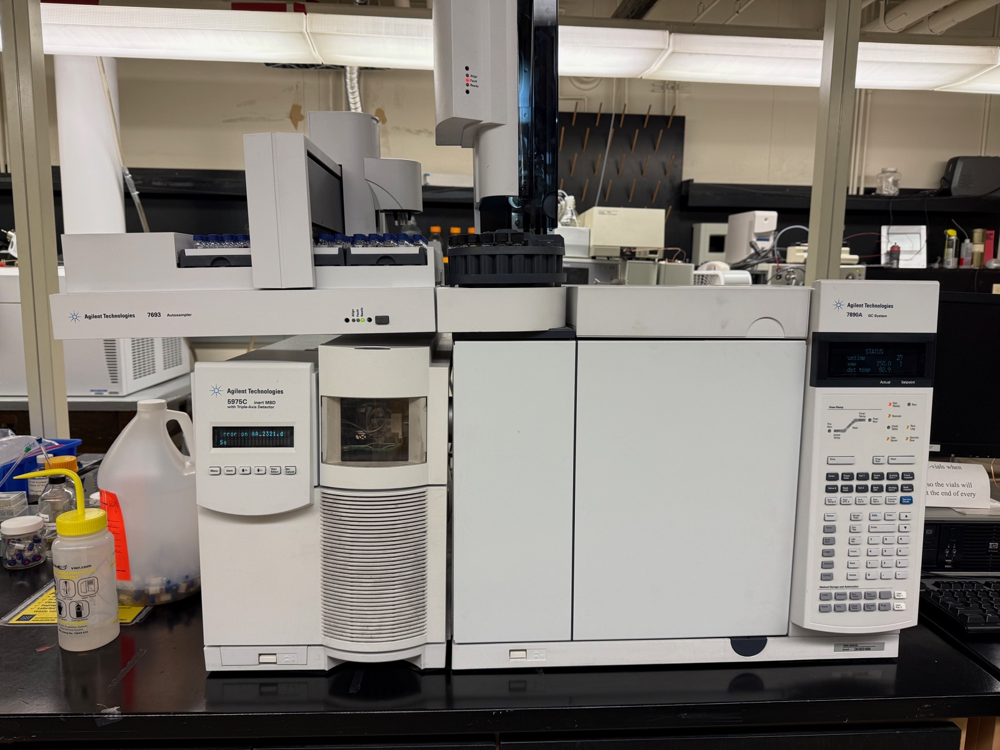
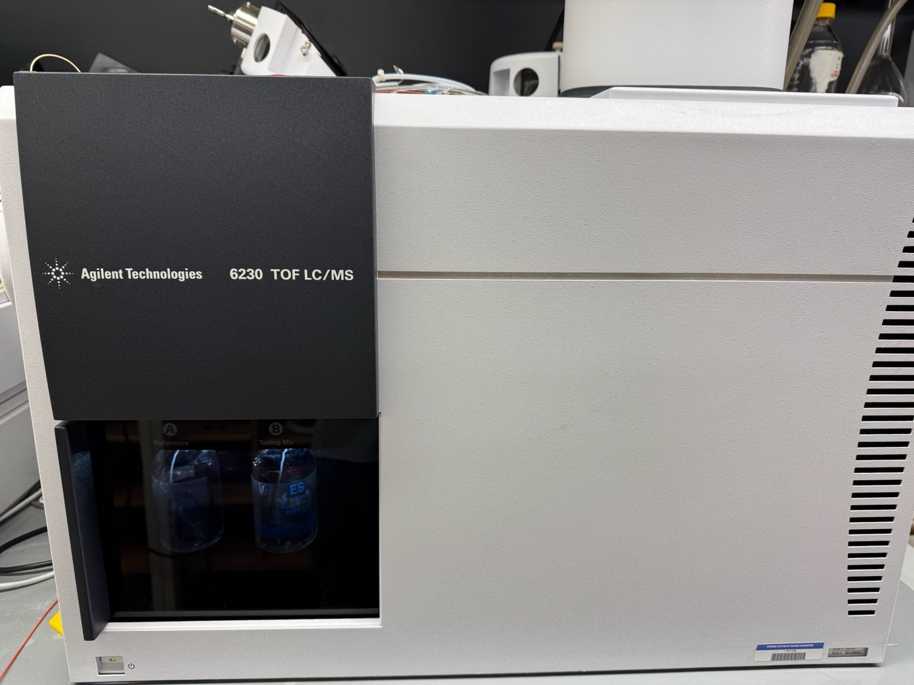

  
  
  
  

<button class="shuffle-btn" onclick="shufflePhotos()">Shuffle Photos</button>

<h2>Overview</h2>April 27th 2026

Mass spectrometry weighs molecules. A UV laser pulse vaporizes and ionizes the sample off a steel target plate; ions fly down a vacuum tube and time-of-flight maps to m/z.

- **MALDI** — sample dried on a plate, laser-ionized direct, **no chromatograph in front**. Fast, minimal prep — the whole mixture hits the MS at once instead of being separated first.
- **GC-MS / LC-MS** — same TOF idea but with a chromatograph in front; each eluting peak is ionized in turn.

Clickthrough dry run — empty plate, clean spot, save the spectrum. Verifies the path before real samples.

## Setup

| Instrument | Role | Range |
|------------|------|-------|
| Shimadzu MALDI-8020 MALDI-TOF Mass Spectrometer | Benchtop linear MALDI-TOF | 500–3000 m/z |

| Toolkit | Details |
|---------|---------|
| Mode | Linear positive ion |
| Vacuum | Built-in pump — pumpdown ~3–5 min |
| Software | MALDIsolutions |
| Method | Default Linear Positive · laser 30/180 · 50 shots · 1 profile |
| Output | `.lcd` / `.run` to USB |

Single-button vent/pumpdown, no roughing pump, no source bake-out. Plate wiped with methanol, loaded gloved.

## Samples

| Category | Sample |
|----------|--------|
| Blank | Clean target plate, no analyte, no matrix |

A real session deposits 1 µL analyte + 1 µL matrix (sinapinic acid for proteins, CHCA for peptides, DHB for small molecules), dries, then loads. The dry run skips matrix — laser fires onto bare polished steel.

## Method

1. **Power up** — rear switch on, status LED steady (~2 min), MALDIsolutions launched, "Ready", lid closed.
2. **Load plate** — Vent (~30–60 s), drawer open, target in, drawer closed, Pump Down (~3–5 min).
3. **Method** — Method Editor → default Linear Positive · 30/180 · 50 shots · 500–3000 m/z.
4. **Acquire** — pick clean spot in camera view, click Acquire.
5. **Save** — `.lcd`/`.run` to USB.
6. **Shutdown** — Vent, remove plate, pump back down, leave powered.

## Expected Results

Flat baseline across 500–3000 m/z — no analyte, no matrix, no peaks; if peaks appear, the plate isn't clean (re-wipe with methanol and retry). Next session deposits a calibration peptide standard (bradykinin / angiotensin) with CHCA matrix, switches to Reflectron mode for sub-Da resolution, and recalibrates the m/z axis.

<h2 id="extensions">Extensions</h2>

  
  
  

| Instrument | Extension | Description |
|------------|-----------|-------------|
| Agilent 7890A GC 5975C Inert MSD | Volatiles | GC + EI MS — small fragmented molecules |
| Waters Micromass ZQ Alliance e2695 LC-MS | Nonvolatiles, unit mass | LC + ESI quad MS — known targets |
| Agilent 1200 Series HPLC 6230A TOF LC-MS | Nonvolatiles, exact mass | LC + ESI TOF MS — large intact molecules |

Technology

<ul class="updates-list">
  <li data-subj="chem">Mass Spectrometry <a href="/research/toys/chemistry/MALDI/">MALDI</a> Direct ionization from a plate — no chromatograph, intact biomolecules via laser + matrix <a class="chip chem" href="/research/#chem">Chemistry</a></li>
  <li data-subj="chem">Mass Spectrometry <a href="/research/toys/chemistry/Gas Chromatography MS/">Gas Chromatography MS</a> Volatile molecules — fragment fingerprints via electron ionization <a class="chip chem" href="/research/#chem">Chemistry</a></li>
  <li data-subj="chem">Mass Spectrometry <a href="/research/toys/chemistry/Liquid Chromatography MS/">Liquid Chromatography MS</a> Nonvolatile molecules — intact weight via electrospray <a class="chip chem" href="/research/#chem">Chemistry</a></li>
</ul>

