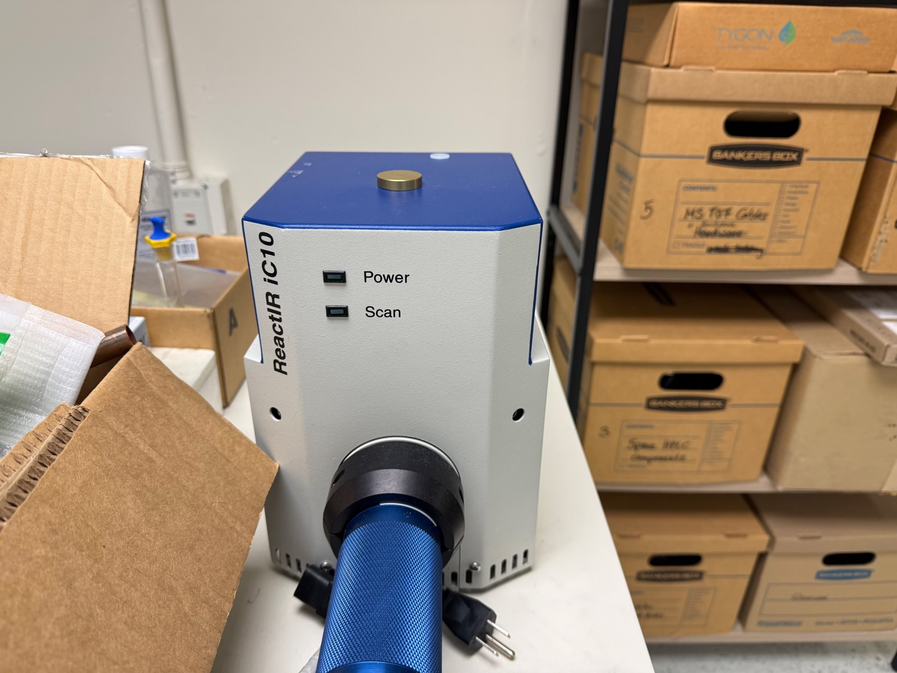
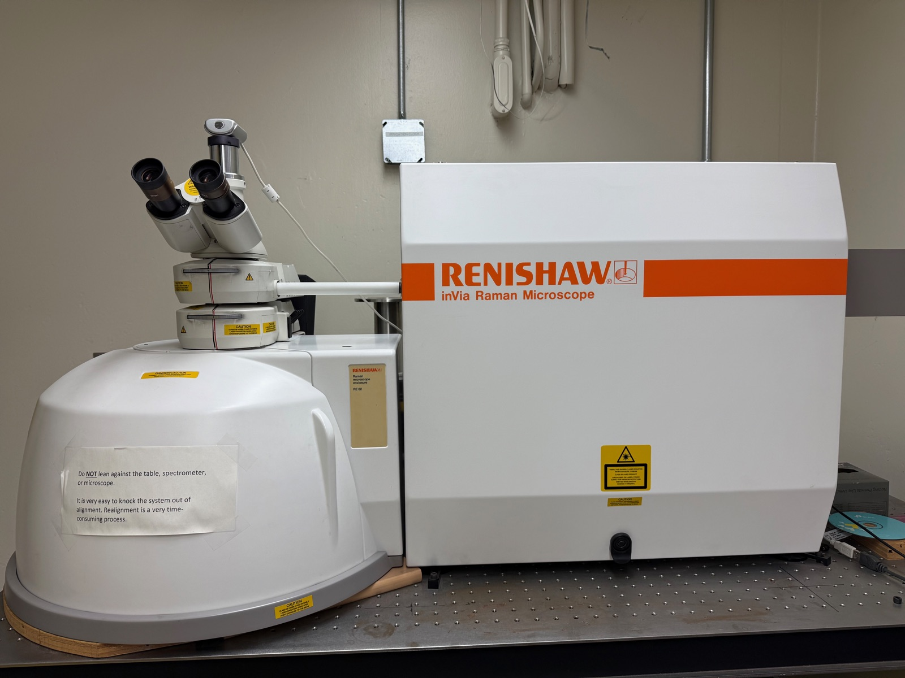

## Equipment

  
  
  

## Results

  <input type="radio" name="spec-tab" id="tab-acetone" checked>
  <input type="radio" name="spec-tab" id="tab-water">
  <input type="radio" name="spec-tab" id="tab-salt">
  <input type="radio" name="spec-tab" id="tab-plastic">
  <input type="radio" name="spec-tab" id="tab-sugar">

  

    <label for="tab-acetone">Acetone</label>
    <label for="tab-water">Water</label>
    <label for="tab-salt">Salt</label>
    <label for="tab-plastic">Plastic Bag</label>
    <label for="tab-sugar">Sugar</label>
  

  

    
  

  

    
  

  

    
  

  

    
  

  

    
  

