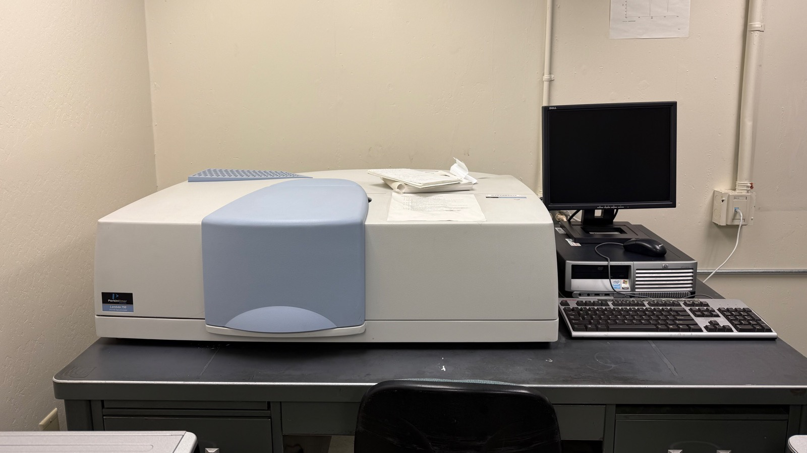
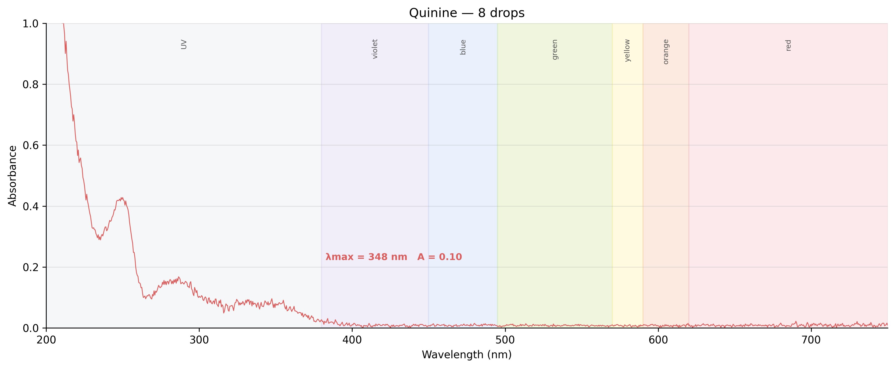
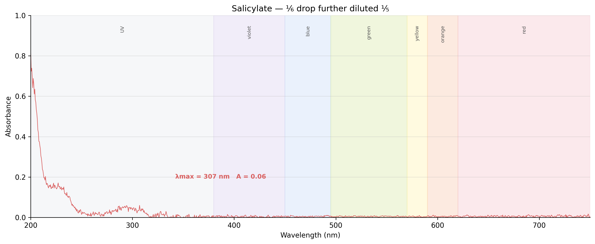

## Equipment

  
  

## Results

  <input type="radio" name="uv-tab" id="uv-overlay" checked>
  <input type="radio" name="uv-tab" id="uv-baseline">
  <input type="radio" name="uv-tab" id="uv-quinine">
  <input type="radio" name="uv-tab" id="uv-yellow">
  <input type="radio" name="uv-tab" id="uv-pink">
  <input type="radio" name="uv-tab" id="uv-salicylate">

  

    <label for="uv-overlay">Overlay</label>
    <label for="uv-baseline">Baseline</label>
    <label for="uv-quinine">Quinine</label>
    <label for="uv-yellow">Yellow HL</label>
    <label for="uv-pink">Pink HL</label>
    <label for="uv-salicylate">Salicylate</label>
  

  

    
  

  

    
  

  

    
  

  

    
  

  

    
  

  

    
  

