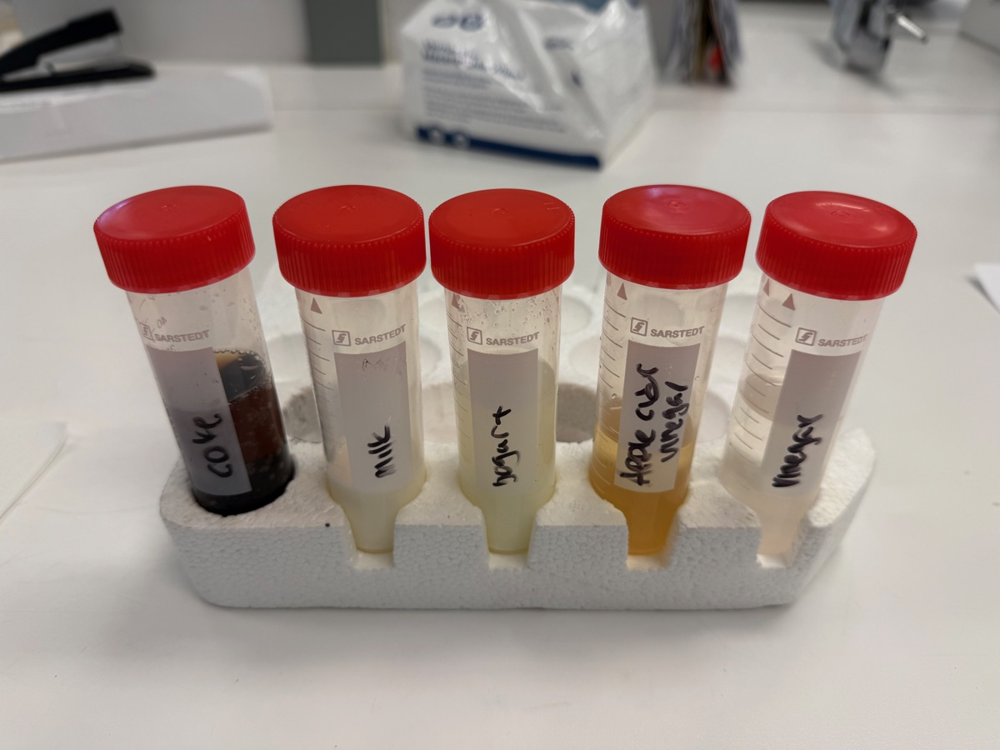

# Centrifugation and pH of Everyday Liquids

  
  
  
  

<button class="shuffle-btn" onclick="shufflePhotos()">Shuffle Photos</button>

April 11th 2026 Thermo Scientific Refrigerated Centrifuge, BioRad Mini Centrifuge, VWR pH 1100 L

## Overview

Centrifugation separates the components of a mixture by spinning it at high speed — denser particles are forced to the bottom of the tube as a pellet, while lighter material stays in the supernatant above. This experiment centrifuged five common household liquids to observe what separates out, and measured the pH of each sample before and after centrifugation using a benchtop pH meter. The session was part of a Basic Lab Training course covering centrifuges, pH meters, analytical balances, and pipettes.

## Setup

| Category | Details |
|----------|---------|
| Centrifuge | Thermo Scientific Refrigerated Centrifuge (large format) |
| Mini centrifuge | BioRad (small format, for microtubes) |
| pH meter | VWR pH 1100 L, calibrated at 25 °C |
| Vortex mixer | Scientific Industries Vortex Genie 2 |
| Balance | Sartorius analytical balance |
| Tubes | Sarstedt 50 mL conical centrifuge tubes, Falcon 50 mL tubes |

## Samples

Five everyday liquids were loaded into labeled 50 mL centrifuge tubes:

| Sample | Description |
|--------|-------------|
| Coke | Carbonated cola soft drink |
| Milk | Whole milk |
| Yogurt | Plain yogurt (liquid consistency) |
| Apple cider vinegar | Unfiltered apple cider vinegar |
| Honey | Liquid honey |

Each sample was vortexed to ensure homogeneity, then centrifuged. pH was measured before and after centrifugation by inserting the VWR electrode directly into the sample or the supernatant.

## Data

pH readings were recorded from photographs of the VWR pH 1100 L display — raw data photos are in the <a href="https://github.com/vivianweidai/science/tree/main/research/20260411%20Centrifuge/PHOTOS">PHOTOS</a> directory.

| Sample | pH (observed) | Notes |
|--------|--------------|-------|
| Coke | ~2.3 | Strongly acidic, as expected for phosphoric/carbonic acid |
| Apple cider vinegar | ~4.3 | Acidic — acetic acid |
| Honey | ~6.6 | Near neutral, slightly acidic |
| Milk / Yogurt | ~11.9 | Unexpected high reading — possible calibration issue or electrode contamination |

## Results

After centrifugation, visible separation was observed in several samples:

- **Milk** — separated into a translucent whey layer and a white fat/casein pellet
- **Yogurt** — similar separation to milk with a denser pellet
- **Honey** — appeared largely homogeneous after spinning, with slight clarification
- **Apple cider vinegar** — sediment ("mother") pelleted at the bottom, leaving clearer vinegar above
- **Coke** — minimal visible separation; some degassing occurred during spinning

The experiment demonstrated that centrifugation is most effective on emulsions and suspensions (milk, yogurt, unfiltered vinegar) where particles of different densities are physically mixed but not dissolved. True solutions (honey dissolved in water, Coke) show little to no separation because the solute is dispersed at the molecular level.

---

<a href="/curriculum/">Curriculum</a><a href="/olympiads/">Olympiads</a><a href="/research/">Research</a>
<a class="footer-github" href="https://github.com/vivianweidai/science/tree/main/research/20260411%20Centrifuge">View on GitHub</a>

