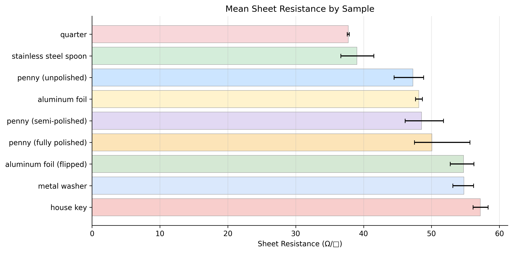

<h2>Research</h2>
<a href="/curriculum/">Curriculum</a><a href="/olympiads/">Olympiads</a><a href="/research/">Research</a>

<h1>Four-Point Probe Sheet Resistance Measurements</h1>Physics

  
  
  
  

<button class="shuffle-btn" onclick="shufflePhotos()">Shuffle Photos</button>

<h2>Overview</h2>April 4th 2026

Sheet resistance is a measure of how easily electric current flows across a material's surface, reported in ohms per square (Ω/□). It characterizes conductive materials without needing to know the exact thickness. This is useful because material thickness is often non-uniform or difficult to measure precisely, so sheet resistance allows direct comparison of materials and quality control even when thickness is unknown.

The four-point probe technique separates the current-carrying and voltage-sensing functions into different probe pairs. The Jandel RM3 applies a known current through the outer two probes and measures the voltage drop across the inner two. Because virtually no current flows through the voltage-sensing probes, the contact resistance between each probe tip and the sample surface drops out of the measurement entirely — only the resistance of the sample itself is captured.

## Setup

| Category | Details |
|----------|---------|
| Instrument | Jandel RM3 Four-Point Probe |
| Technique | Four-point probe — separate current and voltage pairs eliminate contact resistance |
| Measurement | Sheet resistance (Ω/□) |

Each sample was placed on the measurement stage, the four-point probe head lowered onto the surface, and current applied through the outer probes while voltage was measured across the inner two. Multiple points were measured per sample.

## Samples

| Category | Samples |
|----------|---------|
| Coins | quarter, penny (unpolished / semi-polished / fully polished) |
| Household metals | stainless steel spoon, aluminum foil, metal washer, house key |
| Biological | leaf |
| Other | DVD, paper cardboard |

Conductive samples (coins, household metals) produced measurable sheet resistance readings. Non-conductive samples (leaf, DVD, paper cardboard) returned Contact Limit or Out of Range at all current settings. The penny was sanded into three bands — untouched copper, lightly polished, and fully sanded to exposed zinc — to compare surface condition effects. Each sample was measured multiple times in both forward and reverse current directions.

## Data

Raw data were photographs of the instrument display taken after each measurement. These were manually transcribed into a CSV file. The raw photos are in the <a href="https://github.com/vivianweidai/science/tree/main/research/projects/20260404%20Four%20Point%20Probe/photos">photos</a> directory and the scrubbed <a href="https://github.com/vivianweidai/science/blob/main/research/projects/20260404%20Four%20Point%20Probe/output/four_point_probe_readings.csv">CSV</a> is in the <a href="https://github.com/vivianweidai/science/tree/main/research/projects/20260404%20Four%20Point%20Probe/output">output</a> directory.

## Results

In total 56 valid sheet resistance readings were collected at 9 µA. Three non-conductive samples (leaf, DVD, paper cardboard) returned Contact Limit at all current settings, and one metal washer reading was excluded due to an <a href="https://github.com/vivianweidai/science/blob/main/research/projects/20260404%20Four%20Point%20Probe/photos/20260404%20Setup%2089.jpeg">incorrect current range (20 nA)</a> — the current had been changed while testing insulator samples to see if a different current could produce a detection, and was not reset before measuring the washer.

| Sample | Material | n | Mean (Ω/□) | Range |
|--------|----------|--:|------------|-------|
| Quarter | Nickel-clad copper | 2 | 37.8 | 37.6–37.9 |
| Spoon | Stainless steel | 7 | 39.0 | 36.6–41.5 |
| Penny (unpolished) | Copper-plated zinc | 3 | 47.3 | 44.5–48.9 |
| Aluminum foil | Aluminum | 5 | 48.1 | 47.6–48.7 |
| Penny (semi-polished) | Copper-plated zinc | 10 | 48.6 | 46.1–51.8 |
| Penny (fully polished) | Copper-plated zinc | 16 | 50.1 | 47.5–55.7 |
| Aluminum foil (flipped) | Aluminum | 3 | 54.7 | 52.8–56.2 |
| Metal washer | Steel | 5 | 54.8 | 53.2–56.2 |
| House key | Brass | 5 | 57.2 | 56.1–58.3 |

The quarter and spoon were the most conductive samples, while the brass house key was the least — all non-metals were too resistive to measure. Two results stood out: sanding the penny from copper through to zinc *increased* sheet resistance (47.3 → 50.1 Ω/□), and flipping the aluminum foil also increased it (48.1 → 54.7 Ω/□), showing the matte and shiny sides have measurably different surface conductivity.

### Limitations

Readings fluctuated significantly during measurement — the display value drifted continuously and never fully stabilized, even on the same sample without moving the probes. Repeated measurements of the same item produced a wide spread of values, making it difficult to draw firm quantitative conclusions. The broad ranges in the table above reflect this instability rather than true differences between measurement points. Four-point probes are designed for flat, uniform samples with controlled contact pressure, so the irregular and curved surfaces of household objects likely contributed to the variability.

See the <a href="https://github.com/vivianweidai/science/blob/main/research/projects/20260404%20Four%20Point%20Probe/output/four_point_probe_analysis.ipynb">static notebook</a> or .

---

<a class="footer-github" href="/">Science</a>
<a href="/curriculum/">Curriculum</a><a href="/olympiads/">Olympiads</a><a class="active" href="/research/">Research</a>

