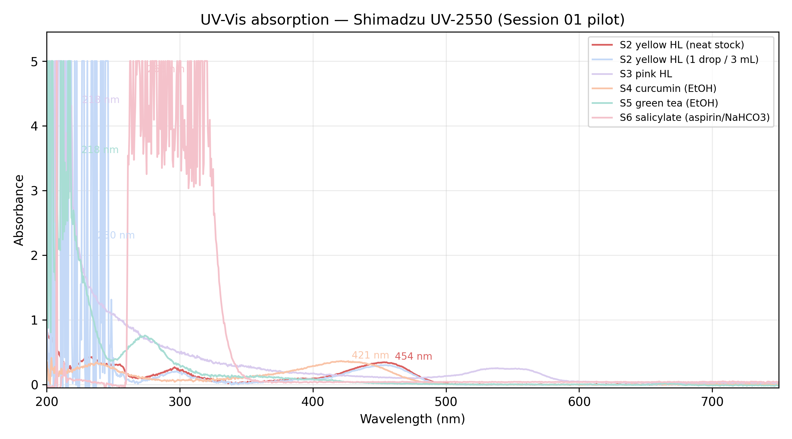

<h2>Research</h2>
<a href="/curriculum/">Curriculum</a><a href="/olympiads/">Olympiads</a><a href="/research/">Research</a>

<h1>UV Spectroscopy of Everyday Fluorophores</h1>Chemistry

  
  
  
  

<button class="shuffle-btn" onclick="shufflePhotos()">Shuffle Photos</button>

<h2>Overview</h2>April 13th 2026

Three optical spectroscopy instruments run back-to-back on the same six samples in a single morning. Each instrument answers a different question about the same molecules: **UV-2550** locates *where* each compound absorbs light (λ_max) and *how much* (A); **FluoroMax-3** uses those λ_max values to excite the same molecules and records *where they emit*; **Lambda 750** cross-validates the UV-Vis spectra on a research-grade double-beam instrument and extends the range into the **near-infrared (800–2500 nm)** to reveal vibrational overtones in the solvents that the first two instruments cannot see. Samples are prepared once the night before and scanned three times.

## Setup

| Category | Details |
|----------|---------|
| Instrument 1 | Shimadzu UV-2550 UV/Vis Spectrophotometer |
| Instrument 2 | Horiba Jobin Yvon FluoroMax-3 Spectrofluorometer |
| Instrument 3 | PerkinElmer Lambda 750 UV/Vis/NIR Spectrophotometer |
| Location | UNR Shared Instrumentation Laboratory, Room 016 |
| Cuvettes | 10 mm quartz, four clear sides (fluorescence-grade) |
| Software | UVProbe (Shimadzu), FluorEssence (Horiba), UV WinLab (PerkinElmer) |
| Blanks | Distilled water (aqueous samples), 95% ethanol (ethanol samples) |
| Waste | Single labeled amber waste bottle carried out of the lab |

All six samples are prepared the evening before: tonic water is de-gassed for quinine, highlighter ink reservoirs are soaked and filtered for the fluorescein and rhodamine dyes, turmeric is extracted into ethanol for curcumin, green tea leaves are extracted into ethanol for chlorophyll/catechins, and a crushed aspirin tablet is hydrolyzed with a pinch of baking soda for salicylate. Both blank solvents (H₂O and 95% EtOH) are bottled alongside. Cuvettes are cleaned with the same ritual on every instrument — 3× distilled water, 1× ethanol, 1× water, Kimwipe polish, never bare fingers on the optical faces — and each sample is pre-rinsed once with itself before the keeper fill to displace residual blank.

## Samples

Six fluorophores plus two blank solvents split cleanly into two families by solvent. The grouping also sets the scan order: all four water samples run first against the water baseline, then the instrument is re-baselined against ethanol for the two alcoholic extracts.

### Water-based H₂O blank

| Category | Sample |
|----------|--------|
| Antimalarial | quinine (tonic water, degassed) |
| Fluorescent dye | yellow highlighter (fluorescein-family) |
| Fluorescent dye | pink highlighter (rhodamine-family) |
| Pharmaceutical | salicylate (aspirin + NaHCO₃) |
| Blank | distilled water |

### Ethanol-based 95% EtOH blank

| Category | Sample |
|----------|--------|
| Natural pigment | curcumin (turmeric / EtOH) |
| Natural pigment | green tea extract (EtOH) |
| Blank | 95% ethanol |

## Data

Session 01 was a **pilot run** — a deliberate scattershot first pass to exercise each instrument and surface pitfalls before a comprehensive rerun. After pruning saturated, duplicate, misfiled, and unlabeled files, the usable pilot dataset is:

- <a href="https://github.com/vivianweidai/science/tree/main/research/projects/20260413%20UV%20Spectroscopy/data/one">`data/one/`</a> — UV-2550 absorption scans (`.txt`, two header lines then `Wavelength nm, Abs.`, ~1,200 points each, 200–800 nm). Five of six samples cleanly covered: yellow HL (two replicates + one 1-drop dilution), pink HL, curcumin, green tea, salicylate. **Quinine missing** — the file on the instrument was overwritten with leftover Chem 423 `I₂ vapor` class data and covers only 614–650 nm.
- <a href="https://github.com/vivianweidai/science/tree/main/research/projects/20260413%20UV%20Spectroscopy/data/two">`data/two/`</a> — FluoroMax-3 (`.csv`, `Wavelength, S1 (CPS)` for emission, `Wavelength, R1 (µA)` for excitation). Only the yellow highlighter emission/excitation pair survived renaming; the other samples' spectra were left inside an OriginLab `.OPJ` workbook without per-sample CSV exports. Those are treated as lost for this pilot and will be rerun.
- `data/three/` — Lambda 750 data, to be populated in Session 02.

## Methods — three sessions, one set of samples

### Session 1 — Shimadzu UV-2550 (absorption, 200–800 nm)

The UV-2550 is the fast, simple first stop. A single spectrum per sample from 200–800 nm tells us two things: the electronic absorption peaks (λ_max) and the absorbance at those peaks (A). The λ_max values become the excitation wavelengths for the FluoroMax session; the A values drive the dilution calculation.

1. **Warmup** — D₂ lamp on for 15 min, UVProbe launched, cuvettes cleaned.
2. **Baseline** — both cuvettes filled with distilled water, full 200–800 nm baseline stored; re-baselined with ethanol before the curcumin and green tea scans.
3. **Scan** — water samples first (quinine → yellow HL → pink HL → salicylate), then ethanol samples (curcumin → green tea). Spectrum mode, 1 nm sampling, 2 nm slit, ~300 nm/min, Absorbance.
4. **Export** — one CSV per sample, named `20260413_UVVis_S{n}_{sample}.csv`.
5. **Handoff** — for each sample record A at the intended FluoroMax excitation peak and compute the dilution factor **D = A_measured / 0.05**; this keeps A < 0.1 at λ_ex and avoids the inner-filter effect in fluorescence.

### Session 2 — Horiba FluoroMax-3 (emission + excitation)

Fluorescence picks up where absorption leaves off: once a molecule has absorbed a photon at λ_max, it relaxes and emits at a longer wavelength. Every sample is measured twice — an **emission scan** with the excitation fixed at its UV-Vis λ_max, and an **excitation scan** with the emission fixed at the expected peak. The two spectra together form the molecule's fluorescence fingerprint.

1. **Warmup** — xenon arc ignited 20 min before scans (started while leaving the UV-2550 room); FluorEssence launched.
2. **Parameters** — 2 nm ex/em slits, 1 nm step, 0.5 s integration, instrument correction (S1/R1) ON.
3. **Order (dilute → concentrated to minimize cross-contamination)** — blank → quinine → blank → salicylate → blank(EtOH) → green tea → curcumin, then switch to the "dyes" cuvette for yellow HL → pink HL.
4. **Per sample** — blank emission + excitation, then the diluted sample emission + excitation. Filenames `20260413_S{n}_{sample}_{EM|EX}_{ex|em}{λ}.csv`.
5. **Between samples** — 3× water, 1× ethanol, 1× water rinse, Kimwipe polish; extra ethanol+water pair after strong dyes.

Expected fluorescence peaks (from guide):

| Sample | Excite at | Expect emission | Notes |
|--------|-----------|-----------------|-------|
| Quinine | 350 nm | ~450 nm (blue) | neat tonic |
| Salicylate | 300 nm | ~410 nm | neat |
| Green tea | 430 nm | ~670 nm (chlorophyll red) | dual Soret + Q band |
| Curcumin | 425 nm | ~540 nm (yellow-green) | strong solvatochromism |
| Yellow HL | 488 nm | ~515 nm | fluorescein-family |
| Pink HL | 540 nm | ~580 nm | rhodamine-family |

### Session 3 — PerkinElmer Lambda 750 (cross-validation + NIR extension)

The Lambda 750 is a research-grade double-beam, double-monochromator instrument with a second PbS detector for the near-infrared. It does two jobs:

- **Cross-validation (200–800 nm)** — rescan the same six undiluted stocks and overlay against the UV-2550 spectra. Peak positions should agree within ~1 nm; A values within a few percent. Any larger discrepancy flags a wavelength calibration or cuvette-pair issue.
- **NIR extension (800–2500 nm)** — rescan both blank solvents and two bonus samples out to 2500 nm. The NIR region probes **vibrational overtones**, not electronic transitions, so the interesting features are in the *solvent*, not the dyes: water shows O–H overtones at ~970, 1200, 1450, and 1940 nm; ethanol adds C–H overtones at ~1400 and 1700 nm.

Parameters: 200–800 nm at 1 nm data interval and 2 nm slit (to match the UV-2550); 800–2500 nm at 2 nm data interval with servo slit; automatic lamp changeover at ~320 nm (D₂ → tungsten) and detector/grating changeover at ~860 nm (PMT → PbS) — small kinks at the changeover points are expected and ignored in qualitative work.

## Results

Session 01 was a pilot. The goal was not to publish six clean spectra — it was to exercise the data → report pipeline end-to-end, find the operational pitfalls, and have the analysis code already written when the comprehensive Session 02 runs. What follows is what the pilot data actually says.

See the <a href="https://github.com/vivianweidai/science/blob/main/research/projects/20260413%20UV%20Spectroscopy/output/uv_spectroscopy.ipynb">static notebook</a> or .

### UV-Vis absorption (UV-2550)

Auto-detected primary peaks (peak picker skips saturated points):

| Sample | λ_max (nm) | A at peak | D = A / 0.05 | Note |
|---|---:|---:|---:|---|
| S2 yellow HL (neat) | 453.5 | 0.35 | 7 | clean fluorescein-family visible band |
| S2 yellow HL (1 drop / 3 mL) | 230 | 2.22 | 44 | over-diluted; UV tail dominates |
| S3 pink HL | 219 | 4.3+ | — | **saturated** — dilute before rescan |
| S4 curcumin (EtOH) | 421 | 0.37 | 7 | matches literature (~425 nm) |
| S5 green tea (EtOH) | 218 | 3.5+ | — | **saturated** — dilute before rescan |
| S6 salicylate | 268 | 4.8+ | — | **saturated** — dilute before rescan |

The curcumin and yellow-stock scans fall inside the 0.1–1.0 A sweet spot that Beer–Lambert requires for reliable peak position. The other three saturated the detector in the deep UV because the stocks were run neat — exactly the outcome the Doc 1 Part F dilution table is designed to prevent, and the main operational lesson from the pilot. **Quinine has no spectrum** (the instrument saved leftover class data in its place).

### Fluorescence (FluoroMax-3) — yellow highlighter

| Sample | Excitation λ_max | Emission λ_max | Stokes shift |
|---|---:|---:|---:|
| S2 yellow HL | 467 nm | 512 nm | 45 nm |

Fluorescein-family behavior as expected: a modest ~45 nm Stokes shift between the excitation peak and the blue-shifted emission peak. The other five samples have no FluoroMax CSVs in the pilot dataset and will be rerun.

### Cross-validation (UV-2550 vs Lambda 750)

*Pending Session 02 — Lambda 750 has not yet been run.*

### NIR solvent overtones (Lambda 750)

*Pending Session 02.*

### Session 02 plan

- Rerun all six UV-2550 scans with predilution for any stock that gave A > 1.5 here; the pipeline will emit the dilution table automatically from the pilot.
- Rerun FluoroMax-3 using the Doc 2 file-naming convention (`YYYYMMDD_S{n}_{sample}_{EM|EX}_{ex|em}{λ}.csv`) so every file is self-identifying without an Origin workbook.
- Add the Lambda 750 session — cross-validation 200–800 nm plus NIR 800–2500 nm on both blanks (H₂O, EtOH) to capture the O–H and C–H overtones.
- Re-run the same notebook against the Session 02 data — the analysis pipeline is already wired.

### Cross-instrument summary

*Will be populated after Session 02 completes all three instruments on the same six samples.*

---

<a href="/curriculum/">Curriculum</a><a href="/olympiads/">Olympiads</a><a href="/research/">Research</a>
<a class="footer-github" href="https://github.com/vivianweidai/science/tree/main/research/projects/20260413%20UV%20Spectroscopy">View on GitHub</a>

