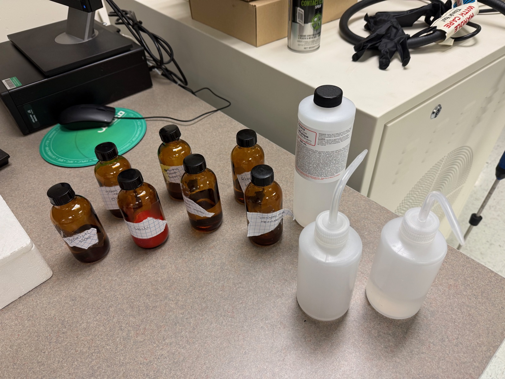

<h2>Research</h2>
<a href="/curriculum/">Curriculum</a><a href="/olympiads/">Olympiads</a><a href="/research/">Research</a>

<h1>UV Spectroscopy of Everyday Fluorophores</h1>Chemistry

  
  
  
  

<button class="shuffle-btn" onclick="shufflePhotos()">Shuffle Photos</button>

<h2>Overview</h2>April 13th 2026

Three optical spectroscopy instruments run back-to-back on the same six samples in a single morning. Each instrument answers a different question about the same molecules: **UV-2550** locates *where* each compound absorbs light (λ_max) and *how much* (A); **FluoroMax-3** uses those λ_max values to excite the same molecules and records *where they emit*; **Lambda 750** cross-validates the UV-Vis spectra on a research-grade double-beam instrument and extends the range into the **near-infrared (800–2500 nm)** to reveal vibrational overtones in the solvents that the first two instruments cannot see. Samples are prepared once the night before and scanned three times.

## Setup

| Category | Details |
|----------|---------|
| Instrument 1 | Shimadzu UV-2550 UV/Vis Spectrophotometer |
| Instrument 2 | Horiba Jobin Yvon FluoroMax-3 Spectrofluorometer |
| Instrument 3 | PerkinElmer Lambda 750 UV/Vis/NIR Spectrophotometer |
| Location | UNR Shared Instrumentation Laboratory, Room 016 |
| Cuvettes | 10 mm quartz, four clear sides (fluorescence-grade) |
| Software | UVProbe (Shimadzu), FluorEssence (Horiba), UV WinLab (PerkinElmer) |
| Blanks | Distilled water (aqueous samples), 95% ethanol (ethanol samples) |
| Waste | Single labeled amber waste bottle carried out of the lab |

All six samples are prepared the evening before: tonic water is de-gassed for quinine, highlighter ink reservoirs are soaked and filtered for the fluorescein and rhodamine dyes, turmeric is extracted into ethanol for curcumin, green tea leaves are extracted into ethanol for chlorophyll/catechins, and a crushed aspirin tablet is hydrolyzed with a pinch of baking soda for salicylate. Both blank solvents (H₂O and 95% EtOH) are bottled alongside. Cuvettes are cleaned with the same ritual on every instrument — 3× distilled water, 1× ethanol, 1× water, Kimwipe polish, never bare fingers on the optical faces — and each sample is pre-rinsed once with itself before the keeper fill to displace residual blank.

## Samples

| Category | Samples |
|----------|---------|
| Antimalarial | quinine (tonic water, degassed) |
| Fluorescent dyes | yellow highlighter (fluorescein-family), pink highlighter (rhodamine-family) |
| Natural pigments | curcumin (turmeric / EtOH), green tea extract (EtOH) |
| Pharmaceutical | salicylate (aspirin + NaHCO₃) |
| Blanks | distilled water, 95% ethanol |

## Data

Data from all three instruments is organized into two folders so far: <a href="https://github.com/vivianweidai/science/tree/main/research/projects/20260413%20UV%20Spectroscopy/DATA/ONE">ONE</a> holds the UV-2550 absorption spectra (`.txt` with `Wavelength nm, Abs.` columns, ~1,200 points over 200–800 nm per sample); <a href="https://github.com/vivianweidai/science/tree/main/research/projects/20260413%20UV%20Spectroscopy/DATA/TWO">TWO</a> holds the FluoroMax-3 excitation and emission scans (`.csv` with `Wavelength, S1` in CPS, plus the OriginLab `.OPJ` project and embedded `.pdf` previews). Lambda 750 data will land in a third folder (`THREE/`) after that session runs.

## Methods — three sessions, one set of samples

### Session 1 — Shimadzu UV-2550 (absorption, 200–800 nm)

The UV-2550 is the fast, simple first stop. A single spectrum per sample from 200–800 nm tells us two things: the electronic absorption peaks (λ_max) and the absorbance at those peaks (A). The λ_max values become the excitation wavelengths for the FluoroMax session; the A values drive the dilution calculation.

1. **Warmup** — D₂ lamp on for 15 min, UVProbe launched, cuvettes cleaned.
2. **Baseline** — both cuvettes filled with distilled water, full 200–800 nm baseline stored; re-baselined with ethanol before the curcumin and green tea scans.
3. **Scan** — water samples first (quinine → yellow HL → pink HL → salicylate), then ethanol samples (curcumin → green tea). Spectrum mode, 1 nm sampling, 2 nm slit, ~300 nm/min, Absorbance.
4. **Export** — one CSV per sample, named `20260413_UVVis_S{n}_{sample}.csv`.
5. **Handoff** — for each sample record A at the intended FluoroMax excitation peak and compute the dilution factor **D = A_measured / 0.05**; this keeps A < 0.1 at λ_ex and avoids the inner-filter effect in fluorescence.

### Session 2 — Horiba FluoroMax-3 (emission + excitation)

Fluorescence picks up where absorption leaves off: once a molecule has absorbed a photon at λ_max, it relaxes and emits at a longer wavelength. Every sample is measured twice — an **emission scan** with the excitation fixed at its UV-Vis λ_max, and an **excitation scan** with the emission fixed at the expected peak. The two spectra together form the molecule's fluorescence fingerprint.

1. **Warmup** — xenon arc ignited 20 min before scans (started while leaving the UV-2550 room); FluorEssence launched.
2. **Parameters** — 2 nm ex/em slits, 1 nm step, 0.5 s integration, instrument correction (S1/R1) ON.
3. **Order (dilute → concentrated to minimize cross-contamination)** — blank → quinine → blank → salicylate → blank(EtOH) → green tea → curcumin, then switch to the "dyes" cuvette for yellow HL → pink HL.
4. **Per sample** — blank emission + excitation, then the diluted sample emission + excitation. Filenames `20260413_S{n}_{sample}_{EM|EX}_{ex|em}{λ}.csv`.
5. **Between samples** — 3× water, 1× ethanol, 1× water rinse, Kimwipe polish; extra ethanol+water pair after strong dyes.

Expected fluorescence peaks (from guide):

| Sample | Excite at | Expect emission | Notes |
|--------|-----------|-----------------|-------|
| Quinine | 350 nm | ~450 nm (blue) | neat tonic |
| Salicylate | 300 nm | ~410 nm | neat |
| Green tea | 430 nm | ~670 nm (chlorophyll red) | dual Soret + Q band |
| Curcumin | 425 nm | ~540 nm (yellow-green) | strong solvatochromism |
| Yellow HL | 488 nm | ~515 nm | fluorescein-family |
| Pink HL | 540 nm | ~580 nm | rhodamine-family |

### Session 3 — PerkinElmer Lambda 750 (cross-validation + NIR extension)

The Lambda 750 is a research-grade double-beam, double-monochromator instrument with a second PbS detector for the near-infrared. It does two jobs:

- **Cross-validation (200–800 nm)** — rescan the same six undiluted stocks and overlay against the UV-2550 spectra. Peak positions should agree within ~1 nm; A values within a few percent. Any larger discrepancy flags a wavelength calibration or cuvette-pair issue.
- **NIR extension (800–2500 nm)** — rescan both blank solvents and two bonus samples out to 2500 nm. The NIR region probes **vibrational overtones**, not electronic transitions, so the interesting features are in the *solvent*, not the dyes: water shows O–H overtones at ~970, 1200, 1450, and 1940 nm; ethanol adds C–H overtones at ~1400 and 1700 nm.

Parameters: 200–800 nm at 1 nm data interval and 2 nm slit (to match the UV-2550); 800–2500 nm at 2 nm data interval with servo slit; automatic lamp changeover at ~320 nm (D₂ → tungsten) and detector/grating changeover at ~860 nm (PMT → PbS) — small kinks at the changeover points are expected and ignored in qualitative work.

## Results

*Analysis in progress — the UV-2550 and FluoroMax-3 scans are collected; Lambda 750 session pending. The sections below are the planned results layout.*

### UV-Vis absorption (UV-2550)

  <input type="radio" name="abs-tab" id="abs-quinine">
  <input type="radio" name="abs-tab" id="abs-yellow">
  <input type="radio" name="abs-tab" id="abs-pink">
  <input type="radio" name="abs-tab" id="abs-curcumin">
  <input type="radio" name="abs-tab" id="abs-greentea">
  <input type="radio" name="abs-tab" id="abs-salicylate">

  

    <label for="abs-quinine">Quinine</label>
    <label for="abs-yellow">Yellow HL</label>
    <label for="abs-pink">Pink HL</label>
    <label for="abs-curcumin">Curcumin</label>
    <label for="abs-greentea">Green Tea</label>
    <label for="abs-salicylate">Salicylate</label>
  

  

    
<em>Expected: peaks near 225, 275, 335 nm. The 335 nm band is the n→π* transition responsible for quinine's blue fluorescence.</em>

  

  

    
<em>Expected: peaks near 230 and 490 nm. The visible peak is the fluorescein-family π→π* transition.</em>

  

  

    
<em>Expected: peaks near 230 and 554 nm. The sharp visible band is characteristic of rhodamine-family dyes.</em>

  

  

    
<em>Expected: peaks near 265 and 425 nm in ethanol. The 425 nm absorption is responsible for turmeric's yellow color.</em>

  

  

    
<em>Expected: peaks near 270, 410, and 665 nm. The 410/665 nm pair is the Soret + Q band of chlorophyll.</em>

  

  

    
<em>Expected: peaks near 230 and 296 nm. The 296 nm band drives salicylate's UV fluorescence.</em>

  

### Fluorescence (FluoroMax-3)

*Emission + excitation overlays per sample; Stokes shift table summarizing the gap between λ_abs and λ_em. Largest Stokes shift is expected for salicylate; smallest for the rhodamine-family pink dye.*

### Cross-validation (UV-2550 vs Lambda 750)

*Overlay of quinine absorption from both instruments. Within-nanometer agreement on peak position is the headline scientific check.*

### NIR solvent overtones (Lambda 750)

*Water spectrum 800–2500 nm with the four O–H overtone peaks labeled (~970, 1200, 1450, 1940 nm); ethanol spectrum showing added C–H overtones at ~1400 and 1700 nm. The massive 1940 nm water band illustrates why infrared telescopes go to dry sites.*

### Cross-instrument summary

*A per-sample table linking each UV-Vis λ_max → FluoroMax excitation wavelength → emission wavelength → Stokes shift → (solvent) NIR overtone position. This is the scientific payoff of the three-instrument morning.*

---

<a class="footer-github" href="/">Science</a>
<a href="/curriculum/">Curriculum</a><a href="/olympiads/">Olympiads</a><a class="active" href="/research/">Research</a>

