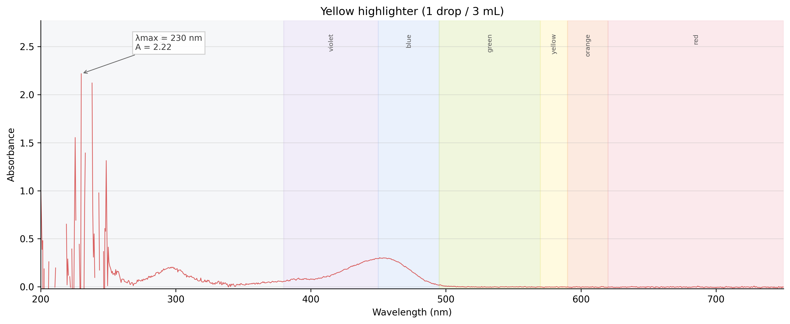
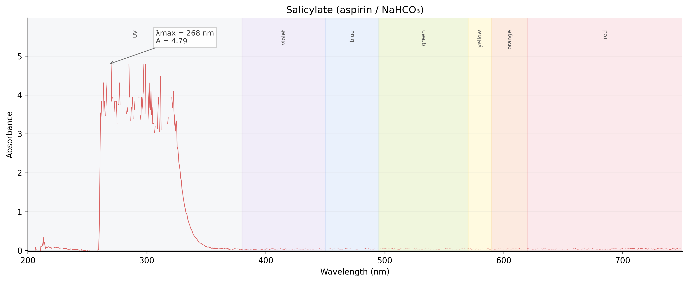

<h2>Research</h2>
<a href="/curriculum/">Curriculum</a><a href="/olympiads/">Olympiads</a><a href="/research/">Research</a>

<h1>UV-Vis Spectroscopy of Everyday Fluorophores</h1>Chemistry

  
  
  
  

<button class="shuffle-btn" onclick="shufflePhotos()">Shuffle Photos</button>

<h2>Overview</h2>April 17th 2026

One set of samples, three instruments, three questions:

- **UV-2550** — which colors of light the compound swallows, and how greedily.
- **FluoroMax-3** — which colors come back out again driven by which absorption.
- **Lambda 750** — which solvents.

The samples are all fluorophores: molecules that catch a photon and release a longer-wavelength one. The gap between the two peaks is the **Stokes shift**, and it's what makes this experiment interesting — the return photon is never quite the one that went in. Everyday sources stand in for lab references: quinine from tonic water, fluorescein and rhodamine dyes from highlighter ink, curcumin from turmeric, chlorophyll from green tea, salicylate from aspirin.

## Setup

| Instrument | Role | Range |
|------------|------|-------|
| Shimadzu UV-2550 UV/Vis Spectrophotometer | Absorption (λmax) | 200–800 nm |
| Horiba Jobin Yvon FluoroMax-3 Spectrofluorometer | Fluorescence (emission and excitation) | 200–800 nm |
| PerkinElmer Lambda 750 UV/Vis/NIR Spectrophotometer | Solvent (NIR overtones) | 200–2500 nm |

| Toolkit | Details |
|----------|---------|
| Cuvettes | Fluorescence-grade 10 mm quartz with four clear sides |
| Software | UVProbe (Shimadzu), FluorEssence (Horiba), UV WinLab (PerkinElmer) |
| Blanks | Distilled water (aqueous samples), 95% ethanol (ethanol samples) |

Cuvette protocol (same on every instrument): 3× distilled water, 1× ethanol, 1× water, Kimwipe polish each optical face, gripped only at the top rim with ceramic tweezers. Each sample pre-rinses its cuvette with itself before the keeper fill.

## Samples

Six fluorophores plus two blanks, split by solvent. The grouping is also the scan order: four water samples first against a water baseline, then re-baseline and run the two ethanol extracts. Each sample is prepared from an everyday source: quinine from de-gassed tonic water, fluorescein- and rhodamine-family dyes from highlighter ink reservoirs, curcumin and chlorophyll from turmeric and green tea extracted into ethanol, salicylate from aspirin hydrolyzed with a pinch of baking soda.

### Water-based

| Category | Sample |
|----------|--------|
| Antimalarial | quinine (tonic water, degassed) |
| Fluorescent dye | yellow highlighter (fluorescein-family) |
| Fluorescent dye | pink highlighter (rhodamine-family) |
| Pharmaceutical | salicylate (aspirin + NaHCO₃) |
| Blank | distilled water |

### Ethanol-based

| Category | Sample |
|----------|--------|
| Natural pigment | curcumin (turmeric / EtOH) |
| Natural pigment | green tea extract (EtOH) |
| Blank | 95% ethanol |

## Methods

Same samples, three instruments in sequence. The UV-2550 run feeds the FluoroMax: its λmax sets FluoroMax's λex, and its peak absorbance sets the dilution factor D = A / 0.05.

  <input type="radio" name="methods-tab" id="m-uv" checked>
  <input type="radio" name="methods-tab" id="m-flu">
  <input type="radio" name="methods-tab" id="m-lam">

  

    <label for="m-uv">UV-2550 — absorptionUV-2550</label>
    <label for="m-flu">FluoroMax-3 — fluorescenceFluoroMax</label>
    <label for="m-lam">Lambda 750 — extensionLambda 750</label>
  

  

One absorption scan per sample, 190–800 nm. Output: λmax and A at peak. Re-baseline when switching solvents.

| # | Sample |
|---|--------|
| 1 | quinine *(against H₂O baseline)* |
| 2 | yellow HL |
| 3 | pink HL |
| 4 | salicylate |
| — | *re-baseline in 95% EtOH* |
| 5 | curcumin |
| 6 | green tea |

  

  

Two scans per sample on aliquots diluted to D = A / 0.05. Emission scan fixes λex (from the UV-2550 λmax) and sweeps emission; excitation scan fixes λem and sweeps excitation. Order runs dilute → concentrated.

| # | Sample | λex | λem | Expected emission |
|---|--------|------|------|--------------------|
| 1 | blank (H₂O) | — | — | — |
| 2 | quinine | 350 | 450 | ~450 nm (blue) |
| 3 | blank (H₂O) | — | — | — |
| 4 | salicylate | 300 | 410 | ~410 nm |
| 5 | blank (95% EtOH) | — | — | — |
| 6 | green tea | 430 | 670 | ~670 nm (chlorophyll, dual Soret + Q) |
| 7 | curcumin | 425 | 540 | ~540 nm (solvatochromic) |
| — | *switch to "dyes" cuvette* | | | |
| 8 | yellow HL | 488 | 515 | ~515 nm (fluorescein) |
| 9 | pink HL | 540 | 585 | ~580 nm (rhodamine) |

  

  

One pass per solvent, 800–2500 nm — the range no other instrument reaches. Water shows O–H overtones at ~970, 1200, 1450, 1940 nm; ethanol adds C–H overtones at ~1400, 1700 nm. A brief 200–800 nm rescan on each sample doubles as a calibration check against the UV-2550 (agreement expected within ~1 nm).

| # | Sample |
|---|--------|
| 1 | distilled water blank |
| 2 | 95% ethanol blank |

  

## Data

One subfolder per instrument. Filenames are date-prefixed and self-identifying (`YYYYMMDD_{instrument}_S{n}_{sample}...`) so the pipeline ingests mixed sessions without external metadata.

### Desired clean-run manifest

Drop these files into the matching folder; the notebook re-runs end-to-end with zero code changes.

| Folder | Instrument | Expected files | Filename pattern |
|--------|------------|----------------|------------------|
| [`data/one/`](https://github.com/vivianweidai/science/tree/main/research/projects/20260417%20UV-Vis%20Spectroscopy/data/one) | UV-2550 | **8** — 6 samples + 2 blanks | `20260417_UVVis_S{n}_{sample}.txt` · `20260417_UVVis_blank_{H2O\|EtOH}.txt` |
| [`data/two/`](https://github.com/vivianweidai/science/tree/main/research/projects/20260417%20UV-Vis%20Spectroscopy/data/two) | FluoroMax-3 | **16** — 2 scans (EM + EX) × 6 samples + 2 scans × 2 blanks | `20260417_S{n}_{sample}_{EM\|EX}_{ex\|em}{λ}.csv` |
| `data/three/` | Lambda 750 | **10** — 6 UV-Vis rescans + 2 NIR blanks + 2 bonus NIR samples | `20260417_Lambda750_{UVVIS\|NIR}_S{n}_{sample}.csv` |

Column conventions: UV-2550 and Lambda 750 export `Wavelength nm., Abs.`; FluoroMax-3 emission exports `Wavelength, S1 (CPS)` and excitation exports `Wavelength, R1 (µA)`.

### Session 01 pilot — what survived triage

- `data/one/` — five of six UV-2550 samples cleanly covered (yellow HL with two replicates + one 1-drop dilution, pink HL, curcumin, green tea, salicylate). **Quinine missing** — the file on the instrument was overwritten with leftover Chem 423 `I₂ vapor` class data and covers only 614–650 nm.
- `data/two/` — only the yellow highlighter EM + EX pair survived renaming; the other samples' spectra were trapped inside an OriginLab `.OPJ` workbook without per-sample CSV exports. Treated as lost.
- `data/three/` — Lambda 750 session not yet run.

## Results

Session 01 was a pilot: not six clean spectra, but a full exercise of the data → report pipeline to surface the operational pitfalls before Session 02.

See the <a href="https://github.com/vivianweidai/science/blob/main/research/projects/20260417%20UV-Vis%20Spectroscopy/output/uv_spectroscopy.ipynb">static notebook</a> or .

### UV-Vis absorption (UV-2550)

  <input type="radio" name="uv-tab" id="uv-overlay" checked>
  <input type="radio" name="uv-tab" id="uv-curcumin">
  <input type="radio" name="uv-tab" id="uv-yellow-neat">
  <input type="radio" name="uv-tab" id="uv-yellow-dilute">
  <input type="radio" name="uv-tab" id="uv-pink">
  <input type="radio" name="uv-tab" id="uv-greentea">
  <input type="radio" name="uv-tab" id="uv-salicylate">

  

    <label for="uv-overlay">Overlay</label>
    <label for="uv-curcumin">Curcumin</label>
    <label for="uv-yellow-neat">Yellow HL</label>
    <label for="uv-yellow-dilute">Yellow HL (dil.)</label>
    <label for="uv-pink">Pink HL</label>
    <label for="uv-greentea">Green tea</label>
    <label for="uv-salicylate">Salicylate</label>
  

  

    
  

  

    
  

  

    
  

  

    
  

  

    
  

  

    
  

  

    
  

Curcumin and the yellow stock land inside the 0.1–1.0 A Beer–Lambert sweet spot. Pink HL, green tea, and salicylate saturated the detector in the deep UV — the stocks were run neat, which is exactly what the Part F dilution table is designed to prevent. That's the pilot's headline lesson. **Quinine has no spectrum**: the file slot was overwritten with leftover class data.

### Fluorescence (FluoroMax-3) — yellow highlighter

| Sample | Excitation λmax | Emission λmax | Stokes shift |
|---|---:|---:|---:|
| S2 yellow HL | 467 nm | 512 nm | 45 nm |

Fluorescein-family behavior as expected: ~45 nm Stokes shift between excitation and the blue-shifted emission. The other five samples had no surviving CSVs — will be rerun.

### Lambda 750 — extension

*Pending Session 02 (NIR overtones + UV-2550 cross-check).*

### Session 02 plan

- **UV-2550** — rerun all six with predilution for any A > 1.5 (the pipeline emits the dilution table from the pilot).
- **FluoroMax-3** — rerun five missing samples using the `YYYYMMDD_S{n}_{sample}_{EM|EX}_{ex|em}{λ}.csv` convention; no more Origin workbooks.
- **Lambda 750** — add the session: NIR 800–2500 nm on both blanks for O–H / C–H overtones, with a 200–800 nm rescan as a UV-2550 cross-check.
- Re-run the same notebook against Session 02 — analysis code is already wired.

### Cross-instrument summary

*Will be populated after Session 02 completes all three instruments on the same six samples.*
