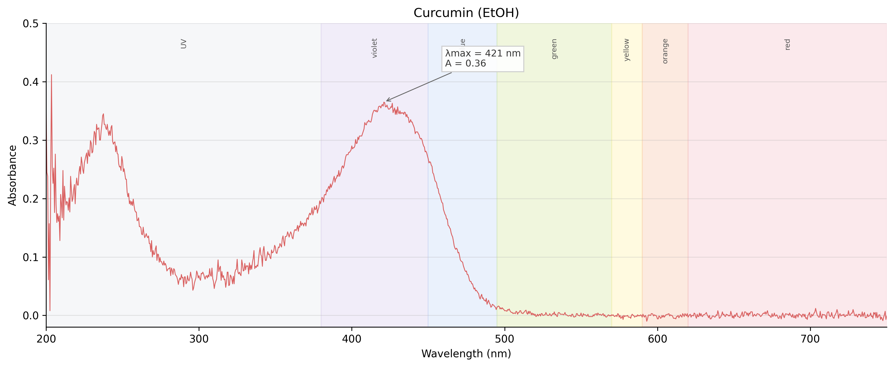
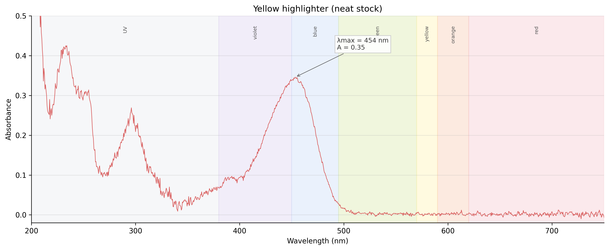
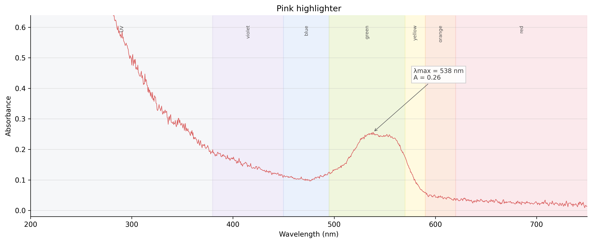
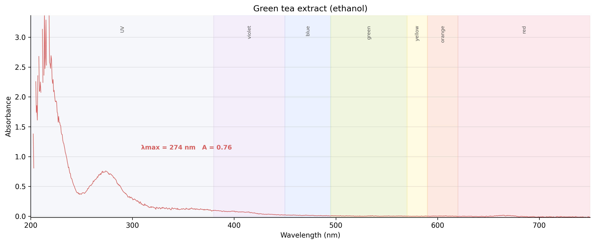
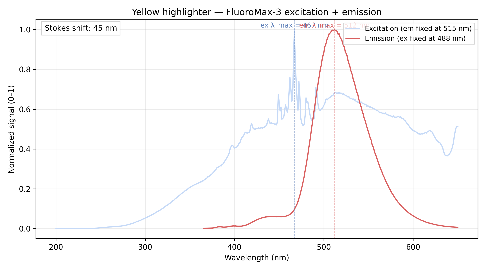

<h2>Research</h2>
<a href="/curriculum/">Curriculum</a><a href="/olympiads/">Olympiads</a><a href="/research/">Research</a>

<h1>UV-Vis Spectroscopy of Everyday Fluorophores</h1>Chemistry

  
  
  
  

<button class="shuffle-btn" onclick="shufflePhotos()">Shuffle Photos</button>

<h2>Overview</h2>April 17th 2026

One set of samples, three instruments, three questions:

- **UV-2550** — which colors of light the compound swallows, and how greedily.
- **FluoroMax-3** — which colors come back out again driven by which absorption.
- **Lambda 750** — which solvents.

The samples are all fluorophores: molecules that catch a photon and release a longer-wavelength one. The gap between the two peaks is the **Stokes shift**, and it's what makes this experiment interesting — the return photon is never quite the one that went in. Everyday sources stand in for lab references: quinine from tonic water, fluorescein and rhodamine dyes from highlighter ink, curcumin from turmeric, chlorophyll from green tea, salicylate from aspirin.

## Setup

| Instrument | Role | Range |
|------------|------|-------|
| Shimadzu UV-2550 UV/Vis Spectrophotometer | Absorption (λmax) | 200–800 nm |
| Horiba Jobin Yvon FluoroMax-3 Spectrofluorometer | Fluorescence (emission and excitation) | 200–800 nm |
| PerkinElmer Lambda 750 UV/Vis/NIR Spectrophotometer | Solvent (NIR overtones) | 200–2500 nm |

| Toolkit | Details |
|----------|---------|
| Cuvettes | Fluorescence-grade 10 mm quartz with four clear sides |
| Software | UVProbe (Shimadzu), FluorEssence (Horiba), UV WinLab (PerkinElmer) |
| Blanks | Distilled water (aqueous samples), 95% ethanol (ethanol samples) |

Cuvette protocol (same on every instrument): 3× distilled water, 1× ethanol, 1× water, Kimwipe polish each optical face, gripped only at the top rim with ceramic tweezers. Each sample pre-rinses its cuvette with itself before the keeper fill.

## Samples

Six fluorophores plus two blanks, split by solvent. The grouping is also the scan order: four water samples first against a water baseline, then re-baseline and run the two ethanol extracts. Each sample is prepared from an everyday source: quinine from de-gassed tonic water, fluorescein- and rhodamine-family dyes from highlighter ink reservoirs, curcumin and chlorophyll from turmeric and green tea extracted into ethanol, salicylate from aspirin hydrolyzed with a pinch of baking soda.

  <input type="radio" name="samples-tab" id="s-water" checked>
  <input type="radio" name="samples-tab" id="s-ethanol">

  

    <label for="s-water">Water-based</label>
    <label for="s-ethanol">Ethanol-based</label>
  

  

| Category | Sample |
|----------|--------|
| Antimalarial | quinine (tonic water, degassed) |
| Fluorescent dye | yellow highlighter (fluorescein-family) |
| Fluorescent dye | pink highlighter (rhodamine-family) |
| Pharmaceutical | salicylate (aspirin + NaHCO₃) |
| Blank | distilled water |

  

  

| Category | Sample |
|----------|--------|
| Natural pigment | curcumin (turmeric + ethanol) |
| Natural pigment | green tea extract (tea leaves + ethanol) |
| Blank | 95% ethanol |

  

## Methods

Same samples, three instruments in sequence. The UV-2550 run feeds the FluoroMax: its λmax sets FluoroMax's λex, and its peak absorbance sets the dilution factor D = A / 0.05.

  <input type="radio" name="methods-tab" id="m-uv" checked>
  <input type="radio" name="methods-tab" id="m-flu">
  <input type="radio" name="methods-tab" id="m-lam">

  

    <label for="m-uv">UV-2550UV-2550</label>
    <label for="m-flu">FluoroMax-3FluoroMax</label>
    <label for="m-lam">Lambda 750Lambda 750</label>
  

  

| # | Sample | Dilution |
|---|--------|----------|
| 1 | *baseline — distilled water* | — |
| 2 | blank (distilled water) — confirm ~0 A | — |
| 3 | quinine | About 3 times |
| 4 | yellow HL | About 3 times |
| 5 | pink HL | About 3 times |
| 6 | salicylate | About 3 times |
| 7 | *re-baseline — 95% ethanol* | — |
| 8 | blank (95% ethanol) — confirm ~0 A | — |
| 9 | curcumin | About 3 times |
| 10 | green tea | About 3 times |

One absorption scan per sample, 190–800 nm produces λmax and A at peak. Each baseline is followed by a blank scanned as a sample: it should come back flat near zero, confirming the baseline took before real samples run. Most stocks need heavy dilution to land in the 0.3–0.8 A sweet spot — each iteration keeps one drop of the previous stock and tops up with fresh solvent until the peak falls in range.

  

  

| # | Sample | Expected λex | Expected λem |
|---|--------|------|------|
| 1 | *baseline — distilled water* | — | — |
| 2 | blank (distilled water) — confirm flat | — | — |
| 3 | quinine | 350 | 450 |
| 4 | salicylate | 300 | 410 |
| 5 | *re-baseline — 95% ethanol* | — | — |
| 6 | blank (95% ethanol) — confirm flat | — | — |
| 7 | green tea | 430 | 670 |
| 8 | curcumin | 425 | 540 |
| 9 | *switch to "dyes" cuvette + re-baseline distilled water* | — | — |
| 10 | blank (distilled water) — confirm flat | — | — |
| 11 | yellow HL | 488 | 515 |
| 12 | pink HL | 540 | 585 |

Two scans per sample on aliquots diluted to D = A / 0.05 (add D drops of solvent per drop of sample). Emission scan fixes λex (from the UV-2550 λmax) and sweeps emission. Excitation scan fixes λem and sweeps excitation. Samples run dilute → concentrated to avoid carryover between reads. An Excitation–Emission Matrix (EEM) scan is run on **green tea extract** and **pink highlighter** — the two samples most likely to be mixtures of multiple fluorophores (chlorophyll a + b + polyphenols in green tea; rhodamine-family dye blends in the ink). The EEM sweeps both λex and λem to produce a 2D contour fingerprint that the single-ex / single-em scans above would collapse.

  

  

| # | Sample |
|---|--------|
| 1 | distilled water blank |
| 2 | 95% ethanol blank |

One pass per solvent, 800–2500 nm — the range no other instrument reaches. Water shows O–H overtones at ~970, 1200, 1450, 1940 nm; ethanol adds C–H overtones at ~1400, 1700 nm. A brief 200–800 nm rescan on each of the six UV-2550 fluorophore samples doubles as a calibration check — peak positions should agree with the UV-2550 within ~1 nm.

  

## Data

| Instrument | Files per run |
|------------|---------------|
| UV-2550 | 8 — 6 samples + 2 blanks |
| FluoroMax-3 | 20 — 2 scans (EM + EX) × (6 samples + 3 blanks) + 2 EEM |
| Lambda 750 | 10 — 6 UV-Vis rescans + 2 NIR blanks + 2 bonus NIR samples |

*Session results pending.*

## Results

### UV-Vis Absorption - UV-2550

  <input type="radio" name="uv-tab" id="uv-overlay" checked>
  <input type="radio" name="uv-tab" id="uv-curcumin">
  <input type="radio" name="uv-tab" id="uv-yellow-neat">
  <input type="radio" name="uv-tab" id="uv-pink">
  <input type="radio" name="uv-tab" id="uv-greentea">

  

    <label for="uv-overlay">Overlay</label>
    <label for="uv-curcumin">Curcumin</label>
    <label for="uv-yellow-neat">Yellow HL</label>
    <label for="uv-pink">Pink HL</label>
    <label for="uv-greentea">Green tea</label>
  

  

    
  

  

    
  

  

    
  

  

    
  

  

    
  

*Per-sample commentary forthcoming.*

### Fluorescence - FluoroMax-3

*Description forthcoming.*

### Solvent - Lambda 750

*Forthcoming.*
