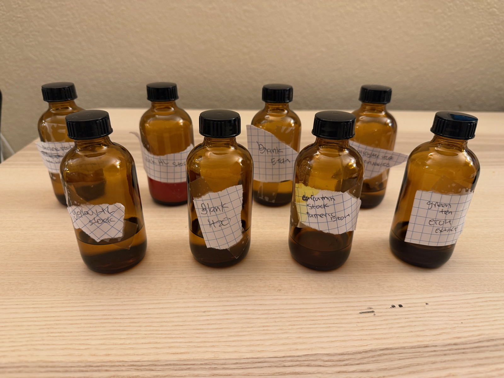
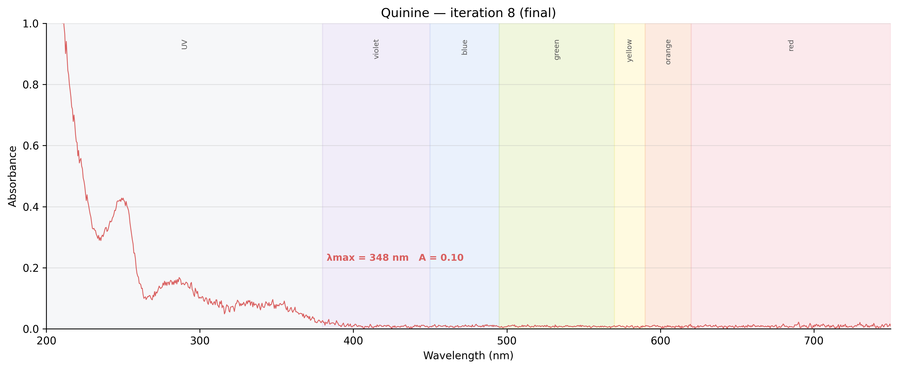
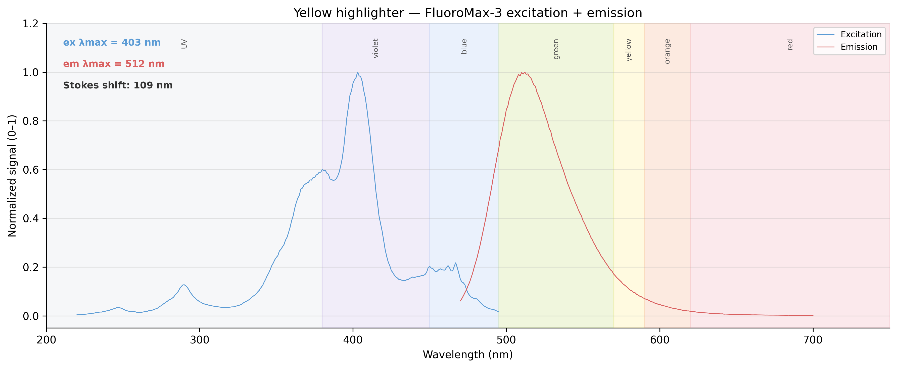
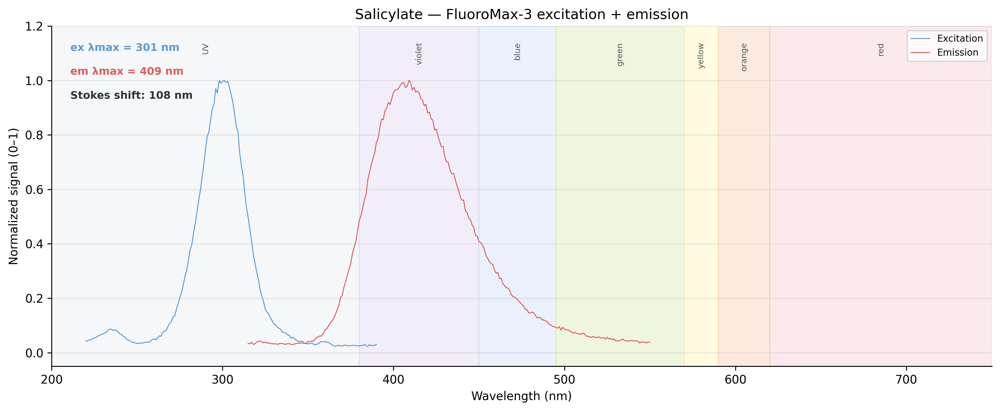
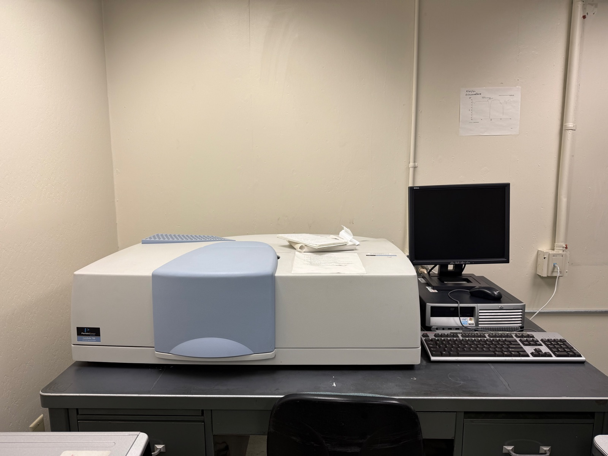

<h2>Research</h2>
<a href="/curriculum/">Curriculum</a><a href="/olympiads/">Olympiads</a><a href="/research/">Research</a>

<h1>UV-Vis Spectroscopy of Everyday Fluorophores</h1>Chemistry

  
  
  
  

<button class="shuffle-btn" onclick="shufflePhotos()">Shuffle Photos</button>

<h2>Overview</h2>April 20th 2026

One set of samples through two instruments:

- **UV-2550** — which colors of light the compound swallows, and how greedily.
- **FluoroMax-3** — which colors come back out again driven by which absorption.

The samples are all **fluorophores**: molecules that catch a photon and release a longer-wavelength one. The gap between the two peaks is the **Stokes shift** — the return photon is never quite the one that went in. Everyday sources stand in for lab references: quinine from tonic water, fluorescein and rhodamine dyes from highlighter ink, curcumin from turmeric, chlorophyll from green tea, salicylate from aspirin.

## Setup

| Instrument | Role | Range |
|------------|------|-------|
| Shimadzu UV-2550 UV/Vis Spectrophotometer | Absorption (λmax) | 200–800 nm |
| Horiba Jobin Yvon FluoroMax-3 Spectrofluorometer | Fluorescence (emission and excitation) | 200–800 nm |

| Toolkit | Details |
|----------|---------|
| Cuvettes | Fluorescence-grade 10 mm quartz with four clear sides |
| Software | UVProbe (Shimadzu), FluorEssence (Horiba) |
| Blanks | Distilled water (aqueous samples), 95% ethanol (ethanol samples) |

Cuvette protocol (same on every instrument): 3× distilled water, 1× ethanol, 1× water, Kimwipe polish each optical face, gripped only at the top rim with ceramic tweezers. Each sample pre-rinses its cuvette with itself before the keeper fill.

## Samples

Six fluorophores plus two blanks, split by solvent. The grouping is also the scan order: four water samples first against a water baseline, then re-baseline and run the two ethanol extracts. Each sample is prepared from an everyday source: quinine from de-gassed tonic water, fluorescein- and rhodamine-family dyes from highlighter ink reservoirs, curcumin and chlorophyll from turmeric and green tea extracted into ethanol, salicylate from aspirin hydrolyzed with a pinch of baking soda.

  <input type="radio" name="samples-tab" id="s-water" checked>
  <input type="radio" name="samples-tab" id="s-ethanol">

  

    <label for="s-water">Water-based</label>
    <label for="s-ethanol">Ethanol-based</label>
  

  

| Category | Sample |
|----------|--------|
| Antimalarial | quinine (tonic water, degassed) |
| Fluorescent dye | yellow highlighter (fluorescein-family) |
| Fluorescent dye | pink highlighter (rhodamine-family) |
| Pharmaceutical | salicylate (aspirin + NaHCO₃) |
| Blank | distilled water |

  

  

| Category | Sample |
|----------|--------|
| Natural pigment | curcumin (turmeric + ethanol) |
| Natural pigment | green tea extract (tea leaves + ethanol) |
| Blank | 95% ethanol |

  

## Method

The UV-2550 scan yields λmax (peak wavelength) and A (peak absorbance). Both feed the FluoroMax: λmax sets λex, and A sets the dilution factor D = A / 0.05 — the FluoroMax needs samples diluted to A ≈ 0.05 to avoid inner-filter effects.

  <input type="radio" name="methods-tab" id="m-uv" checked>
  <input type="radio" name="methods-tab" id="m-flu">

  

    <label for="m-uv">UV-2550UV-2550</label>
    <label for="m-flu">FluoroMax-3FluoroMax</label>
  

  

| # | Sample | Final Solute |
|---|--------|----------|
| 1 | *baseline — distilled water* | — |
| 2 | blank (distilled water) — confirm ~0 A | — |
| 3 | quinine | 8 drops |
| 4 | yellow HL | 1 drop |
| 5 | pink HL | ⅙ drop |
| 6 | salicylate | ⅙ drop |
| 7 | *re-baseline — 95% ethanol* | — |
| 8 | blank (95% ethanol) — confirm ~0 A | — |
| 9 | curcumin | upcoming |
| 10 | green tea | upcoming |

One absorption scan per sample across 200–800 nm. Every baseline is immediately followed by the solvent blank rescanned as a sample — it should return flat near zero, confirming the baseline held. Most stocks need heavy dilution to land in the 0.3–0.8 A sweet spot: each sample started at 1 drop of stock in 3 mL of solvent, then was diluted or concentrated iteratively until the peak fell in range.

  

  

| # | Sample | Expected λex | Expected λem |
|---|--------|------|------|
| 1 | quinine | 350 | 450 |
| 2 | yellow HL | 488 | 515 |
| 3 | pink HL | 540 | 585 |
| 4 | salicylate | 300 | 410 |
| 5 | curcumin | 425 | 540 |
| 6 | green tea | 430 | 670 |

Each sample goes straight from the UV-2550 into the FluoroMax using the final in-range aliquot diluted to D = A / 0.05 (add D drops of solvent per drop of sample). Two scans per sample: emission fixes λex (from the UV-2550 λmax) and sweeps λem; excitation fixes λem and sweeps λex. An Excitation–Emission Matrix (EEM) scan is planned for **green tea extract** to produce a 2D contour map.

  

## Data

| Instrument | Files | Coverage |
|------------|-------|----------|
| UV-2550 | 19 `.txt` | baseline, quinine (9), yellow HL (3), pink HL (2), salicylate (3) |
| FluoroMax-3 | 7 `.csv` + 7 `.pdf` | quinine, yellow HL, salicylate — emission + excitation; pink HL — emission only |
| Lambda 750 | 2 `.csv` | exploratory — water sample + baseline |

Water-solvent samples only this session — ethanol block (curcumin, green tea) deferred to a later run. Raw files live under <a href="https://github.com/vivianweidai/science/tree/main/research/projects/20260420%20UV-Vis%20Spectroscopy/data">data</a>. Iterative-dilution filenames preserve the full convergence sequence for each sample in the attempt to land in the 0.3–0.8 A sweet spot.

## Results

### UV-Vis Absorption - UV-2550

  <input type="radio" name="uv-tab" id="uv-overlay" checked>
  <input type="radio" name="uv-tab" id="uv-baseline">
  <input type="radio" name="uv-tab" id="uv-quinine">
  <input type="radio" name="uv-tab" id="uv-yellow">
  <input type="radio" name="uv-tab" id="uv-pink">
  <input type="radio" name="uv-tab" id="uv-salicylate">

  

    <label for="uv-overlay">Overlay</label>
    <label for="uv-baseline">Baseline</label>
    <label for="uv-quinine">Quinine</label>
    <label for="uv-yellow">Yellow HL</label>
    <label for="uv-pink">Pink HL</label>
    <label for="uv-salicylate">Salicylate</label>
  

  

    
  

  

    
  

  

    
  

  

    
  

  

    
  

  

    
  

*Per-sample commentary forthcoming.*

### Fluorescence - FluoroMax-3

  <input type="radio" name="flu-tab" id="flu-quinine" checked>
  <input type="radio" name="flu-tab" id="flu-yellow">
  <input type="radio" name="flu-tab" id="flu-pink">
  <input type="radio" name="flu-tab" id="flu-salicylate">

  

    <label for="flu-quinine">Quinine</label>
    <label for="flu-yellow">Yellow HL</label>
    <label for="flu-pink">Pink HL</label>
    <label for="flu-salicylate">Salicylate</label>
  

  

    
  

  

    
  

  

    
  

  

    
  

Seven FluoroMax PDFs (one per scan) record the full acquisition settings — wavelength ranges, slit widths, integration times, grating, detector. Each scan was vetted against the predicted λex/λem:

| Sample | Scan | λex | λem | Slits (ex / em) | Integration |
|--------|------|----------------|----------------|-----------------|-------------|
| quinine | em | park 347 | scan 200–800 | 5 nm / 5 nm | 0.1 s |
| quinine | ex | scan 220–430 | park 450 | 1 nm / 1 nm | 1.0 s |
| yellow HL | em | park 451 | scan 470–700 | 5 nm / 2 nm | 0.1 s |
| yellow HL | ex | scan 220–495 | park 515 | 2 nm / 2 nm | 0.1 s |
| pink HL | em | park 533 | scan 553–750 | 2 nm / 2 nm | 0.1 s |
| salicylate | em | park 290 | scan 315–550 | 2 nm / 2 nm | 0.1 s |
| salicylate | ex | scan 220–390 | park 410 | 2 nm / 2 nm | 0.1 s |

Settings vet:

- **Mostly clean.** Defaults (2 nm slits, 0.1 s integration, 1200 g/mm grating, single-scan accumulation) applied to four of the seven scans.
- **Quinine emission scan uses the full 200–800 nm range** — unusual. The region below 347 nm is below the excitation wavelength, so it captures Rayleigh scatter rather than emission. Not harmful, just wasteful; trim to 357–600 nm next session.
- **Quinine excitation narrowed to 1 nm slits with 1 s integration** — higher resolution, dimmer signal, longer dwell. Deliberate trade-off; fine.
- **Yellow HL λex park = 451 nm** vs the 488 nm prediction. Either the UV-2550 measured λmax at 451 (not 488) for this highlighter's fluorescein variant, or the operator mis-set the park. Cross-check against the UV-2550 yellow data.
- **Pink HL excitation scan missing** — only emission was collected. Plan to run the excitation scan next session.
- **Salicylate λex park = 290 nm** vs 300 predicted — within 10 nm; acceptable.

Yellow highlighter shows a clean excitation/emission pair with a visible Stokes shift. Plots for quinine, pink, and salicylate forthcoming.

<h2 id="extensions">Extensions</h2>

  
  

| Instrument | Extension | Description |
|------------|-----------|-------------|
| [PerkinElmer Lambda 750 UV/Vis/NIR Spectrophotometer](photos/setup/setup12.jpeg) 📷 | Range | Extend into near-infrared (200–2500 nm) for solvent overtones |
| [Jasco J-1500 CD Spectrometer](photos/setup/setup18.jpeg) 📷 | Chirality | Detect chiral molecules and protein secondary structure |

